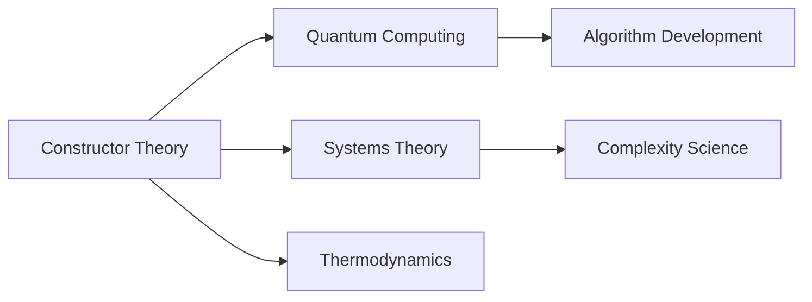

# Constructor Theory

## Origin

[[Constructor Theory]] was developed by David Deutsch, primarily known for his work in quantum computing and physics, as a new mode of explanation in fundamental physics. It arose from the inadequacies of existing scientific theories in providing a framework for counterfactuals — statements about what could be possible or impossible. The theory reframes how scientific theories are constructed by focusing on which tasks or transformations are possible, rather than predicting events or states. This shift is intended to address limitations inherent in traditional approaches to fundamental physics, which often fail to adequately handle complex systems interactions or compute potential alterations outside observed states.

### Evolution

[[Constructor Theory]] has evolved conceptually since its introduction in the early 21st century, influenced by interdisciplinary fields like information theory, quantum computing, and even biological systems. Initially positioned as a theoretical framework, it has progressively explored real-world applications, challenging existing paradigms like the traditional laws of thermodynamics and information processing constraints. As interdisciplinary interest has increased, the theory has expanded, exploring implications for other areas such as biological evolution, indicating its potential to spur innovative frameworks across diverse scientific domains.

## Possibilities

### Expected Outcomes

#### Positive Outcomes

- **Enhanced Scientific Paradigms**: By providing a universal framework for distinguishing what is possible from what is impossible, [[Constructor Theory]] could enhance the precision and explanatory power in disciplines like physics and chemistry.

- **Improved Problem-Solving Frameworks**: [[Constructor Theory]] could revolutionize problem-solving by allowing clearer delineation of practical possibilities, transforming complex system analyses and strategic planning in fields ranging from engineering to information science.

- **Stimulating Technological Innovations**: The framework might inspire innovations in computing, particularly quantum computing, encouraging developments in hardware and software that exploit previously unrecognized potentialities.

#### Negative Outcomes

- **Overcomplexity**: The conceptual stretching of [[Constructor Theory]] into multilineal applications might lead to an overcomplexity that could deter practical experimentation or real-world applicability.

- **Misapplication Risks**: Without robust empirical grounding, the theory might lead to speculative or inaccurate applications, resulting in technological misadventures or erroneous scientific conclusions.

## Actual Outcomes

### Positive Outcomes

- **Quantum Computing Advancements**: Constructor Theory's emphasis on counterfactual scenarios has influenced the development of algorithms that improve error rate management in quantum computing systems.

- **Biological Evolution Insights**: The theory's principles have been applied in evolutionary biology to examine the constraints on possible evolutionary pathways, informing theoretical models on the evolution of complex traits.

### Negative Outcomes

- **Resource Misallocation in Research**: Some attempts to apply Constructor Theory in areas like thermodynamics have led to inefficient use of resources due to the speculative nature of outcomes without enough empirical backing.

### Resonance

Constructor Theory's holistic framework resonates with fields like [[Systems Theory]], [[Complexity Science]], and [[Information Theory]]. Its comprehensive approach to understanding the possibilities within systems parallels ideas from complexity theory, providing a structure that can integrate and enhance multidisciplinary understanding by focusing on interconnected potentialities rather than isolated events.

### Distinction

While Constructor Theory offers a novel conceptual framework, it is juxtaposed against traditional scientific theories like [[Relativity]] and [[Quantum Mechanics]], which focus on predictive models of reality. Critiques focus on its abstract nature and lack of experimental validation, highlighting the importance of empirical grounding comparable to these established theories.

## Summary

### Bloom's Taxonomy Table

| **Bloom's Layer** | **Description**                                                       | **Examples**                                                                                                                                         |
| ----------------- | --------------------------------------------------------------------- | ---------------------------------------------------------------------------------------------------------------------------------------------------- |
| Factual           | Core facts and terminology                                            | Understanding terms like 'constructor', 'counterfactuals', and 'transformations'.                                                                 |
| Conceptual        | Relationships and overarching ideas                                   | Connection with quantum physics and system theory principles.                                                                                       |
| Procedural        | Practical methods and processes                                       | Applying the theory to develop algorithms in quantum computing.                                                                                    |
| Metacognitive     | Reflective insights                                                   | Reflecting on the implications of defining possibility constraints on knowledge management, influencing both theory and practice.                   |

### Integral Theory Table

| **Quadrant**        | **Key Elements/Insights**                                                                                                   |
| ------------------- | -------------------------------------------------------------------------------------------------------------------------- |
| Interior-Individual | Personal accounts of using Constructor Theory to rethink problem-solving in academia.                                       |
| Interior-Collective | How scientific communities have embraced Constructor Theory frameworks to foster collaborative innovation.                   |
| Exterior-Individual | Implementation of Constructor Theory principles in quantum computing projects.                                               |
| Exterior-Collective | Impact on educational systems by introducing Constructor Theory concepts in curriculum to challenge conventional paradigms. |

### Knowledge Expansion Table

| **Knowledge Item**                 | **Description**                                            | **Relevance/Relationship**                                             |
| ---------------------------------- | ---------------------------------------------------------- | ---------------------------------------------------------------------- |
| [[Quantum Computing]]              | Computational systems leveraging quantum mechanics.        | Constructor Theory impacts algorithm development.                      |
| [[Systems Theory]]                 | Framework to analyze complex interactions.                 | Resonates with Constructor Theory's focus on possibility constraints.  |
| [[Thermodynamics]]                 | Study of heat and energy transformations.                  | Challenges with applying Constructor Theory in practical scenarios.    |

### Visualization

In the structured narrative about Constructor Theory, we have explored its origins, possibilities, actual outcomes, and its relationships with other fields, aligning the insights with Bloom's Taxonomy and Integral Theory frameworks, supplemented with tables and visualizations to ensure clarity and actionable understanding.

## Project Link

[[Create Knowledge Management System]]
