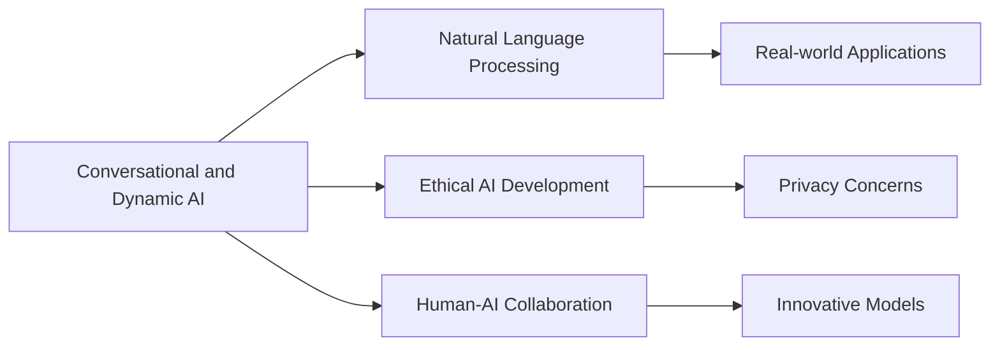

# Analysis of Conversational and Dynamic AI in Relation to "Knowledge Management Description"

## Origin

The concept of **Conversational and Dynamic [[AI]]** emerged to tackle the problem of static, one-way interaction models prevalent in early [[AI]] systems. Initially developed to create more natural and intuitive human-machine interactions, these systems leveraged advances in natural language processing ([[NLP]]), [[Machine Learning]], and computational linguistics. The specific purpose was to make [[AI]] more adaptive, responsive, and capable of understanding human nuances in conversation.

Significant milestones include:
- The advent of sophisticated chatbots in the early 2000s, which utilized basic scripts for customer support.
- The launch of AI assistants like Apple's Siri, Google Assistant, and Amazon's Alexa in the 2010s, which marked a shift towards more dynamic and conversational models.
- Recent developments in large language models such as GPT-3, which demonstrate advanced understanding and generation of human-like text.

Over time, the meaning and application of **Conversational and Dynamic [[AI]]** have expanded from simple query responses to holistic engagement in complex and multi-layered interactions, spanning sectors like healthcare, finance, education, and entertainment.

## Possibilities

### Expected Outcomes

**Positive Outcomes**:
- Enhancements in customer service with 24/7 availability and personalized support.
- Increased productivity through AI-assisted scheduling, reminders, and information retrieval.
- Educational advancements via interactive learning tools and personalized feedback systems.
- Promotion of mental well-being with AI therapists providing conversational support.

**Negative Outcomes**:
- Privacy concerns due to [[AI]] capturing and processing personal conversations.
- Job displacement in sectors reliant on routine interaction tasks.
- Potential manipulation through deepfake conversational agents.
- Echo chamber effects if conversational [[AI]] promotes information within a closed system.

## Actual Outcomes

### Positive Outcomes

- **Customer Service Transformation**: Companies like H&M have integrated chatbots to provide seamless customer support, reducing response times, and increasing customer satisfaction.
- **Healthcare Automation**: [[AI]] like Babylon Health offers real-time health consultations and advice, improving access and efficiency.
- **Educational Impact**: Systems like Duolingo use conversational [[AI]] to create interactive language learning experiences, enhancing user engagement and retention.

### Negative Outcomes

- **Privacy Breaches**: Incidents such as the listening-in controversies with Alexa highlight significant concerns around consent and privacy.
- **Job Displacement**: Automation in sectors like banking has led to reduced reliance on human tellers, causing workforce shifts.

### Resonance

The principles of **Conversational and Dynamic [[AI]]** resonate with fields like emotional intelligence and human psychology, essential for creating systems that genuinely understand and respond to human emotions and social cues. In the realm of [[Living Knowledge Management Systems]], integrating such [[AI]] can lead to more intelligent categorization and retrieval of information based on user intent and contextual understanding.

### Distinction

Contrary to static information systems, **Conversational and Dynamic [[AI]]** offer fluid interaction models. However, limitations arise in emotional depth and ethical considerations, challenging pure [[AI]]-driven solutions with alternative approaches such as human-AI collaboration. Critiques often focus on biases in language models, which can reproduce or exacerbate social inequalities when not managed.

## Summary

### Bloom's Taxonomy Table

| **Bloom's Layer** | **Description**                                            | **Examples**                                     |
| ----------------- | ---------------------------------------------------------- | ------------------------------------------------ |
| Factual           | Definitions and key components of conversational [[AI]]    | Siri, Alexa, GPT-3                               |
| Conceptual        | Relationship between [[AI]] and human interaction models   | Conversational flow, Contextual understanding    |
| Procedural        | Developing [[AI]] applications for various uses            | Building chatbots for customer service           |
| Metacognitive     | Reflection on [[AI]]'s impact on privacy and [[AI Ethics]] | Debates on AI bias and data privacy implications |

### Integral Theory Table

| **Quadrant**        | **Key Elements/Insights**                         |
| ------------------- | ------------------------------------------------- |
| Interior-Individual | User stories of personal productivity with [[AI]] aids|
| Interior-Collective | Cultural shifts towards [[AI]] acceptance in daily tasks|
| Exterior-Individual | Examples of [[AI]] use in personal assistants and apps|
| Exterior-Collective | Impact on digital economies and organizational processes |

### Knowledge Expansion Table

| **Knowledge Item**              | **Description**                                   | **Relevance/Relationship**                              |
| ------------------------------- | ------------------------------------------------- | ------------------------------------------------------- |
| [[Natural Language Processing]] | Technology enabling [[AI]] to understand language | Foundation of conversational AI capabilities            |
| [[AI Ethics]]                   | Framework for ethical AI creation                 | Addresses ethical concerns in dynamic AI implementation |
| [[Human-AI Collaboration]]      | Combining strengths of humans and AI              | Alternative approach to purely AI-driven interactions   |

### Visualization

---

## Project Link

[[Create Knowledge Management System]]
