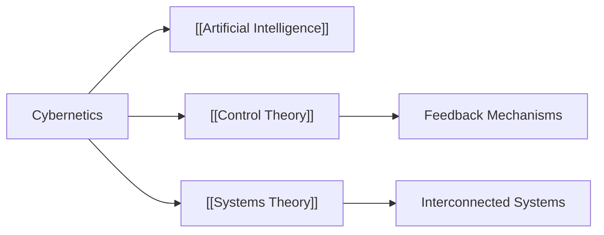

# Analysis of **Cybernetics** in the Context of Knowledge Management Description

## Origin

Cybernetics, as a field, emerged in the mid-20th century, primarily developed by Norbert Wiener in the 1940s. The immediate purpose of cybernetics was to understand and design systems of communication and control in animals and machines. It aimed to solve problems related to system stability, feedback loops, and decision-making. As an interdisciplinary domain, it drew from mathematics, engineering, and biology, extending its focus to understanding regulatory systems, their structures, constraints, and possibilities.

Over time, cybernetics has evolved, significantly influencing diverse fields such as computer science, control systems in engineering, biological systems, organizational theories, and social systems. The concept of feedback loops, central to cybernetic theory, has been seminal in developing automated control systems and in advancing [[AI|Artificial Intelligence]] and machine learning algorithms.

## Possibilities

### Expected Outcomes

#### Positive Outcomes

- **Enhancement of Automated Systems**: Cybernetics principles guide the development of automated and self-regulating systems, resulting in increased productivity and efficiency.
- **Advanced Understanding in Biology and Medicine**: Understanding feedback mechanisms in biology leads to better medical diagnostics and treatments.
- **Improved Organizational Structures**: Cybernetic models foster efficient communication and control within organizations, enhancing operational effectiveness.

#### Negative Outcomes

- **Over-reliance on Technology**: Misapplication can lead to systems that are overly complex or too dependent on automation, reducing human oversight.
- **Ethical Concerns**: Cybernetics in [[AI|Artificial Intelligence]] and automation solutions raises ethical questions about privacy, control, and employment disruption.

## Actual Outcomes

### Positive Outcomes

- **Development of AI and Robotics**: Cybernetic principles have directly influenced the creation of adaptive and autonomous systems in AI and robotics, enhancing industries such as manufacturing and service automation.
- **Biological Research Advancements**: By applying cybernetic models, researchers have better understood homeostasis and adaptation in organisms.

### Negative Outcomes

- **Automation-Induced Job Displacement**: The deployment of cybernetically-informed automation has led to significant changes in job markets, evidencing societal challenges.

### Resonance

Cybernetics shares resonant ideas with [[Systems Theory]], [[Control Theory]], and feedback systems in various disciplines, promoting a holistic view of complex interconnected networks. This complements the development of knowledge management systems by enhancing the understanding of dynamic interactions within knowledge networks.

### Distinction

Competing ideas include traditional linear models of problem-solving and control that do not consider the feedback loops central to cybernetics. Critiques also focus on the potential for oversimplification when cybernetic principles are applied universally without adaptation to context-specific variables.

## Summary

### Bloom's Taxonomy Table

| **Bloom's Layer**  | **Description**                                       | **Examples**                                  |
|--------------------|-------------------------------------------------------|-----------------------------------------------|
| Factual            | Basic facts and terminology related to cybernetics    | Feedback loops, control systems               |
| Conceptual         | Relationships among systems and regulatory mechanisms | Systems theory, homeostasis                   |
| Procedural         | Methods of applying cybernetic principles             | Designing autonomous control systems          |
| Metacognitive      | Reflecting on the impact of automation                | Evaluating implications on employment and ethics |

### Integral Theory Table

| **Quadrant**         | **Key Elements/Insights**                                                                 |
|----------------------|-------------------------------------------------------------------------------------------|
| Interior-Individual  | Personal reflection of maintaining homeostasis in daily activities                        |
| Interior-Collective  | Societal shifts in job markets due to automation                                          |
| Exterior-Individual  | Implementation of cybernetic models in personal computing devices                         |
| Exterior-Collective  | Organizational shifts in communication and control structures in large corporations       |

### Knowledge Expansion Table

| **Knowledge Item**              | **Description**                                       | **Relevance/Relationship**                                |
| ------------------------------- | ----------------------------------------------------- | --------------------------------------------------------- |
| [[AI\|Artificial Intelligence]] | Encompasses technologies influenced by cybernetics    | Shares concepts of automation and adaptation              |
| [[Control Theory]]              | Focuses on regulating system outputs through feedback | Core principles of cybernetics                            |
| [[Systems Theory]]              | Studies holistic systems and their interactions       | Provides a framework for understanding cybernetic systems |

### Visualization

### Conclusions

The examination of cybernetics within the context of a knowledge management system reveals its insightful applications in promoting dynamic, interrelated knowledge networks. Despite offering significant advancements, particularly in automation and organizational efficiency, it also presents challenges, including ethical concerns and societal implications. Understanding the balance between these outcomes is crucial for leveraging cybernetic principles in a living knowledge management system aimed at enriching meaningful knowledge access and application.

## Project Link

[[Create Knowledge Management System]]
