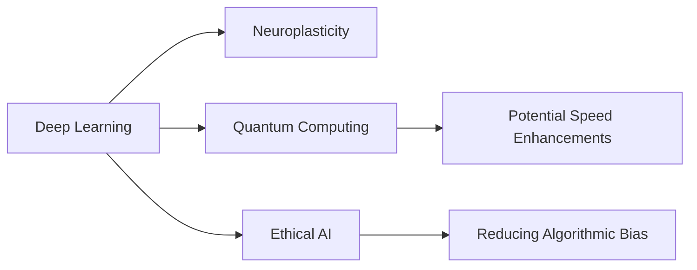

# Deep Learning

## Origin

### Immediate Circumstances

**Deep Learning** emerged in response to a need for improved artificial intelligence ([[AI]]) models capable of learning patterns from vast amounts of data. It was created to address the limitations of traditional [[Machine Learning]] methods that required manual feature extraction and couldn't process raw, high-dimensional data effectively.

### Evolution

Initially, deep learning concepts can be traced back to the 1940s with the development of neural networks, but they saw significant advancement in the 1980s and 1990s with innovations like backpropagation and convolutional networks. The advent of big data and enhanced computational power in the early 2000s catalyzed deep learning's explosive growth. Notable milestones include the development of convolutional neural networks (CNNs) for image recognition and recurrent neural networks (RNNs) for sequential data.

## Possibilities

### Expected Outcomes

#### Positive Outcomes

- **Enhancements in Image and Speech Recognition**: Deep learning has revolutionized how computers perceive images and understand speech, leading to innovations in areas like autonomous vehicles and real-time language translation.
- **Medical Diagnosis and Research**: Deep learning is used for detecting diseases in medical images and analyzing genomic sequences, significantly improving diagnostic accuracy and research capabilities.
- **Improved Efficiency and Automation**: In industries, deep learning optimizes supply chains, automates quality assurance, and improves energy management through predictive analysis.

#### Negative Outcomes

- **Data Privacy Concerns**: Deep learning systems require vast amounts of data, raising concerns about data privacy and the potential misuse of personal information.
- **Job Displacement**: Automation resulting from deep learning-enabled systems may lead to job displacement in sectors where routine tasks can be automated.
- **Algorithmic Bias**: If trained on biased datasets, deep learning models can perpetuate or even exacerbate societal biases.

## Actual Outcomes

### Positive Outcomes

- **Advancements in Self-Driving Cars**: Companies like Tesla and Waymo are using deep learning algorithms to develop autonomous driving technologies, potentially reducing traffic accidents and fatalities.
- **Breakthroughs in Natural Language Processing**: Applications like Google's BERT have enhanced language understanding, powering more accurate search engines and voice assistants.

### Negative Outcomes

- **Facial Recognition Issues**: The use of deep learning in facial recognition has led to privacy violations and wrongful surveillance, raising ethical and legal concerns.
- **Economic Disparities**: The concentration of AI resources in developed countries may widen the economic gap with less-developed regions, which may not have access to similar technologies.

### Resonance

Deep learning resonates with various disciplines, such as [[Neuroscience]], where biological neural networks inspire artificial neural network architectures, and [[Statistics]], which provides mathematical foundations for learning algorithms.

### Distinction

Alternative approaches to AI include [[Symbolic AI]], which relies on rule-based systems as opposed to deep learning's data-driven models. While symbolic AI explains its reasoning processes better, it lacks the flexibility and pattern recognition capabilities of deep learning.

## Summary

### Bloom's Taxonomy Table

| **Bloom's Layer**  | **Description**                                             | **Examples**                                                                 |
| ------------------ | ----------------------------------------------------------- | ---------------------------------------------------------------------------- |
| Factual            | Core facts and terminology                                  | Neural networks, backpropagation, convolutional networks                     |
| Conceptual         | Relationships and overarching ideas                         | Connection to bio-inspired models, data-driven approach                      |
| Procedural         | Practical methods, tools, or applications                   | Image recognition algorithms, natural language processing methods            |
| Metacognitive      | Reflection on understanding and impact                      | Awareness of ethical implications and societal impacts                        |

### Integral Theory Table

| **Quadrant**           | **Key Elements/Insights**                                     |
| ---------------------- | ------------------------------------------------------------- |
| Interior-Individual    | Personal stories of AI technologists driving autonomous cars  |
| Interior-Collective    | Societal debates on AI ethics in surveillance                  |
| Exterior-Individual    | Developers using TensorFlow and PyTorch                        |
| Exterior-Collective    | AI-integrated organizational infrastructure for decision-making|

### Knowledge Expansion Table

| **Knowledge Item**    | **Description**                                | **Relevance/Relationship**                          |
| --------------------- | ---------------------------------------------- | --------------------------------------------------- |
| [[Neuroplasticity]]   | The brain's ability to reorganize itself       | Inspiration for network adaptability in neural nets |
| [[Quantum Computing]] | Computation using quantum-mechanical phenomena | Future potential for speeding up deep learning      |
| [[AI Ethics]]         | Principles for guiding ethical AI development  | Addressing biases in deep learning models           |

### Visualization

## Project Link

[[Create Knowledge Management System]]
