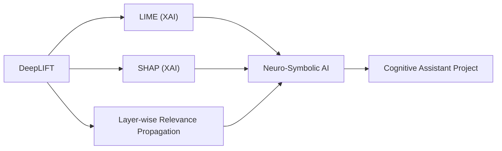

# DeepLIFT

## Origin

[[DeepLIFT]], or Deep Learning Important FeaTures, was developed to address the "black box" nature of neural networks by providing a method to decompose the output prediction of a neural network on a specific input. It was introduced by Avanti Shrikumar et al. in 2017 as a way to improve the interpretability of neural networks by backpropagating the contributions of all neurons in the network to every feature of the input.[^1][^2] [[DeepLIFT]] compares the activation of each neuron to its 'reference activation' and assigns contribution scores based on the difference, allowing it to reveal dependencies that might be missed by other approaches.[^3][^4]

The evolution of [[DeepLIFT]] has seen its application expand across various machine learning tasks, including classification and segmentation, with implementations available for frameworks like TensorFlow and Keras.[^4] Variants of [[DeepLIFT]] have also been integrated into other packages, such as [[SHAP]] and Captum, to support broader model types and incorporate concepts like Shapley values.[^4]

## Possibilities

### Expected Outcomes

#### Positive Outcomes

- **Enhanced Interpretability**: [[DeepLIFT]] provides detailed insights into how different features contribute to the predictions made by neural networks, enhancing model transparency and trustworthiness.[^3][^1]
- **Improved Model Performance**: By identifying important features, [[DeepLIFT]] can help in optimizing model performance by focusing on critical input features.[^2]
- **Better Decision-Making**: In applications where interpretability is crucial, such as healthcare or finance, [[DeepLIFT]] can aid in making informed decisions by understanding the basis of model predictions.[^4]

#### Negative Outcomes

- **Computational Complexity**: [[DeepLIFT]] requires additional computational resources to compute contribution scores, which can be a challenge for large models or real-time applications.[^4]
- **Overreliance on Reference Inputs**: The choice of reference inputs can significantly affect the results, potentially leading to misleading interpretations if not chosen appropriately.[^2]
- **Limited Generalizability**: [[DeepLIFT]] is primarily designed for deep neural networks and may not be directly applicable to other types of machine learning models.[^4]

## Actual Outcomes

### Positive Outcomes

- **MNIST Dataset Application**: DeepLIFT has been successfully applied to models trained on the MNIST dataset, providing insights into how different pixels contribute to digit recognition.[^1]
- **Genomic Data Analysis**: It has also been used in genomic data analysis to identify important genomic features contributing to specific predictions.[^2]

### Negative Outcomes

- **Misinterpretation in Complex Models**: In complex neural networks, the reliance on reference inputs can lead to misinterpretation if the reference does not accurately represent the baseline scenario.[^2]
- **Resource Intensive**: For large-scale models, the computational cost of running DeepLIFT can be prohibitive, limiting its use in real-time applications.[^4]

### Resonance

DeepLIFT resonates with other explainability techniques like LIME and SHAP, which also aim to provide insights into model predictions. It shares similarities with Layer-wise Relevance Propagation (LRP) but addresses limitations by considering activation differences rather than just gradients.[^2][^5] DeepLIFT's approach to feature importance can complement neuro-symbolic integration by enhancing transparency in neural components of hybrid models.

### Distinction

DeepLIFT is distinct from other explainability methods due to its focus on activation differences rather than gradients. However, it faces challenges from methods like SHAP, which incorporate Shapley values for more comprehensive feature attribution.[^4] Limitations include its model-specific nature and the need for appropriate reference inputs, which can be challenging to define in complex scenarios.[^4][^2]

## Summary

### Bloom's Taxonomy Table

| **Bloom's Layer** | **Description**                     | **Examples**               |
| ----------------- | ----------------------------------- | -------------------------- |
| Factual           | Basic facts and terminology         | DeepLIFT uses backpropagation to compare neuron activations.[^3] |
| Conceptual        | Relationships and overarching ideas | DeepLIFT enhances model interpretability by attributing feature importance.[^1] |
| Procedural        | Practical methods and processes     | Applying DeepLIFT to optimize model performance by focusing on critical features.[^2] |
| Metacognitive     | Reflective insights                 | Recognizing the impact of reference inputs on DeepLIFT results.[^2] |

### Integral Theory Table

| **Quadrant**        | **Key Elements/Insights**  |
| ------------------- | -------------------------- |
| Interior-Individual | Personal insights into model interpretability, enhancing trust in AI decisions. |
| Interior-Collective | Shared values emphasizing transparency and accountability in AI systems. |
| Exterior-Individual | Observable actions like using DeepLIFT to refine model performance. |
| Exterior-Collective | Organizational adoption of DeepLIFT for more transparent AI systems across industries. |

### Knowledge Expansion Table

| **Knowledge Item**        | **Description**                    | **Relevance/Relationship**                      |
| ------------------------- | ---------------------------------- | ----------------------------------------------- |
| [[xAI]]           | Local interpretability method       | Complementary to DeepLIFT in providing model insights. |
| [[SHAP]]           | Feature importance using Shapley values | Extends DeepLIFT with broader model support.[^4] |
| [[Layer-wise Relevance Propagation (LRP)]] | Feature attribution method        | Similarities with DeepLIFT in attributing feature importance.[^2] |

### Visualization

This visualization highlights DeepLIFT's connections to other explainability methods and its integration within neuro-symbolic AI frameworks, contributing to the development of more transparent and trustworthy cognitive assistants.
[^3] [^1] [^4] [^2] [^5]

## Project Link

[[AI Cognitive Assistant]]

[^1]: https://arxiv.org/abs/1704.02685
[^2]: https://mit6874.github.io/assets/misc/shrikumar-2.pdf
[^3]: https://neptune.ai/blog/explainability-auditability-ml-definitions-techniques-tools
[^4]: https://edwinwenink.github.io/ai-ethics-tool-landscape/tools/deeplift/
[^5]: https://towardsdatascience.com/explainable-neural-networks-recent-advancements-part-3-6a838d15f2fb/
