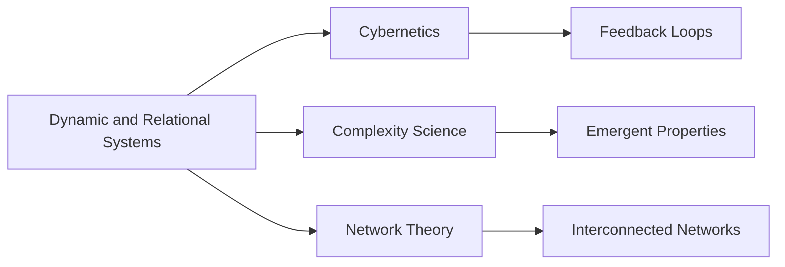

# Dynamic and Relational Systems

## Origin

### Immediate Circumstances

Dynamic and Relational Systems were initially conceptualized to address complex and interrelated behaviors within various environments, from ecosystems to social systems. The need for better models that could simulate interactions and changes over time spurred their development, primarily driven by limitations in understanding nonlinear and interconnected dynamics through traditional models.

### Evolution

The concept has evolved significantly since its inception. Early systems theories were expanded through the advancement of computational power, allowing for detailed simulations and analyses. Key milestones include the development of General Systems Theory by Ludwig von Bertalanffy in the mid-20th century and the integration of [[Cybernetics]] principles by Norbert Wiener, which laid the groundwork for understanding feedback loops and systemic relationships. These theories have broadened to encompass fields such as economics, urban planning, and [[AI]].

## Possibilities

### Expected Outcomes

#### Positive Outcomes

1. **Enhanced Decision-Making**: Implementing dynamic systems can improve strategic planning by providing insights into potential future scenarios. For example, urban planners leverage such systems to simulate traffic patterns under various conditions, leading to more effective infrastructure development.

2. **Ecosystem Management**: Conservation efforts benefit from relational system models that predict how changes in one species might affect others, facilitating more sustainable practices.

3. **Improved Communication**: Recognizing interdependencies within organizations can enhance understanding, leading to better collaboration and innovation.

#### Negative Outcomes

1. **Complexity Overload**: The intricate nature of dynamic and relational systems can lead to information overload, making interpretations challenging without proper expertise.

2. **Model Dependency**: Over-reliance on models without consideration for unexpected variables may result in flawed decisions, as seen in financial markets during economic crises.

## Actual Outcomes

### Positive Outcomes

1. **Environmental Conservation Success**: The Yellowstone National Park reintroduction of wolves demonstrated the system's impact, where changing a single species affected the entire ecosystem positively.

2. **Business Application Improvements**: Companies using relational models for supply chain management have noted efficiency boosts and reduced costs due to better demand forecasting and resource allocation.

### Negative Outcomes

1. **Economic Downfalls**: The 2008 financial crisis highlighted flaws in dynamic systems modeling, where assumptions failed to account for irrational human behavior, leading to significant global repercussions.

## Resonance

Dynamic and Relational Systems intersect with fields such as [[Cybernetics]], [[Complexity Science]], and [[Network Theory]]. These disciplines enhance understanding by exploring feedback loops, emergence, and interconnected networks, which provide a deeper insight into system behaviors.

## Distinction

Competing approaches include [[Linear Systems]] analysis, which often oversimplifies relationships by ignoring nonlinearity and interaction effects, potentially limiting insights. There are criticisms voiced regarding the over-complexification of systems which can sometimes lead to analysis paralysis.

# Summary

## Bloom's Taxonomy Table

| **Bloom's Layer**  | **Description**                            | **Examples**                         |
| ------------------ | ------------------------------------------ | ------------------------------------ |
| Factual            | Terminology of systems, feedback loops     | Terms like "nonlinear dynamics"       |
| Conceptual         | Relationships between system components    | Interactions within ecological models |
| Procedural         | Methods for systems modeling and analysis  | Use of simulations in urban planning  |
| Metacognitive      | Insights on assumptions and model limits   | Reflection on financial models        |

## Integral Theory Table

| **Quadrant**          | **Key Elements/Insights**                                   |
| --------------------- | ----------------------------------------------------------- |
| Interior-Individual   | Personal understanding of interconnectivity within systems  |
| Interior-Collective   | Cultural appreciation for [[Systems Thinking]] in sustainability |
| Exterior-Individual   | Adoption of systems tools, e.g., simulation software        |
| Exterior-Collective   | Institutional use of systems in policy and strategy         |

## Knowledge Expansion Table

| **Knowledge Item**        | **Description**                                    | **Relevance/Relationship**                          |
| ------------------------- | -------------------------------------------------- | --------------------------------------------------- |
| [[Cybernetics]]           | Study of systems, feedback, and control            | Enhances understanding of dynamic systems            |
| [[Complexity Science]]    | Examination of complex interactions                | Offers insights into emergent system properties      |
| [[Network Theory]]        | Analysis of networks and their properties          | Provides a framework for relational connections      |

## Visualization

This structure captures the evolution, applications, and impact of Dynamic and Relational Systems. It also outlines their alignment with frameworks like Bloom's Taxonomy and Integral Theory, providing a comprehensive understanding and potential uses in fields like environmental conservation, urban planning, and more.

# Project Link

[[Create Knowledge Management System]]
