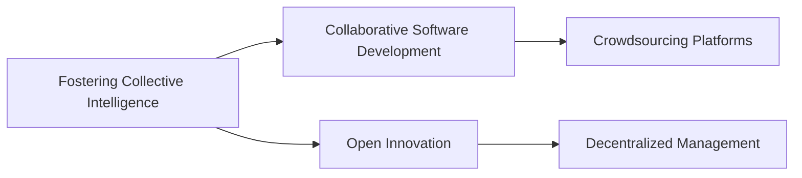

# Fostering Collective Intelligence

## Origin

**Immediate Circumstances and Purpose:**
The concept of **Fostering Collective Intelligence** emerged from the need to address complex, multifaceted problems that surpass individual problem-solving capabilities. Its inception is rooted in the idea that a group of individuals, when effectively coordinated, can achieve greater outcomes than any single member due to the diverse perspectives, experiences, and knowledge they bring. This approach seeks to harness the insights and skills of a collective to enhance decision-making, innovation, and efficiency.

**Evolution:**
Historically, collective intelligence can be linked to early human societies where collaboration and shared knowledge were integral for survival, such as in hunting tribes and early agricultural communities. As societies evolved, the concept expanded with the advent of the internet and digital technologies, facilitating global collaboration and real-time information sharing. Significant milestones include the creation of platforms like Wikipedia, which exemplifies collective intelligence through communal contributions and editing. Over time, its application has broadened, encompassing business, education, and governance sectors, and is foundational to modern approaches like crowdsourcing and open-source projects.

## Possibilities

**Expected Outcomes:**

1. **Positive Outcomes:**
	 - **Innovation and Creativity:** By leveraging collective intelligence, organizations can foster environments that encourage innovation. For example, companies like Google use interdisciplinary teams to spark creativity and develop cutting-edge technologies.
	 - **Enhanced Decision-Making:** Groups utilizing collective intelligence can often arrive at superior decisions due to diverse input. This is evident in open-source software projects like Linux, where collaboration leads to reliable software solutions.
	 - **Social and Community Benefits:** Communities utilizing collective intelligence, such as local councils employing citizen feedback platforms, enhance civic participation and responsiveness.

2. **Negative Outcomes:**
	 - **Groupthink Risks:** Without careful management, fostering collective intelligence can lead to conformity, stifling creativity and innovation. An example is how corporate environments sometimes fall into bureaucratic cycles that hinder innovative thinking.
	 - **Information Overload:** The constant influx of shared information can overwhelm systems, leading to inefficiencies if not properly managed. Organizations can face decision paralysis or misinformation due to unexamined collective inputs.

## Actual Outcomes

**Real Historical Events/Situations:**

1. **Positive Outcomes:**
	 - **Wikipedia's Success**: As a prime example of collective intelligence, Wikipedia demonstrates how open collaboration can create a vast, reliable knowledge repository that benefits society worldwide.
	 - **Crowdsourcing in Crisis Management**: Platforms like Ushahidi, used during the 2010 Haiti earthquake, show how collective efforts can effectively coordinate relief responses and resource allocation.

2. **Negative Outcomes:**
	 - **Dot-com Bubble (Late 1990s)**: Illustrates the dangers of unchecked collective enthusiasm leading to inflated market valuations, which ultimately resulted in significant financial losses.
	 - **Echo Chambers in Social Media**: Platforms can unintentionally foster environments that amplify biased information, as seen in misinformation spread during political events or health crises.

### Resonance

- **Interdisciplinary Collaboration:** Collective intelligence resonates with fields like [[Cognitive Science]], which examines how group dynamics influence problem-solving, and [[Organizational Psychology]], focusing on team structures and performance.
- **Participatory Cultures:** Related to work in [[Communities of Practice]] and [[Participatory Design]], enhancing engagement and shared ownership among members.

### Distinction

- **Alternative Approaches:** Competitors include the concept of [[Swarm Intelligence]], which specifically studies natural and artificial systems inspired by biological systems like ant colonies, and [[Decentralized Decision-Making]], which reduces reliance on centralized control.
- **Challenges and Limitations:** Critiques of collective intelligence highlight potential inefficiencies, where greater input does not always equate to better outcomes, and the risk of data privacy breaches in open environments.

## Summary

### Bloom's Taxonomy Table

| **Bloom's Layer**  | **Description**                            | **Examples**                                                                           |
| ------------------ | ------------------------------------------ | -------------------------------------------------------------------------------------- |
| Factual            | Basic facts and terminology                | Terms like "crowdsourcing," "groupthink," and "collective problem-solving"             |
| Conceptual         | Relationships and overarching ideas        | Relationship between team diversity and innovative outcomes                             |
| Procedural         | Practical methods and processes            | Techniques for integrating collective feedback, such as using consensus-building tools  |
| Metacognitive      | Reflective insights                        | Understanding the impact of shared knowledge systems on cultural development            |

### Integral Theory Table

| **Quadrant**        | **Key Elements/Insights**                                                       |
| ------------------- | ------------------------------------------------------------------------------- |
| Interior-Individual | Personal stories of enhanced creative insights during team collaborations       |
| Interior-Collective | Cultural significance of shared knowledge systems, like Wikipedia in education  |
| Exterior-Individual | Behavioral shifts in professionals using collaborative platforms                |
| Exterior-Collective | Organizations designing systems to harness collective intelligence efficiently  |

### Knowledge Expansion Table

| **Knowledge Item**                      | **Description**                                                                     | **Relevance/Relationship**                                       |
| --------------------------------------- | ----------------------------------------------------------------------------------- | ---------------------------------------------------------------- |
| [[Collaborative Software Development]]  | Involves distributed code development across diverse teams                          | Essential in understanding how technology facilitates collective intelligence |
| [[Open Innovation]]                     | Approach where firms use external and internal ideas to advance technology          | Explores the boundary-less collaboration that fosters collective creativity    |
| [[Holacracy]]                           | A method of decentralized management and organizational governance                  | Relevant for examining new ways to structure and govern collective environments  |

### Visualization

## Project Link

[[Create Knowledge Management System]]
