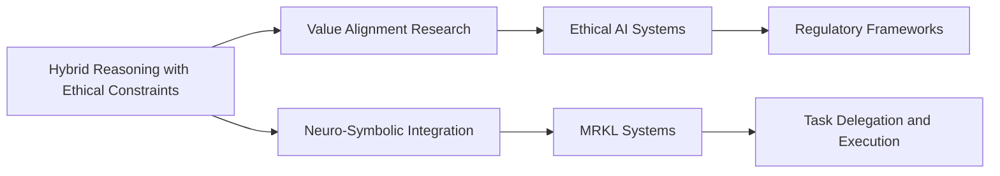

# Idea Generation with Hybrid Reasoning Connecting Abstract Concepts to Ethical Constraints

## Origin

The concept of **idea generation with hybrid reasoning connecting abstract concepts to ethical constraints** emerges from the intersection of **neuro-symbolic integration** and **value alignment research**. This approach aims to combine the strengths of neural networks and symbolic AI to enhance reasoning tasks, ensuring that generated ideas are ethically sound. The immediate circumstances driving this knowledge include the need for AI systems to make decisions that align with human values, addressing challenges like the **is-ought gap**—where empirical facts alone cannot justify ethical norms.[^1][^2]

Historically, this field has evolved from early **logic-based** and **machine learning ([[Machine Learning]])-based** value alignment systems. Logic-based systems use independently justified ethical principles, while [[Machine Learning]]-based systems rely on empirical data, which can be biased.[^1][^2] The hybrid approach integrates both, leveraging ethical reasoning and empirical observation to derive necessary conditions for ethical actions.[^2]

## Possibilities

### Expected Outcomes

#### Positive Outcomes

- **Enhanced Decision-Making**: By integrating ethical constraints, AI systems can generate ideas that are not only innovative but also aligned with societal values, enhancing decision-making in complex scenarios.
- **Improved Transparency**: Hybrid reasoning provides a clear framework for understanding how ethical decisions are made, promoting transparency and trust in AI systems.
- **Reduced Bias**: Incorporating ethical principles can mitigate biases inherent in ML-based systems, leading to more equitable outcomes.

#### Negative Outcomes

- **Complexity and Overfitting**: Integrating multiple reasoning systems can increase complexity, potentially leading to overfitting or inefficiencies in decision-making processes.
- **Ethical Dilemmas**: The challenge of defining universally accepted ethical principles can lead to dilemmas where different stakeholders have conflicting values.
- **Dependence on Data Quality**: The effectiveness of hybrid reasoning depends on the quality of both empirical data and ethical frameworks, which can be flawed or incomplete.

## Actual Outcomes

### Positive Outcomes

- **Ethical AI Systems**: Companies like **DeepMind** have worked on value alignment to ensure AI systems make decisions that reflect human ethics, enhancing trust and safety in AI applications.
- **Innovative Problem-Solving**: Hybrid reasoning has been applied in neuro-symbolic AI frameworks like **MRKL Systems**, enabling more effective task delegation and execution by aligning creative ideas with ethical guidelines.[^1][^3]

### Negative Outcomes

- **Misaligned Goals**: In some cases, AI systems may prioritize efficiency over ethical considerations, leading to unintended consequences, such as reinforcing existing biases or causing harm to certain groups.
- **Regulatory Challenges**: The complexity of integrating ethical constraints into AI decision-making processes poses challenges for regulatory frameworks, which must balance innovation with ethical oversight.

### Resonance

This knowledge item resonates with various disciplines:
- **Cognitive Architectures**: Frameworks like **SOAR** and **ACT-R** demonstrate how integrating ethical reasoning into cognitive models can enhance decision-making.
- **Value Alignment Research**: Efforts to align AI systems with human values highlight the importance of ethical constraints in AI development.

### Distinction

Competing ideas include:
- **Pure ML-Based Approaches**: These rely solely on empirical data and can lack ethical oversight, leading to biased outcomes.[^1]
- **Logic-Based Systems**: While these ensure ethical consistency, they may struggle with complex, dynamic environments without empirical input.[^2]

## Summary

### Bloom's Taxonomy Table

| **Bloom's Layer** | **Description**                     | **Examples**               |
| ----------------- | ----------------------------------- | -------------------------- |
| Factual           | Basic concepts of hybrid reasoning | Neuro-symbolic integration, value alignment |
| Conceptual        | Relationship between ethics and AI | Ethical constraints in AI decision-making |
| Procedural        | Methods for integrating ethics into AI | Hybrid reasoning frameworks, MRKL Systems |
| Metacognitive     | Reflecting on ethical implications of AI | Evaluating biases in AI systems, considering ethical dilemmas |

### Integral Theory Table

| **Quadrant**        | **Key Elements/Insights**  |
| ------------------- | -------------------------- |
| Interior-Individual | Personal reflections on AI ethics, e.g., considering the impact of AI decisions on personal values |
| Interior-Collective | Societal norms and shared values influencing AI development, such as emphasizing transparency and accountability |
| Exterior-Individual | Observable behaviors influenced by AI, e.g., using AI tools for ethical decision-making |
| Exterior-Collective | Larger structures impacted by AI ethics, such as regulatory frameworks and organizational policies |

### Knowledge Expansion Table

| **Knowledge Item**        | **Description**                    | **Relevance/Relationship**                      |
| ------------------------- | ---------------------------------- | ----------------------------------------------- |
| [[Value Alignment Research]] | Ensuring AI systems reflect human ethics | Directly related to integrating ethical constraints in AI |
| [[Neuro-Symbolic Integration]] | Combining neural networks with symbolic AI | Provides the foundational framework for hybrid reasoning |
| [[Cognitive Architectures]] | Theoretical models of human cognition | Offers structures for implementing ethical reasoning in AI systems |

### Visualization

This visualization illustrates how hybrid reasoning connects to key related concepts, highlighting its integration with value alignment and neuro-symbolic integration, and its applications in ethical AI systems and task delegation frameworks.
[^1] [^3] [^2] [^4] [^5]

## Project Link

[[AI Cognitive Assistant]]

[^1]: https://www.jair.org/index.php/jair/article/download/12481/26663/26209
[^2]: https://dl.acm.org/doi/pdf/10.1613/jair.1.12481
[^3]: https://www.youtube.com/watch?v=dmnVml_jbsQ
[^4]: https://forum.obsidian.md/t/wikilinks-in-yaml-front-matter/10052
[^5]: https://www.scitepress.org/Papers/2023/117045/117045.pdf
