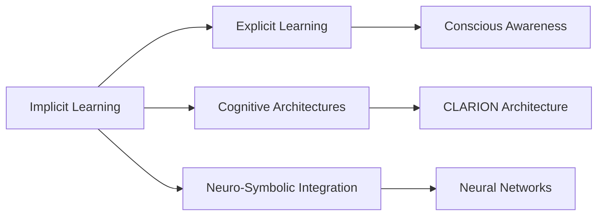

# Implicit Learning in Psychology

## Origin

**Implicit Learning** in psychology emerged as a concept to explain how individuals acquire complex information without conscious awareness. This type of learning has been studied extensively since the 1960s, particularly through paradigms like **artificial grammar learning** and **sequence learning**. The field has evolved significantly, with researchers like Arthur Reber contributing seminal work on implicit learning, which laid the groundwork for understanding unconscious learning processes.[^1][^2]

Historically, implicit learning has been a subject of debate due to its intangible nature and the difficulty in measuring unconscious processes. Despite these challenges, it has become a crucial area of study, especially in understanding cognitive functions that are preserved even in individuals with certain neurological disorders.[^3][^4]

## Possibilities

### Expected Outcomes

#### Positive Outcomes

- **Skill Acquisition**: Implicit learning facilitates the acquisition of complex skills, such as riding a bicycle or swimming, without explicit instruction.[^1]
- **Preserved Cognitive Function**: It helps individuals with mild neurocognitive disorders to continue learning and adapting.[^3]
- **Efficient Learning**: Implicit learning can be more efficient and less dependent on working memory compared to explicit learning.[^1][^2]

#### Negative Outcomes

- **Limited Transferability**: Knowledge gained through implicit learning may not transfer well to different contexts.[^1]
- **Difficulty in Verbalization**: Learners often cannot articulate the rules or patterns they have learned, which can hinder teaching or explaining processes.[^1][^2]
- **Dependence on Context**: Implicit learning is highly context-dependent, which may limit its applicability in new situations.[^1]

## Actual Outcomes

### Positive Outcomes

- **Language Acquisition**: Children often learn language rules implicitly, demonstrating how this process aids in complex pattern recognition without conscious effort.[^1]
- **Adaptation in Neurological Disorders**: Studies on amnesiac patients show that implicit learning remains intact despite impaired explicit memory, allowing for some skill acquisition and adaptation.[^1]

### Negative Outcomes

- **Misapplication in Stereotyping**: Implicit learning can contribute to the formation of stereotypes, as individuals may unconsciously absorb and reinforce societal biases.[^1]
- **Limited Awareness**: The inability to verbalize learned patterns can hinder problem-solving in certain situations, as individuals may not fully understand the rules they are applying.[^1][^2]

## Resonance

Implicit learning resonates with other disciplines by highlighting the role of unconscious processes in skill acquisition and cognitive function. It parallels concepts in **neuro-symbolic integration**, where neural networks (unconscious pattern recognition) and symbolic AI (conscious rule application) are combined to enhance reasoning tasks. Additionally, it aligns with **cognitive architectures** like **CLARION**, which models both implicit and explicit learning processes.

## Distinction

Implicit learning is distinct from explicit learning due to its unconscious nature and lack of verbalizable knowledge. Critiques argue that the existence of implicit learning is difficult to prove due to methodological challenges in measuring unconscious processes. However, its preservation in neurological disorders underscores its importance as a separate cognitive function.[^1][^2]

## Summary

### Bloom's Taxonomy Table

| **Bloom's Layer** | **Description**                     | **Examples**               |
| ----------------- | ----------------------------------- | -------------------------- |
| Factual           | Basic facts and terminology         | Definition of implicit learning, its historical development |
| Conceptual        | Relationships and overarching ideas | Comparison with explicit learning, role in skill acquisition |
| Procedural        | Practical methods and processes     | Artificial grammar learning, sequence learning paradigms |
| Metacognitive     | Reflective insights                 | Understanding limitations and applications in cognitive disorders |

### Integral Theory Table

| **Quadrant**        | **Key Elements/Insights**  |
| ------------------- | -------------------------- |
| Interior-Individual | Personal experiences of unconscious skill acquisition, such as learning to ride a bike |
| Interior-Collective | Cultural significance of implicit learning in language acquisition and social norms |
| Exterior-Individual | Observable behaviors resulting from implicit learning, like improved reaction times in sequence learning tasks |
| Exterior-Collective | Impact on educational systems and cognitive architectures that incorporate implicit learning processes |

### Knowledge Expansion Table

| **Knowledge Item**        | **Description**                    | **Relevance/Relationship**                      |
| ------------------------- | ---------------------------------- | ----------------------------------------------- |
| [[Explicit Learning]]    | Conscious learning with awareness   | Contrasts with implicit learning in terms of awareness and verbalization |
| [[Cognitive Architectures]] | Models of human cognition for AI systems | Incorporates implicit learning processes, such as in CLARION |
| [[Neuro-Symbolic Integration]] | Combines neural and symbolic AI for reasoning | Enhances understanding of implicit learning through neural networks |

### Visualization

This visualization illustrates how implicit learning connects to other key concepts in cognitive psychology and AI, highlighting its role in both cognitive architectures and neuro-symbolic integration.
[^1] [^3] [^2] [^4] [^5]

## Project Link

[[AI Cognitive Assistant]]

[^1]: https://en.wikipedia.org/wiki/Implicit_learning
[^2]: https://pubmed.ncbi.nlm.nih.gov/8165269/
[^3]: https://fiveable.me/key-terms/abnormal-psychology/implicit-learning
[^4]: https://fiveable.me/key-terms/cognitive-psychology/implicit-learning
[^5]: https://sfwork.com/implicit-learning
