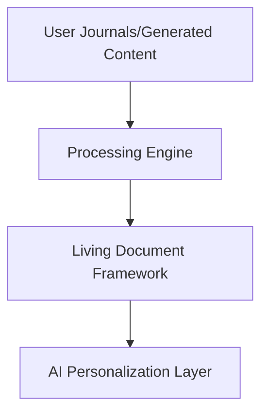
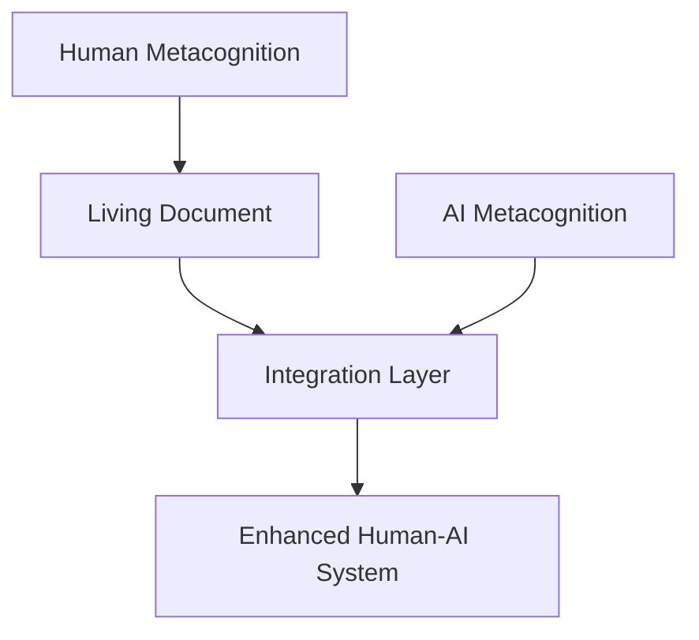

# The Theory of Integrated Human-AI Metacognitive Systems (IHAMS)

> [!Abstract]
The **Theory of Integrated Human-AI Metacognitive Systems ([[IHAMS]])** presents a novel framework for harmonizing human metacognitive strengths with artificial intelligence ([[AI]]) to address existing limitations in artificial metacognition. While [[AI]] systems excel at tasks like pattern recognition, scalability, and problem-solving, they lack crucial human elements such as subjective awareness, ethical reasoning, and meaning-making. [[IHAMS]] proposes filling these gaps by incorporating uniquely human elements into [[AI]] systems. A key innovation introduced in this framework is the **Living Document Approach**, which uses user-generated content, such as journals, creative works, and written reflections, to create a dynamic and personalized representation of the user's cognitive processes, values, and subjective experiences. This living document integrates seamlessly with [[AI]] systems, enabling them to tailor their interactions and guidance in alignment with the user's unique philosophy, growth trajectory, and context. By synthesizing concepts from psychology, cognitive science, and philosophy, [[IHAMS]] and the Living Document Framework provide a roadmap for building more adaptive, ethical, and meaningful [[human-AI]] collaborations.

---

## 1. Introduction

Artificial intelligence continues to transform the world, offering incredible advancements in automation, predictive analytics, and decision-making. Still, despite its remarkable capabilities, [[AI]] lacks core elements of human metacognition—those capacities that allow humans to reflect, adapt, create meaning, and grow as values-driven, self-aware agents. These unmet needs hinder [[AI]]'s ability to provide meaningful, personalized, and ethically nuanced support to its users.

This paper introduces the **Theory of Integrated Human-AI Metacognitive Systems ([[IHAMS]])**, a paradigm designed to address these gaps. [[IHAMS]] draws upon established concepts of metacognition from psychology (e.g., Flavell's study of self-monitoring), cognitive development (e.g., Piaget's theories of adaptation), and philosophical insights into personal growth (e.g., [[Nietzsche]]'s exploration of self-actualization and values). Building upon IHAMS, the **Living Document Approach** transforms journals, personal reflections, and other user-generated content into a rich, individualized document that informs AI systems. This enables them to reflect the user's unique values, goals, and growth trajectory, making interactions with AI more personalized, meaningful, and tailored to the user's inner world.

As technological systems play a growing role in education, healthcare, personal development, and more, IHAMS and the Living Document Approach offer a critical step forward: a way to humanize AI by aligning it more closely with the complexity of human thought, emotion, and life purpose.

---

## 2. Core Premises of IHAMS

### 2.1. Human Metacognitive Elements

Human metacognition reflects our ability to think about our thoughts, monitor our actions, and adapt our approaches in deliberate, reflective ways. These capacities are central to human self-awareness, problem-solving, and moral reasoning, encompassing:
1. **Self-awareness**: Reflection upon decisions, emotions, and internal conflicts.
2. **Empathy and emotional intelligence**: Navigating relationships and shared emotions.
3. **Moral reasoning and ethical judgment**: Evaluating actions in light of personal and societal values.
4. **Symbolic thinking**: Using abstract language to form complex ideas.
5. **Meaning-making and purpose**: Connecting experiences to broader existential narratives.
6. **Creativity and imagination**: Generating novel ideas and seeking innovative solutions.
7. **Adaptability and resilience**: Acclimating to uncertainty, change, and growth.

These capacities are dynamic and evolve as individuals confront life challenges, navigate internal conflicts, and grapple with external demands.

---

### 2.2. AI Metacognitive Limitations

Modern AI systems, despite their computational power and pattern-recognition capabilities, lack the following:
- **Self-awareness**: AI systems cannot introspect or understand themselves holistically.
- **Ethical reasoning**: AI struggles with navigating moral ambiguities, relying on preset ethical frameworks.
- **Subjective experience and meaning-making**: AI lacks intrinsic motivation and does not synthesize purpose or meaning.
- **Contextual and emotional understanding**: Capturing situational nuances is challenging without explicit data.

These barriers limit AI's capacity to align with human needs on a deep, personalized level.

---

### 2.3. The Living Document as a Bridge

The **Living Document Approach** is proposed as a bridge between human metacognitive elements and AI systems. By drawing on user-generated content—such as personal journals, creative writing, and other introspective works—the Living Document creates a personalized and dynamic reflection of the user's cognitive patterns, emotional landscape, and value hierarchies. AI systems use this continuously evolving document to guide interactions, making their responses more meaningful, contextually relevant, and true to the individual.

---

## 3. The Living Document Framework

### 3.1. Content Sources

Instead of relying on structured interview questions or surveys, the Living Document derives insights from:
1. **Personal Diaries/Journals**: Capturing authentic reflections on challenges, growth, and emotions.
2. **Creative Works**: Art, poetry, or stories providing unique perspectives and meaning-making efforts.
3. **Digital Communication**: Social media posts, blogs, or messages (with user consent) offering patterns of communication and reoccurring themes.
4. **Professional Contributions**: Notes, presentations, or documents reflecting competence and problem-solving.

### 3.2. Framework Questions and Insights

The Living Document integrates principles inspired by **Piaget** (cognitive development) and **Nietzsche** (self-realization). Key themes include:
- **Cognitive Structures**: How users think, adapt, and solve problems.
- **Developmental Journeys**: Experiences that shaped beliefs and values.
- **Driving Forces**: Ambitions, creativity, and emotional expression.
- **Meaning-Making**: Sources of purpose, coping mechanisms, and life goals.

#### Example Questions from the Living Document Framework

For example, a user might write regularly about key milestones or describe decision-making struggles in their journal. The Living Document processes this content, assigning insights (e.g., "prioritizes relationships over personal ambition") to categories like **value hierarchies** or **emotional intelligence**.

| **Category**          | **Question**                                                                                  |
|------------------------|----------------------------------------------------------------------------------------------|
| Cognitive Structure    | "How do you approach complex problems? What patterns do you notice in your environment?"     |
| Meaning-Making         | "What gives your life meaning? How do you integrate past suffering into your life story?"    |
| Personal Metamorphoses | "Which inherited values have you questioned or rejected? What personal freedoms matter most?"|
| Driving Forces         | "What are your most ambitious goals? How do you balance rational planning and spontaneity?"  |

### 3.3. Personal Philosophy Development

- Users answer structured questions from Piaget and Nietzsche-inspired categories (e.g., value hierarchies, meaning-making, and adaptation strategies).
- Insights are stored in the Living Document and serve as the foundation for personalized AI interaction.
- The AI tailors its responses, suggestions, and decisions based on the user's beliefs, values, and growth trajectory.

---

### 3.4. Metacognitive Complementarity with the Living Document

Humans and AI possess complementary cognitive capabilities. Humans contribute introspection, ethical reasoning, and contextual awareness, while AI offers computational power, scalable pattern recognition, and memory retention. The Living Document allows the AI system to "access" human insights without needing to replicate complex metacognitive processes.

### 3.5. Implementation in AI

The AI system uses the Living Document to:
1. Provide **customized assistance**, e.g., guiding an overwhelmed individual on how to regain life balance.
2. Offer **ethical decision-making support** aligned with personal beliefs.
3. Foster **personal growth** by surfacing recurring cognitive themes and suggesting reflective prompts for exploration.

---

## 4. Applications

The Living Document enables iterative self-reflection. Users can review and update their inputs, creating a feedback loop for personal growth. Simultaneously, the AI evolves in its ability to align with the user's perspective, fostering increasingly sophisticated and meaningful interactions.

1. **Personalized Healthcare**:
	 - A physician's Living Document includes their diagnostic preferences and ethical frameworks, enabling AI to offer suggestions tailored to their practice style.
2. **Education**:
	 - An educator's Living Document reflects teaching styles and values, allowing AI tools to provide recommendations for curriculum design aligned with their philosophy.
3. **Creative Collaboration**:
	 - An artist's reflections and creations feed the AI, enabling it to co-create works in alignment with the artist's evolving vision.
4. **Life Coaching**:
	 - Individuals use the Living Document to track growth, with the AI assistant offering personalized strategies to meet life goals.

---

## 5. Challenges and Ethical Considerations

### 5.1. Privacy and Security

- **Consent-Driven Content Use**: Users retain control, deciding what to share and how it is processed.
- **Data Protection**: Strong encryption safeguards sensitive user-generated content.

### 5.2. Overreliance on AI

- Users must view the AI as a collaborative tool, not a substitute for personal introspection or decision-making.

---

## 6. Future Directions

- **Enhanced Processing**: Increasing NLP sophistication to process rich, nuanced user-generated content.
- **Longitudinal Growth Insights**: Exploring how individuals evolve over time by analyzing updates to their Living Document.
- **Interdisciplinary Collaboration**: Partnering with psychologists and philosophers to refine frameworks and enhance ethical AI design.

---

## 7. Conclusion

The **Theory of Integrated Human-AI Metacognitive Systems (IHAMS)** enhanced by the **Living Document Approach** provides a framework for fostering meaningful collaboration between humans and AI. By leveraging journals, reflections, and creative works, the Living Document creates a personalized metacognitive profile that enables AI systems to adapt to the user's unique philosophy and developmental trajectory. This innovation represents a critical step toward creating AI systems that are not only intelligent but also deeply connected to the humanity of their users.
