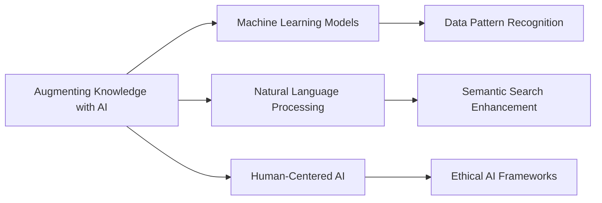

# Augmenting Knowledge with AI

## Origin

The concept of **Augmenting Knowledge with [[AI]]** emerged from a need to better manage the massive influx of information in the digital age. Initially, [[AI]] was integrated into knowledge management systems (KMS) to automate the sorting and retrieval of data, aiming to replace laborious manual efforts and to enhance the speed and accuracy of information delivery.

### Historical Evolution

- **1990s**: Primitive [[AI]] began assisting in data categorization and indexing, using rule-based systems.
- **2000s**: Development of [[Machine Learning]] algorithms allowed systems to learn from data patterns, enabling more sophisticated data handling and predictive analytics.
- **2010s**: The rise of natural language processing (NLP) and deep learning opened new frontiers for [[AI]] in KMS, with advancements in semantic search and personalized content delivery.
- **2020s**: [[AI]]'s role expanded to not only managing explicit knowledge but also facilitating the discovery and integration of tacit and implicit knowledge, aligning with the project goal of creating a living knowledge management system. This evolution exemplifies an integration of [[Knowledge Graphs]], [[Machine Learning Models]], and [[Natural Language Processing]] into more sophisticated AI-powered KMS.

## Possibilities

### Expected Outcomes

#### Positive Outcomes

- **Improved Efficiency**: [[AI]] can rapidly process information, significantly reducing the time required for data retrieval and decision-making.
- **Enhanced Insights**: [[AI]] systems can uncover patterns and correlations invisible to human analysis, providing deeper insights into complex issues.
- **Personalization**: Through [[AI]], systems can tailor content and recommendations based on user behavior and preferences, fostering a more engaging experience.
- **Scalability**: [[AI]]-driven systems can handle vast datasets, facilitating global, interconnected networks of knowledge sharing and management.

#### Negative Outcomes

- **Bias and Misinterpretations**: [[AI]] systems may perpetuate existing biases in data or create misleading correlations, impacting decisions adversely.
- **Over-reliance**: Dependency on [[AI]] could undermine critical thinking and human expertise, leading to potential misjudgments.
- **Privacy Concerns**: The use of personal data by [[AI]] systems raises ethical issues regarding user consent and data security.

## Actual Outcomes

### Positive Outcomes

- **Case of IBM Watson**: Deployed in the healthcare industry to assist in diagnosing diseases, demonstrating [[AI]]'s capability to synthesize vast medical knowledge and provide real-time support to practitioners.
- **Google's BERT Model**: Revolutionized search engines with its contextual understanding of language, improving information retrieval significantly, evidenced by more accurate search results.

### Negative Outcomes

- **Amazon Hiring Tool**: Amazon's AI recruiting tool, which showed bias against female candidates, illustrates the risk of perpetuating existing discrimination in [[AI]]-managed systems.
- **Microsoft Tay**: Microsoft's AI chatbot, which quickly began generating offensive content, emphasizes the risks associated with [[AI]] systems learning from unfiltered public interactions.

### Resonance

- The convergence with [[Data Science]] and [[Big Data Analytics]] highlights a symbiotic relationship, wherein [[AI]]-driven insights feed into larger datasets, enhancing predictive capabilities.
- Fields such as [[Cognitive Science]] and [[Organizational Behavior]] contribute to understanding how human-machine interaction can optimize knowledge management.

### Distinction

- Competing ideas include relying more heavily on human judgment ([[Human-Centered AI]]), emphasizing [[AI Ethics]] and interpretability when deploying [[AI]] in knowledge contexts.
- Gaps remain in addressing ethical concerns fully, requiring frameworks that govern [[AI]]'s application and its alignment with human values and rights.

## Summary

### Bloom's Taxonomy Table

| **Bloom's Layer** | **Description**                                       | **Examples**                                            |
|-------------------|-------------------------------------------------------|---------------------------------------------------------|
| Factual           | Core facts about [[AI]] and knowledge management          | Definitions of [[AI]], KMS, and [[Machine Learning]] algorithms |
| Conceptual        | How [[AI]] integrates with knowledge systems              | Use of NLP in improving search engines                  |
| Procedural        | Methods of deploying [[AI]] in KMS                        | Implementing [[AI]] for personalized content delivery       |
| Metacognitive     | Reflective insights on [[AI]]'s impact on cognition       | Analysis of [[AI]] bias and its socio-ethical implications  |

### Integral Theory Table

| **Quadrant**        | **Key Elements/Insights**                                                   |
|---------------------|-----------------------------------------------------------------------------|
| Interior-Individual | Personal experiences of enhanced learning through [[AI]]-augmented platforms    |
| Interior-Collective | Cultural shift towards accepting [[AI]] tools in everyday life                  |
| Exterior-Individual | Observable behavior changes, such as increased productivity with AI tools   |
| Exterior-Collective | Systemic changes, including widespread AI adoption in organizational models |

### Knowledge Expansion Table

| **Knowledge Item**          | **Description**                             | **Relevance/Relationship**                                        |
|-----------------------------|---------------------------------------------|-------------------------------------------------------------------|
| [[Human-Centered AI]]       | Focuses on aligning AI with human values    | Critical in addressing ethical concerns related to AI technologies|
| [[Machine Learning Models]] | Structures for training AI to recognize patterns | Core to developing AI capabilities in knowledge systems             |
| [[Natural Language Processing]] | AI's ability to understand human language        | Key to enhancing communication and information retrieval            |

### Visualization

This comprehensive analysis highlights how augmenting knowledge with AI intertwines technology and human values in a framework that both embraces the transformative power of AI and mitigates its inherent risks. The structured, layered approach enables an understanding of its potential benefits and pitfalls against a backdrop of innovative real-world applications.

## Project Link

[[Create Knowledge Management System]]
