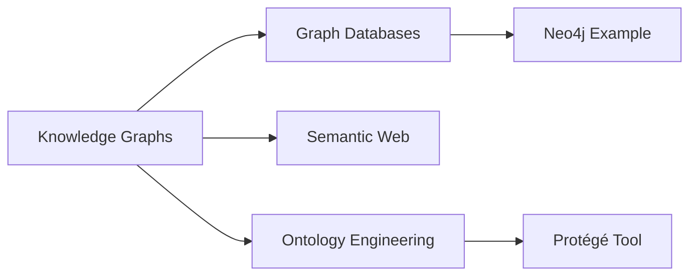

# Knowledge Graphs

## Narrative

### Origin

**Immediate Circumstances**:
Knowledge Graphs (KGs) emerged from the need to organize and represent data in a way that reflects real-world entities and their interrelationships. Google's 2012 introduction of its Knowledge Graph signaled a critical moment in KG development, aimed at enhancing search results by connecting facts, concepts, and relationships rather than relying solely on keyword matching. This addressed the problem of fragmented and siloed information retrieval, enabling a shift toward semantic understanding and contextual relevance in data systems.

**Evolution**:
The concept of Knowledge Graphs evolved from earlier work in fields like [[Semantic Web]], [[AI]], and [[Ontology Engineering]]. Milestones include:
- Tim Berners-Lee's vision of a "web of data" (2001), which laid the groundwork for semantic technologies.
- [[Ontology]] standards such as [[RDF]] (Resource Description Framework) and [[OWL]] (Web [[Ontology]] Language), enabling structured data representation.
- Google's Knowledge Graph popularizing the term by surfacing direct answers to user queries with entities like "Leonardo da Vinci" linked to attributes such as his works ("Mona Lisa").
Over time, KGs expanded beyond search engines into domains like healthcare, finance, e-commerce, and more—driving advancements in [[Natural Language Processing]] ([[NLP]]), recommendation systems, and intelligent applications.

---

### Possibilities

#### Expected Outcomes

##### Positive Outcomes

1. **Improved Search & Discovery**: KGs enhance information retrieval by providing contextually relevant results across domains. Google Search's ability to answer questions directly from its KG is an illustrative example.
2. **Enhanced Decision-Making**: In healthcare, KGs like IBM Watson Health's use of structured medical knowledge improve diagnosis accuracy by connecting symptoms to possible conditions or treatments.
3. **Personalization & Recommendations**: Platforms like Spotify or Netflix leverage KGs for personalized recommendations by linking user preferences with related content.
4. **Data Integration Across Silos**: Organizations use KGs to unify disparate datasets—examples include AstraZeneca's biomedical KG integrating research insights across pharmaceuticals.
5. **Accelerated Research & Innovation**: Academic KGs such as [[Open Research Knowledge Graph]] foster collaboration by linking scientific publications based on shared concepts or methodologies.

##### Negative Outcomes

1. **Bias Amplification**: Errors or biases in source data can propagate through KGs; for instance, biased training data can lead to skewed recommendations or misinterpretation of facts.
2. **Privacy Risks**: Aggregating personal data into linked structures raises risks if sensitive information is exposed or misused—imagine a financial institution's KG inadvertently revealing confidential customer links.
3. **High Complexity & Maintenance Costs**: Building and maintaining accurate KGs demands expertise in [[Ontology]] design, continuous updates, and computational resources.
4. **Misapplication Risks**: Poorly designed graphs can lead to incorrect conclusions or inefficient systems—for example, mismatched relationships could hinder automated decision-making processes.

---

#### Actual Outcomes

##### Positive Outcomes

1. Google Search's Knowledge Graph revolutionized internet search by moving from keywords to entity-based search—answering questions directly instead of just listing links.
2. Amazon's product recommendation system utilizes a KG connecting items with metadata (e.g., "people who bought X also bought Y"), significantly boosting sales conversions.
3. Siemens uses industrial knowledge graphs for predictive maintenance in manufacturing plants—reducing downtime through improved machine diagnostics.

##### Negative Outcomes

1. Facebook's Social Graph faced criticism when improperly leveraged during the Cambridge Analytica scandal—a case where relationship mapping between users was exploited for unauthorized political profiling.
2. In 2020, biases were found embedded within OpenAI's GPT models connected to knowledge graphs; inappropriate associations led to ethical concerns over [[AI]]-generated outputs.

---

### Resonance

Knowledge Graphs share conceptual roots with other technologies in [[Graph Theory]], [[Databases]], [[Machine Learning]], and [[Semantic Networks]]. For instance:
- They complement graph databases like [[Neo4j]] or [[AWS Neptune]] through their ability to query interconnected datasets efficiently using [[SPARQL]] protocols.
- They enhance NLP models by providing structured contexts for ambiguous terms—for example, distinguishing "Java" as an island versus programming language.

---

### Distinction

Competing approaches include traditional relational databases that rely on tabular schemas versus graph-based approaches favoring adaptability and scalability for unstructured relationships ([see Relational Databases vs Knowledge Graphs](https://example.com)). Challenges also arise when contrasting symbolic reasoning within KGs against purely statistical models favored in deep learning approaches—a debate between explainability versus performance trade-offs persists across AI design philosophies.

---

## 2. Summary Section

### Bloom's Taxonomy Table

| **Bloom's Layer** | **Description**               | **Examples/Insights**                                      |
| ----------------- | ----------------------------- | ---------------------------------------------------------- |
| Factual           | Basic terminology             | Entities (nodes), Relationships (edges), RDF triples       |
| Conceptual        | Overarching ideas             | Linking structured/unstructured data; [[Semantic Web]]     |
| Procedural        | Practical tools/methodologies | [[SPARQL]] queries; [[Ontology]] design using [[Protégé]]  |
| Metacognitive     | Reflection on impact          | Realizing how bias/errors propagate across linked datasets |

---

### Integral Theory Table

| Quadrant                 | Key Elements/Insights                                                                              |
|--------------------------|---------------------------------------------------------------------------------------------------|
| Interior-Individual      | Personal insights gained from using tools like Google Search powered by knowledge graphs         |
| Interior-Collective      | Shared cultural adoption seen with Wikipedia integrating Wikidata                                 |
| Exterior-Individual      | Users interacting with recommendation engines built on Amazon/Netflix-like graph structures       |
| Exterior-Collective      | Organizational integration via enterprise-level knowledge graphs unifying disparate datasets      |

---

### Knowledge Expansion Table

| Knowledge Item                 | Description                                      | Relevance/Relationship                                  |
|---------------------------------|--------------------------------------------------|--------------------------------------------------------|
| [[Graph Databases]]             | Specialized databases optimized for graph models.| Core technology underlying practical implementations   |
| [[Semantic Web]]                | Web standards enabling machines to understand web content.| Foundational concept behind semantic KGs              |
| [[Ontology Engineering]]        | Design process for formalizing domain-specific vocabularies.| Central technique for structuring KG schemas         |

---

## 3.Visualization

## Project Link

[[Create Knowledge Management System]]
