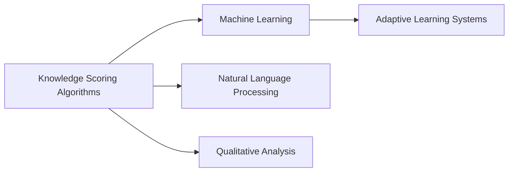

# Knowledge Scoring Algorithms

## Origin

### Immediate Circumstances

Knowledge Scoring Algorithms emerged from the need to effectively manage and evaluate the vast amounts of information generated in the digital age. Their creation was driven by the necessity to organize knowledge systematically, assigning value to information based on various factors such as relevance, reliability, and impact. Initially, these algorithms aimed to address the problem of information overload by filtering significant worth from the extraneous noise.

### Evolution

Knowledge Scoring Algorithms have evolved considerably since their inception. Originally deployed in academic settings to assess educational content and student performance, they have now expanded into multiple industries, including corporate sectors, online education platforms, and digital content management systems. Over time, milestones such as the integration of [[Machine Learning]] and [[Natural Language Processing]] have refined these algorithms, allowing them to handle complex datasets and adapt to changing informational contexts, resulting in more nuanced and personalized knowledge scoring systems.

## Possibilities

### Expected Outcomes

#### Positive Outcomes

1. **Enhanced Knowledge Discovery**: These algorithms prioritize information based on value, improving accessibility and comprehension for both individuals and organizations.
2. **Improved Decision Making**: By providing a structured view of valuable insights, they facilitate better strategic planning and innovation in businesses and educational institutions.
3. **Societal Contributions**: Encourage the sharing and dissemination of high-quality information, promoting informed public discourse and decision-making.

#### Negative Outcomes

1. **Bias and Subjectivity**: Poorly designed algorithms can reinforce existing biases, leading to skewed representations of knowledge.
2. **Over-reliance**: Dependence on algorithms may reduce critical thinking and discernment, as users might accept algorithmic outputs without question.
3. **Privacy Concerns**: The data required for these algorithms can raise issues about personal privacy and data security.

## Actual Outcomes

### Positive Outcomes

- **Corporate Performance**: Companies using knowledge scoring algorithms, like [[Google]]'s PageRank, have seen substantial improvements in data management, leading to enhanced productivity and strategic capabilities.
- **Educational Enrichment**: In online learning platforms such as [[Coursera]] and [[EdX]], algorithm-driven content personalization has led to improved student engagement and learning outcomes.

### Negative Outcomes

- **Algorithmic Bias**: Instances such as biased hiring tools in recruitment or skewed recommendation systems on social media platforms highlight the risks of unchecked algorithmic bias.
- **Data Misuse**: Facebook's past controversies involving data breaches illustrate the negative outcomes arising from the misuse of data in algorithm development.

### Resonance

Knowledge Scoring Algorithms share resonant principles with areas like [[Machine Learning]], [[Natural Language Processing]], and information theory, where data valuation and prioritization play crucial roles. Similar methodologies in [[Adaptive Learning Systems]] enhance personalized education by evaluating learning efficacy.

### Distinction

Alternative approaches such as [[Qualitative Analysis]] or human-centered design challenge the over-dependence on purely algorithmic scoring, advocating for hybrid models that incorporate human judgment and contextual nuances for more balanced and ethical outcomes.

## Summary

### Bloom's Taxonomy Table

| **Bloom's Layer** | **Description**                     | **Examples**               |
| ----------------- | ----------------------------------- | -------------------------- |
| Factual           | Basic facts and terminology         | Scoring criteria, algorithm design |
| Conceptual        | Relationships and overarching ideas | Integration with [[AI]]/ML, data impact |
| Procedural        | Practical methods and processes     | Algorithm implementation, evaluation techniques |
| Metacognitive     | Reflective insights                 | Critical thinking on biases, ethical considerations |

### Integral Theory Table

| **Quadrant**        | **Key Elements/Insights**  |
| ------------------- | -------------------------- |
| Interior-Individual | Personal empowerment in managing knowledge |
| Interior-Collective | Cultural shifts towards data-driven decision-making |
| Exterior-Individual | Observable changes in user behavior and engagement |
| Exterior-Collective | Evolution of organizational knowledge structures |

### Knowledge Expansion Table

| **Knowledge Item**        | **Description**                    | **Relevance/Relationship**                      |
| ------------------------- | ---------------------------------- | ----------------------------------------------- |
| [[Qualitative Analysis]]  | Analyzing data using non-numeric insights | Complements algorithmic scoring by providing context |
| [[Machine Learning]]      | Algorithms that improve from experience | Underlies many knowledge scoring systems |
| [[Natural Language Processing]] | Analyzing and synthesizing language data | Enhances understanding and contextualization in scoring |

### Visualization

---

## Project Link

[[Create Knowledge Management System]]
