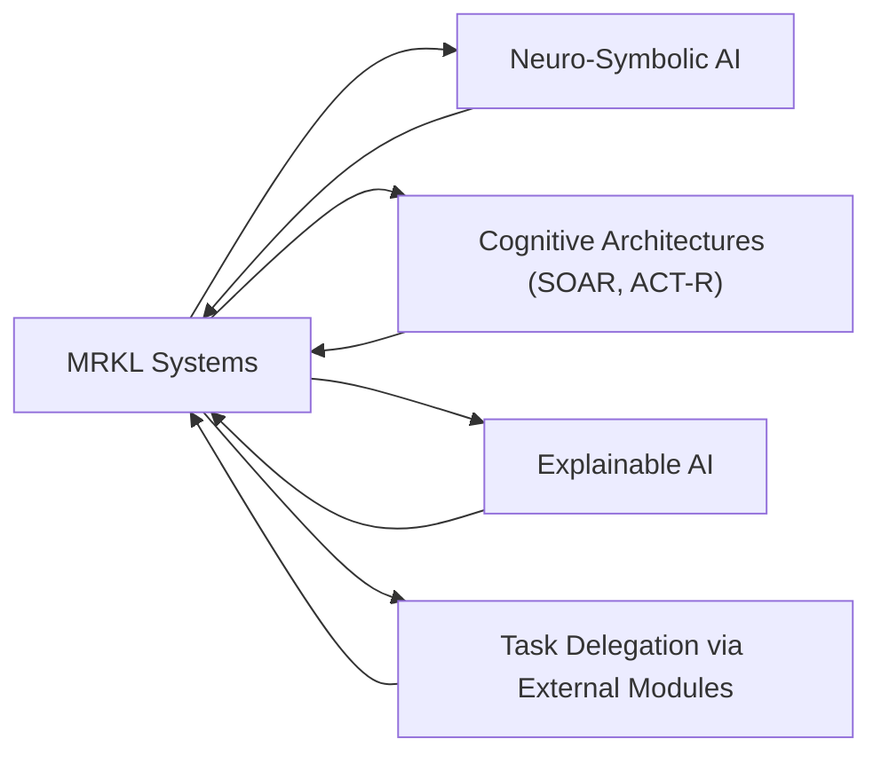

# MRKL Systems: A Unified Navigation Framework for Hybrid AI Reasoning

## Unified Narrative

### Core Insights and Thematic Interrelations

[[MRKL]] (Modular Reasoning, Knowledge, and Language) systems are an advanced neuro-symbolic architecture designed to augment large language models (LLMs) by integrating external tools, databases, and computational modules. The primary motivation behind [[MRKL]]'s development is to overcome the intrinsic limitations of LLMs, particularly their factual inaccuracies, lack of structured reasoning, and inability to perform specialized tasks requiring external real-time data.

The evolution of [[MRKL]] systems from simple tool-assisted automation to complex multi-module coordination highlights a broader shift in [[AI]]: from monolithic deep learning models to hybrid frameworks that combine statistical pattern recognition with rule-based reasoning. [[MRKL]] accomplishes this by acting as a **routing system**, determining whether a given task should be handled by the [[LLM]], a symbolic [[AI]] module, or an external tool (e.g., APIs, domain-specific calculators).

This modular approach reflects deeper themes in [[AI]] research, emphasizing:
- **Hybrid Reasoning Approaches**: Bridging neural networks and symbolic systems to enhance problem decomposition and structured decision-making.
- **Modular Extensibility**: Enabling flexibility by adding or upgrading modules without requiring complete model retraining.
- **Explainability and Reliability**: By delegating tasks to well-defined external components, [[MRKL]] fosters system transparency and reduces the risk of erroneous inference propagation.

Despite these advantages, [[MRKL]] systems face significant **integration challenges**. The modular interactions must be carefully designed to prevent compatibility issues, avoid excessive processing overheads, and ensure smooth inter-module communication. Additionally, reliance on external APIs introduces security risks and potential points of failure, making **resilience engineering** a crucial aspect of [[MRKL]] adoption.

Emerging variations, such as **[[MRKL]] for task delegation** and **MRKL-style routing**, further contextualize the real-world utility of this architecture. Task delegation involves using LLMs primarily as orchestration agents that assign problems to specialized tools, while routing systems enhance [[AI]]'s adaptability by allowing real-time information retrieval. These implementations reinforce MRKL's role in facilitating **cognitively structured workflows**, particularly for applications in intelligent assistants, automated research, and real-time data analysis.

MRKL systems do not exist in isolation but are deeply intertwined with **neuro-symbolic AI paradigms** such as:
1. **Neuro-Symbolic Concept Learners (NSCL)** – which blend statistical learning with symbolic reasoning for visual and linguistic tasks.
2. **Cognitive Architectures (SOAR and ACT-R)** – which model human cognitive processes using structured problem-solving logic.
3. **Explainable AI (XAI)** – which enhances transparency in AI decisions, fostering trust and interpretability.
4. **API-Driven AI Design** – ensuring seamless interaction between LLMs and specialized knowledge bases.

The fundamental shift enabled by MRKL is **the transition from static LLM outputs to dynamic, module-mediated reasoning**, allowing AI systems to operate with **structured cognition rather than mere linguistic pattern generation**. Future refinements will likely focus on optimizing module selection logic, reducing architectural complexity, and improving real-time error handling.

---

## Organized Summaries via Tables

### Bloom's Taxonomy: MRKL System Knowledge Structure

| **Bloom's Layer** | **Description**                     | **Examples from MRKL Systems**               |
|------------------|-----------------------------------|--------------------------------------------|
| **Factual**     | Basic terminology, definitions   | MRKL integrates LLMs with symbolic reasoning and external knowledge databases. |
| **Conceptual**  | Relationships between concepts   | MRKL's modularity enhances explainability, reliability, and adaptability in AI. |
| **Procedural**  | Implementation and methodologies | Task delegation via MRKL routing; query execution by assigned modules. |
| **Metacognitive** | Critical analysis and reflection | Evaluating trade-offs of modular AI (flexibility vs. system complexity). |

---

### Integral Theory: Broader Implications of MRKL

| **Quadrant**            | **Key Elements/Insights** |
|-------------------------|--------------------------|
| **Interior-Individual** | Users interact with MRKL-enhanced AI for improved information retrieval and decision-making. |
| **Interior-Collective** | MRKL contributes to the shift towards hybrid AI paradigms, combining neural and symbolic reasoning. |
| **Exterior-Individual** | MRKL-powered systems exhibit modular behavior for structured task delegation, enhancing reliability. |
| **Exterior-Collective** | MRKL's impact extends to industry-wide advancements in AI explainability, security, and augmentation. |

---

### Knowledge Expansion Table: Related AI and Cognitive Science Theories

| **Knowledge Item**        | **Description & Relation to MRKL**                           | **Relevance to Future Research** |
|-------------------------|-------------------------------------------------|----------------------------------|
| **Neuro-Symbolic AI** | Merges neural networks with rule-based symbolic reasoning. | Enhancing MRKL's multi-step, logical reasoning. |
| **Cognitive Architectures** | Theories like SOAR and ACT-R model structured human cognition. | Insights into how MRKL can simulate human-like structured thought. |
| **Explainable AI (XAI)**  | Improves AI system interpretability and accountability. | Enhancing MRKL transparency for debugging and ethical AI. |
| **API Integration** | Ensures AI tools access real-time data dynamically. | Optimizing MRKL performance by refining routing efficiency. |

---

## Emergent Relationships with Visualizations

### MRKL's Positioning Within AI Knowledge Structures

This visualization highlights MRKL's role as a bridge between neural learning, symbolic reasoning, modular task delegation, and AI explainability — reinforcing its position as a **central architecture enabling hybrid AI**.

---

## Actionable Framework/Guide for Applying MRKL Knowledge

### Practical Implementation: Designing an MRKL Application

#### Steps for Development

1. **Define the Goal**: Determine whether the MRKL system will be used for **task delegation, real-time retrieval, decision-making augmentation**, or all three.
2. **Identify Core Modules**: Select which external tools (APIs, symbolic AI, domain calculators) will be necessary.
3. **Develop Routing Logic**: Design a flexible router capable of delegating queries intelligently.
4. **Ensure Explainability**: Align with XAI principles to ensure module outputs are traceable.
5. **Optimize Integration**: Address API failures, security concerns, and data synchronization.
6. **Evaluate Performance**: Test for efficiency, redundancy support, and reasoning accuracy.

---

### Future Research Directions

- **Evolving Routing Heuristics**: How can MRKL's decision-making be optimized for better efficiency?
- **Adaptive Module Selection**: Can MRKL dynamically reconfigure itself based on historical data patterns?
- **Security & Privacy in External API Calls**: How to mitigate risks in integrating proprietary or sensitive data?
- **Human-AI Co-Creation**: How can MRKL's reasoning augment user decision-making instead of just acting autonomously?

---

### Real-World Relevance

| **Industry**          | **Application of MRKL**                          |
|---------------------|------------------------------------------------|
| **Finance**        | Automated financial analytics using API-driven real-time stock market monitoring. |
| **Healthcare**     | MRKL-assisted diagnosis by routing medical questions to specialized databases. |
| **Legal Research** | AI-powered legal assistants querying past case precedents dynamically. |
| **Scientific Discovery** | MRKL-fueled ChemCrow for chemical synthesis planning. |

---

## Conclusion: The Function of MRKL as an AI Evolutionary Step

Rather than replacing LLMs, MRKL functions as a **modular intelligence augmentation layer**, mitigating the drawbacks of standalone neural networks. By combining **reasoning, task delegation, and real-time knowledge access**, MRKL moves AI towards **structured cognitive processing**—paving the way for **next-generation explainable, modular, and hybrid AI architectures**.

---
This synthesized framework provides a **practical roadmap and theoretical grounding for MRKL research**, ensuring its ongoing adaptability and refinement in AI-driven applications.
[^1] [^2] [^3] [^4] [^5] [^6] [^7] [^8] [^9]

[^1]: https://www.topbots.com/overcoming-the-limitations-of-large-language-models/
[^2]: https://www.youtube.com/watch?v=vJ1yfvIV_no
[^3]: https://lilianweng.github.io/posts/2023-06-23-agent/
[^4]: https://pure.tudelft.nl/ws/portalfiles/portal/158132282/3571884.3604313.pdf
[^5]: https://learnprompting.org/docs/agents/mrkl
[^6]: https://www.ibm.com/architectures/hybrid/genai-mrkl
[^7]: https://www.nownextlater.ai/Insights/post/making-ai-more-useful-and-reliable-with-modular-systems-mrkl
[^8]: https://learnprompting.org/docs/agents/mrkl
[^9]: https://pinocchat.com/mrkl-explained/
