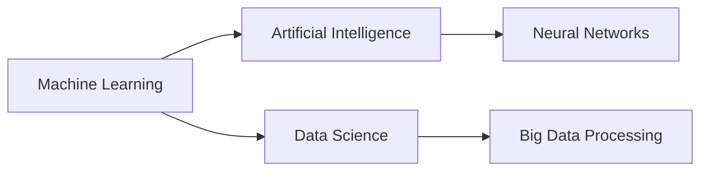

# Machine Learning

## Origin

Machine Learning ([[Machine Learning]]) emerged from the field of [[AI|Artificial Intelligence]], with the purpose of creating systems that can learn from data and improve over time autonomously. Its origins can be traced back to the early 1950s when researchers sought to understand whether computers could be taught to think like humans. Arthur Samuel is credited with pioneering the term "machine learning" in 1959 through his work on a program that played checkers, which became better as it played more games.

Over time, [[Machine Learning]] has evolved significantly, driven by increasing computational power, the availability of large datasets, and theoretical advancements. Key historical milestones include the development of [[neural networks]] in the 1980s, the advent of [[support vector machines]] in the 1990s, and the rise of [[Deep Learning]] frameworks in the 2010s, which facilitated breakthroughs in image and speech recognition tasks.

## Possibilities

### Expected Outcomes

**Positive Outcomes:**
- **Automation and Efficiency:** ML enables the automation of routine tasks, leading to increased productivity in industries such as manufacturing, healthcare, and finance.
- **Personalization:** Enhanced user experiences through personalized recommendations in e-commerce (e.g., [[Amazon]], [[Netflix]]) and personalized medicine.
- **Innovation:** Accelerates scientific research and discovery, notably in drug development and climate modeling.

**Negative Outcomes:**
- **Bias and Discrimination:** [[Machine Learning]] systems can inherit or amplify biases present in training data, leading to unfair decisions, especially in areas like criminal justice and hiring.
- **Privacy Concerns:** The vast amount of data required can infringe on individual privacy rights if not handled with appropriate safeguards.
- **Economic Disruption:** Potential job displacement in sectors heavily affected by automation, leading to socioeconomic disparities.

## Actual Outcomes

### Positive Outcomes

1. **Healthcare Advancements:** ML has been pivotal in diagnosing diseases such as cancer through imaging techniques, leading to earlier detection and better patient outcomes.
2. **Financial Market Predictions:** Firms use ML algorithms to recognize market patterns and make predictive trading decisions, improving investment returns.

### Negative Outcomes

1. **Facial Recognition:** Instances of racial bias in ML-powered facial recognition systems have led to false arrests and privacy violations in surveillance.
2. **Algorithmic Trading Failures:** Flash crashes, like the 2010 event, demonstrated the potential for ML algorithms to act unpredictably in high-frequency trading contexts.

### Resonance

Machine Learning shares parallels with fields such as [[Data Science]], [[Statistics]], and cognitive sciences. Concepts like pattern recognition and predictive analytics are foundational across these disciplines. In cognitive sciences, understanding human learning processes contributes to the design of more intuitive ML models, enhancing AI-human interaction.

### Distinction

Machine Learning can be contrasted with [[Rule-Based Systems]], which rely on a pre-defined set of rules rather than data-driven learning. Rule-based systems are limited by their inflexibility, whereas ML systems thrive on adaptability. Despite its promise, ML faces challenges like interpretability—the "black box" nature of complex models remains a major critique, necessitating advances in explainable AI.

## Summary

### Bloom's Taxonomy Table

| **Bloom's Layer** | **Description**                               | **Examples**                                       |
| ----------------- | --------------------------------------------- | -------------------------------------------------- |
| Factual           | Core facts and terminology of [[Machine Learning]]   | Definition of algorithms like [[neural networks]], [[supervised learning]], etc. |
| Conceptual        | Relationships and overarching ideas of data processing  | Interaction with other fields like [[Data Science]] and [[Statistics]]. |
| Procedural        | Practical methods and tools used in [[Machine Learning]]| Implementation of ML models using [[TensorFlow]], [[PyTorch]]. |
| Metacognitive     | Reflective insights on ML's impact and potential          | Evaluating ethical implications and long-term societal effects. |

### Integral Theory Table

| **Quadrant**        | **Key Elements/Insights**                                                      |
| ------------------- | ------------------------------------------------------------------------------ |
| Interior-Individual | Personal impact of ML: A data scientist's journey using ML for cancer research. |
| Interior-Collective | The cultural shift: Public's changing perception on privacy due to ML capabilities.|
| Exterior-Individual | Skills influenced: A stock trader's adaptation to using ML in decision-making. |
| Exterior-Collective | Institutional change: How healthcare systems integrate ML for predictive analytics. |

### Knowledge Expansion Table

| **Knowledge Item**              | **Description**                                                         | **Relevance/Relationship**                                        |
| ------------------------------- | ----------------------------------------------------------------------- | ----------------------------------------------------------------- |
| [[AI\|Artificial Intelligence]] | Broader field encompassing ML, aiming to automate intelligent behavior. | ML is a subset focusing on learning from data automatically.      |
| [[Data Science]]                | Interdisciplinary field about extracting knowledge from data.           | ML provides the algorithms and models for analysis in this field. |

### Visualization

---

## Project Link

[[Create Knowledge Management System]]
