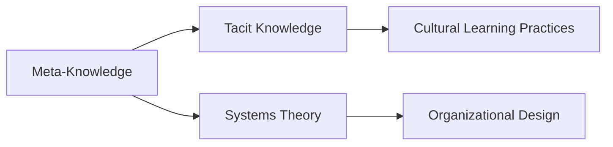

# Meta-Knowledge Analysis in the Context of Knowledge Management

## Origin

Meta-knowledge, or knowledge about knowledge, is an essential concept in the field of knowledge management. It emerged from the need to effectively manage the growing complexity of information encountered in modern environments, offering a way to understand and categorize knowledge by its nature and function. The concept finds its roots in [[Epistemology]], the philosophical branch concerned with the nature and scope of knowledge. This framework helps in understanding not just what knowledge is, but how it is acquired, validated, and utilized.

### Evolution

The importance of meta-knowledge has increased significantly with the rise of digital technology and information overload. Key milestones in its evolution include the development of expert systems in artificial intelligence (AI), where meta-knowledge is used to improve learning efficiency by understanding how knowledge is structured and processed. Additionally, in educational spheres, meta-knowledge informs approaches to teaching that prioritize learning how to learn. Over time, the application of meta-knowledge has expanded from philosophical debates to practical applications across various sectors, including corporate, educational, and technological domains.

## Possibilities

### Expected Outcomes

**Positive Outcomes:**
- **Enhanced Decision-Making**: Understanding meta-knowledge leads to better decision-making by contextualizing information, allowing for the prioritization of relevant data.
- **Improved Learning Processes**: By fostering an awareness of one's own knowledge systems, individuals can improve their learning efficiency and adaptability.
- **Innovation and Creativity**: A deeper insight into knowledge structures can spur innovation by identifying gaps and opportunities for creative thinking.

**Negative Outcomes:**
- **Complexity and Misapplication**: Over-reliance on meta-knowledge may lead to analysis paralysis, where one is overwhelmed by the constant evaluation of information.
- **Misinterpretation Risks**: If misapplied, meta-knowledge can result in flawed assumptions or conclusions due to misunderstood meta-cognitive assessments.

## Actual Outcomes

### Positive Outcomes

**Real-World Example**: In the domain of AI, meta-knowledge significantly contributes to developing adaptive learning systems, enabling technologies to refine their learning models over time for better accuracy and performance.

### Negative Outcomes

**Real-Life Situation**: In organizational settings, misinterpretation of meta-knowledge has sometimes led to misguided strategies. For instance, when firms neglect actionable insights in favor of theoretical understanding, it can delay decision-making processes and stifle agility.

### Resonance

Meta-knowledge aligns with several disciplines, enhancing their effectiveness. In psychology, it intersects with [[metacognition]], offering insights into human thinking processes. In education, it informs pedagogical strategies that focus on learning methodologies. Further, it complements [[Systems Theory]] by emphasizing the interconnectedness and structure of knowledge systems.

### Distinction

While some argue against the practicality of meta-knowledge, highlighting the complexity it adds to knowledge management, others propose alternatives like [[Tacit Knowledge]] focus, which emphasizes intuitive judgments and experiential learning. A critique often faced is its abstract nature, which in some contexts might detract from direct applications or tangible results.

## Summary

### Bloom's Taxonomy Table

| **Bloom's Layer** | **Description**                     | **Examples**                                              |
| ----------------- | ----------------------------------- | --------------------------------------------------------- |
| Factual           | Basic facts and terminology         | Meta-knowledge, metacognition, [[Epistemology]]               |
| Conceptual        | Relationships and overarching ideas | Relation to learning, decision-making, and AI adaptation  |
| Procedural        | Practical methods and processes     | Implementing learning strategies based on meta-awareness  |
| Metacognitive     | Reflective insights                 | Understanding personal learning processes for improvement |

### Integral Theory Table

| **Quadrant**        | **Key Elements/Insights**                                        |
| ------------------- | ---------------------------------------------------------------- |
| Interior-Individual | Personal reflection on one's understanding and awareness of knowledge |
| Interior-Collective | Cultural emphasis on lifelong learning and knowledge sharing     |
| Exterior-Individual | Practicing meta-cognitive strategies in educational systems      |
| Exterior-Collective | Organizational structures that support knowledge sharing and innovation |

### Knowledge Expansion Table

| **Knowledge Item**        | **Description**                    | **Relevance/Relationship**                      |
| ------------------------- | ---------------------------------- | ----------------------------------------------- |
| [[Tacit Knowledge]]       | Understanding unarticulated knowledge | Complements by exploring unstructured knowledge realms |
| [[Systems Theory]]        | Examines interrelationships within systems | Aligns with meta-knowledge in [[Systems Thinking]] |

### Visualization

---

By understanding meta-knowledge within the framework of Bloom's Taxonomy and Integral Theory, this analysis aids in creating a living knowledge management system. Such a system is vital for navigating the knowledge/meaning crisis by ensuring that knowledge is meaningful and actionable, ultimately fostering a culture of wisdom and innovation.

## Project Link

[[Create Knowledge Management System]]
