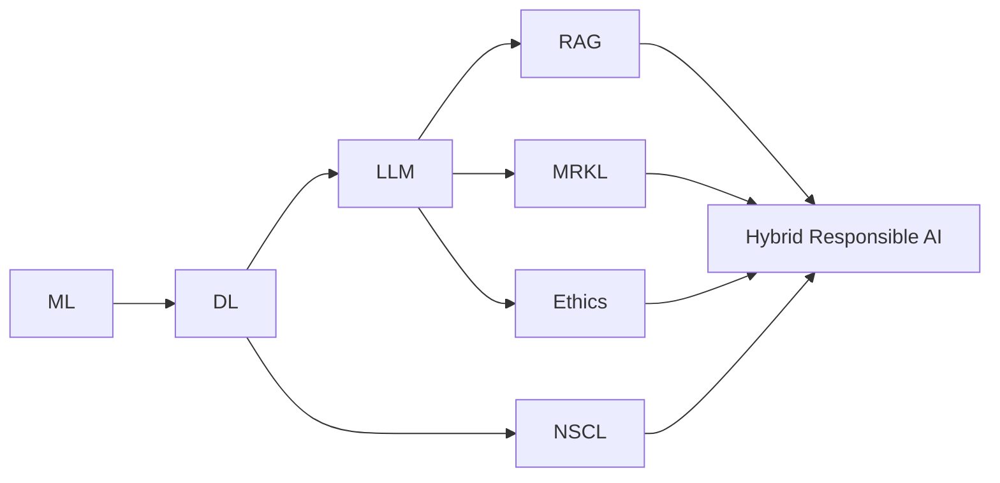
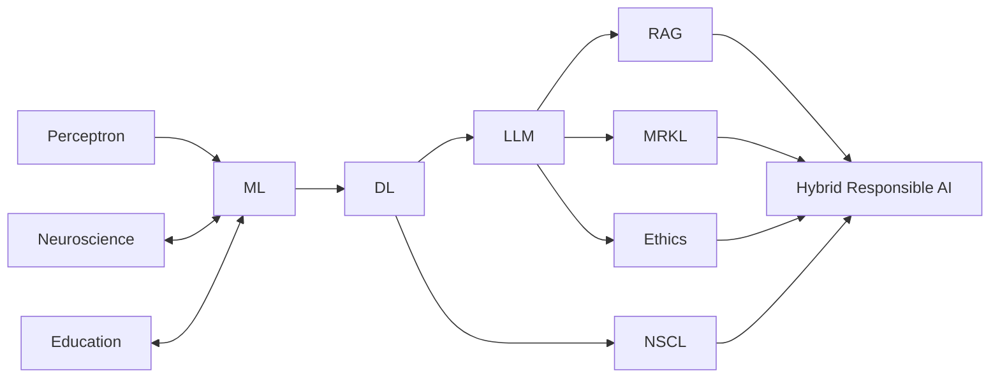
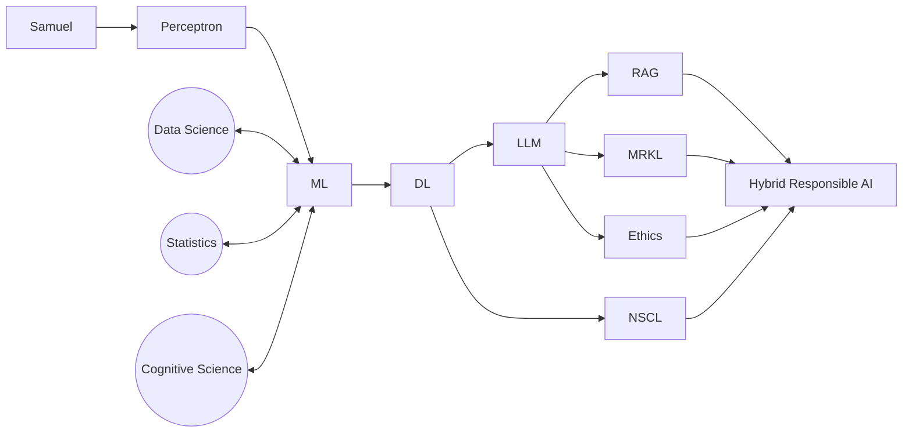
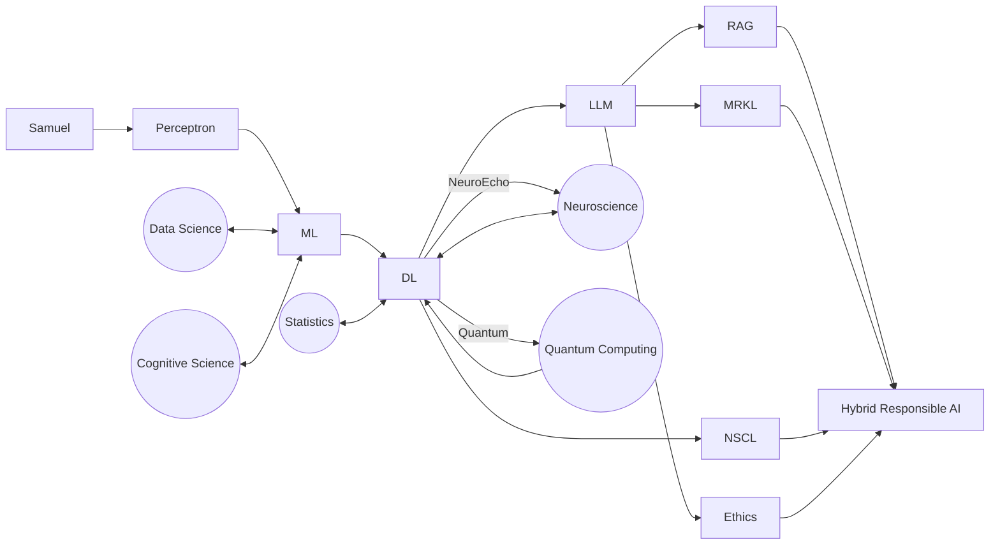
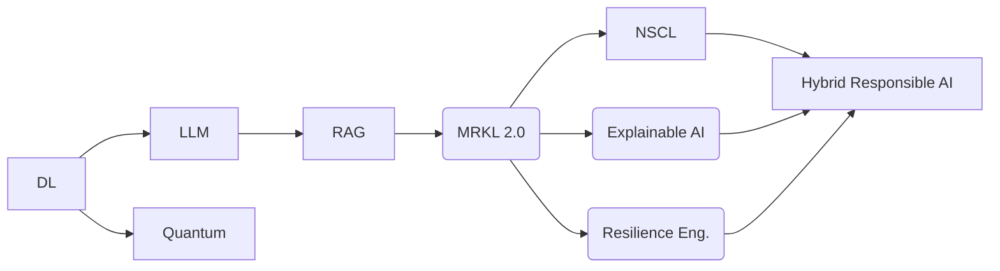
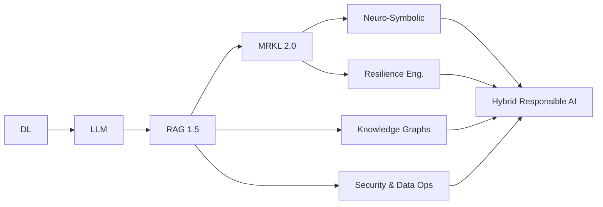
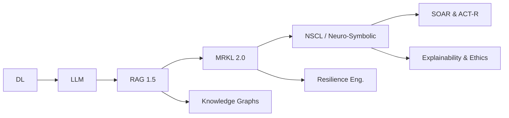

[[Modern AI Systems From Machine-Learning Foundations to Hybrid Reasoning Chain]]

# Modern AI Systems (Refined 2024): From Machine-Learning Foundations to Hybrid, Responsible Reasoning

*(Machine Learning ▸ Deep Learning ▸ Large-Language Models ▸ RAG ▸ MRKL ▸ NSCL)*

------------------------------------------------------------------------------

## 1. Unified Narrative — Now with Historical Lineage & Societal Lens

Artificial-intelligence progress can still be read as a layered stack, but the "LLM layer" now deserves a richer back-story and a sharper discussion of real-world impact and ethics.

1. Machine Learning (ML) – 1980-2000s
	 Data-driven pattern discovery via algorithms such as decision trees, SVMs, k-means, Q-learning. Hand-crafted features and careful data engineering dominate.

2. Deep Learning (DL) – 2010-2017
	 Multi-layer neural nets (CNN, RNN, Transformer) automate feature learning. Scale + data + GPUs beat manual engineering in vision, speech, translation.

3. Large-Language Models (LLMs) – 2018-present
	 ROOTS: decades of NLP, word-embeddings (Word2Vec, GloVe), then the 2017 Transformer and 2019 BERT, which proved self-supervised pre-training could create a reusable language backbone.
	 EVOLUTION: GPT-2/3/4, PaLM, Llama-2 scale parameters → emergent abilities (code gen, chain-of-thought).
	 IMPACT: deployed into Google Search (BERT ranker), GitHub Copilot, ChatGPT. Productivity gains and knowledge access explode, but so do hallucinations, misinformation, plagiarism, and labour-market anxieties.
	 ETHICS: bias, privacy, copyright, academic integrity—LLMs sit at the crossroads of AI-Ethics and Data-Science practice.

4. Retrieval-Augmented Generation (RAG) – 2021-
	 Mitigates LLM staleness and hallucination by grounding generation in freshly-retrieved documents. Combines vector search (FAISS, Pinecone) with prompt-time synthesis. Opens enterprise use cases (legal, medical, internal knowledge).

5. MRKL (Modular Reasoning, Knowledge & Language) – 2022-
	 The LLM becomes a router: "Should I answer, call Wolfram, query SQL, or invoke a logic engine?" Improves factuality and transparency; introduces new engineering concerns (tool security, orchestration latency).

6. NSCL (Neuro-Symbolic Concept Learner) – research frontier
	 Tight fusion of neural perception with symbolic program execution. Yields explicit reasoning traces over visual or structured scenes, aiming for both generalisation and explainability.

Trajectory Synopsis
Data-driven learning → representation learning → large-scale generative ability → grounded, tool-augmented, ethically-aware reasoning agents.

------------------------------------------------------------------------------

## 2. Conceptual Overview (updated)

| Stack Layer | Core Ideas | Key Methods | Representative Deployments | Open Technical & Ethical Challenges |
|-------------|------------|-------------|----------------------------|-------------------------------------|
| Machine Learning | Patterns from data, classic algorithms | Gradient descent, decision trees, SVM, k-means, Q-learning | Fraud detection, recommendation, predictive maintenance | Data bias, feature drift, interpretability |
| Deep Learning | Automatic feature learning, hierarchical reps | CNN, RNN, Transformer, large-batch optimisation | ImageNet vision, speech-to-text, autonomous driving | Energy use, adversarial attacks |
| Large-Language Models | Self-supervised pre-training; Transformer; scaling laws | BERT fine-tuning, GPT prompting, RLHF | Google Search (BERT), ChatGPT, Copilot, translation | Hallucination, misinformation, copyright, academic integrity, job-shift |
| Retrieval-Augmented Generation | Ground text in external evidence | Embed-index-retrieve, chunking, re-ranking, in-context citations | Enterprise Q&A, news assistants, policy chatbots | Source quality, retrieval attacks, latency |
| MRKL / Tool-Augmented Agents | LLM as planner/router across tools | Function-calling, API wrappers, symbolic solvers | Data-analysis agents, code-exec tutors | Tool reliability, security, cost |
| NSCL / Neuro-Symbolic | Neural perception + symbolic reasoning | Scene graphs, program induction, logic executors | Visual QA over CLEVR, robotics task planning | Scalability, continuous learning, knowledge update |
| Cross-Cutting Ethics & Governance (new) | Responsible AI, transparency, societal impact | Model cards, bias audits, red-teaming, regulatory compliance | AI policy docs, audit logs, content filters | Standardisation, global regulation, value alignment |

------------------------------------------------------------------------------

## 3. Interconnections Across Topics (expanded)

Textual Map (→ builds upon / enables):
ML → DL → LLMs ⇒ (societal-impact) Ethics
LLMs → RAG (factual grounding)
LLMs → MRKL (tool use)
DL → NSCL (neuro-symbolic fusion)
RAG, MRKL, NSCL → Hybrid, Responsible AI

Mermaid quick-view

------------------------------------------------------------------------------

## 4. Actionable Framework / Guided Learning Path (minor additions)

Step 0 – Ethical Foundations (pre-work)
	- Read "A Short Introduction to AI Ethics" or IEEE Ethically Aligned Design.
	- Install bias/trace-logging tools (e.g., LangChain tracer, SHAP) in all later projects.

1. Foundations (Weeks 1-4) – unchanged.
2. Representation Learning (Weeks 5-8) – unchanged.
3. Large-Language Models (Weeks 9-11)
	 - Trace historical lineage from Eliza → Word2Vec → Transformer → BERT.
	 - Exercise: measure hallucination rate on custom prompts; discuss mitigation.

4. Retrieval-Augmented Generation (Weeks 12-13) – unchanged.
5. Modular / Tool-Using Agents (Weeks 14-15) – unchanged.
6. Neuro-Symbolic Reasoning (Weeks 16-18) – unchanged.

Compliance & Governance Checkpoints (new)
	✓ After each milestone, run bias audit.
	✓ Log and version datasets & prompts; attach model cards.

------------------------------------------------------------------------------

## 5. Key Papers & References (augmented)

- "BERT: Pre-training of Deep Bidirectional Transformers for Language Understanding" – Devlin et al., 2019
- "Scaling Laws for Neural Language Models" – Kaplan et al., 2020
- "RLHF: Training Language Models to Follow Instructions" – Ouyang et al., 2022
- plus earlier list (Goodfellow15, Vaswani17, Lewis20, Mao19, etc.)

------------------------------------------------------------------------------

By weaving the historical emergence of LLMs and their ethical-societal ramifications into the original scaffold, this updated summary guides learners from core algorithms all the way to building responsible, hybrid AI systems that are both powerful and accountable.

# Modern AI Systems (Refined 2024.2)

From Early Perceptrons to Hybrid, Responsible Reasoning Agents
*(Classic ML ▸ Deep Learning ▸ LLMs ▸ RAG ▸ MRKL ▸ NSCL)*

------------------------------------------------------------------------------

## 1. Unified Narrative — Now With Deeper Historical Roots & Societal Feedback Loops

Artificial-intelligence progress is still best viewed as a layered stack, yet each layer now carries a story that begins earlier and radiates farther into society.

1. Proto–Machine Learning — 1950-1979
	 - Rosenblatt's Perceptron (1958) proves machines can learn linear decision rules.
	 - Statistical pattern-recognition (k-NN, least-squares, logistic-regression) provides transparent baselines still vital in regulated settings.

2. Classic Machine Learning — 1980-2009
	 - Multilayer-perceptrons (back-prop, 1986), decision trees, SVMs, k-means, Q-learning.
	 - Data engineering + handcrafted features dominate.
	 Impact snapshot → Netflix Prize (2009) & fraud detection.
	 Cautionary tale → Cambridge Analytica: micro-targeting shows how data + ML can undermine democratic processes.

3. Deep Learning — 2010-2017
	 - Hierarchical feature learning via CNN, RNN, (later) Transformer.
	 - Enabled by ImageNet-scale data and GPUs.
	 - Successes: vision, speech, AlphaGo; set the stage for self-supervised pre-training.
	 Ethical headwinds: energy consumption, adversarial attacks.

4. Large-Language Models — 2018-present
	 Roots: Word2Vec → GloVe → Transformer → BERT.
	 Evolution: GPT-2/3/4, PaLM, Llama-2; RLHF unlocks instruction-following.
	 Real-world: ChatGPT, Copilot, Google Search ranker.
	 Societal impact: productivity surge vs. hallucination, plagiarism, job displacement.
	 Ethics: bias, privacy, copyright; audit tooling (model cards, red-teaming) becomes mandatory.

5. Retrieval-Augmented Generation (RAG) — 2021-
	 LLM + vector search = fresher, evidence-linked answers; fuels enterprise knowledge bots, policy explainers, medical triage assistants.

6. MRKL / Tool-Augmented Agents — 2022-
	 LLM acts as planner: route to SQL, Wolfram, code-exec.
	 Challenges: tool sandboxing, latency, cost.

7. Neuro-Symbolic Concept Learner (NSCL) — research frontier
	 Neural perception fused with program execution for explainable, generalisable reasoning.

Trajectory Synopsis
Linear perceptrons → feature-engineering ML → representation-learning DL → generative & self-supervised LLMs → grounded (RAG), tool-using (MRKL), neuro-symbolic (NSCL) agents governed by responsible-AI practices.

------------------------------------------------------------------------------

## 2. Conceptual Overview

| Stack Layer | Core Ideas | Key Methods | Representative Deployments | Illustrative Positives | Illustrative Negatives |
|-------------|------------|-------------|----------------------------|-----------------------|------------------------|
| Proto-ML | Learnable linear separators | Perceptron rule | Early character recognition | Proof that learning is possible | Limited expressivity |
| Classic ML | Patterns from data, manual features | Decision trees, SVM, k-means | Netflix Prize, credit-scoring | Better forecasts, efficiency | Data drift, opacity |
| Deep Learning | Hierarchical feature learning | CNN, RNN, Transformer | AlphaGo, speech-to-text | Breakthrough accuracy | Adversarial attacks, energy use |
| Large-Language Models | Self-supervised pre-training; scaling laws | BERT fine-tune, GPT prompt, RLHF | ChatGPT, Copilot | Knowledge access, coding boost | Hallucination, copyright |
| Retrieval-Augmented Generation | Ground answers in evidence | Embed-index-retrieve, re-rank | Legal/medical Q&A, enterprise search | Factuality, freshness | Retrieval attacks, latency |
| MRKL / Tool Agents | LLM as planner/router | Function calling, API orchestration | Code tutors, analytics bots | Transparency, capability | Tool security, cost |
| Neuro-Symbolic | Neural + symbolic reasoning | Scene graphs, program induction | CLEVR-based VQA, robotics | Explainability, transfer | Scalability, update lag |
| Cross-Cutting Ethics & Governance | Privacy, bias, oversight | Model cards, bias audits, data governance | IBM Watson oncology audits, GDPR reports | Trust, compliance | Regulatory gaps, global inequality |

------------------------------------------------------------------------------

## 3. Interconnections & New Cross-Disciplinary Echoes

New edges (⟷) added in bold.

- ML ⟶ DL ⟶ LLM ⟶ RAG / MRKL / Ethics
- DL ⟶ NSCL
- **ML ⟷ Neuroscience** (computational metaphors)
- **ML ⟷ Education** (adaptive tutoring)
- **Statistical Models ⟷ ML** (interpretability trade-offs)

Mermaid quick-view (updated)

------------------------------------------------------------------------------

## 4. Actionable Framework / Guided Learning Path

Step 0 – Ethical & Privacy Foundations (pre-work)
	- Read "A Short Introduction to AI Ethics" + OECD AI Principles.
	- Set up bias, privacy, and data-lineage logging (e.g., OpenAI Policy Analyzer, LangChain tracer).

1. Proto & Classic ML (Weeks 1-3)
	 - Perceptron lab → visualise decision boundaries.
	 - Case study: Cambridge Analytica – identify where governance failed.

2. Representation Learning (Weeks 4-6)
	 - Implement CNN for CIFAR-10; profile energy use.

3. Large-Language Models (Weeks 7-9)
	 - Build a mini-BERT; measure hallucination & bias.

4. Retrieval-Augmented Generation (Weeks 10-11)
	 - Enterprise doc-bot with vector store; evaluate citation precision.

5. Tool-Augmented Agents (Weeks 12-13)
	 - Create finance-analysis agent; enforce sandboxed code exec.

6. Neuro-Symbolic Reasoning (Weeks 14-16)
	 - Combine visual parser + Prolog for CLEVR-style tasks.

Compliance & Governance Checkpoints
	✓ After each phase: run bias/privacy audit, update model card, record energy metrics.

------------------------------------------------------------------------------

## 5. Key Papers & References (expanded)

- Rosenblatt, "The Perceptron," 1958
- Rumelhart et al., "Learning representations by back-propagating errors," 1986
- Devlin et al., "BERT," 2019
- Kaplan et al., "Scaling Laws," 2020
- Ouyang et al., "RLHF," 2022
- Mialon et al., "RAG Survey," 2023
- Schwartz et al., "Green AI," 2020
- Bommasani & al., "Foundation Models," 2021

------------------------------------------------------------------------------
By extending the timeline back to the Perceptron era and threading in concrete societal wins (IBM Watson) and missteps (Cambridge Analytica), this revision grounds modern AI achievements in their historical, ethical, and cross-disciplinary contexts—while preserving the practical learning scaffold for building the next generation of responsible, hybrid AI systems.

# Modern AI Systems (Refined 2024.3)

From Early Perceptrons & Samuel's Checkers to Hybrid, Responsible Reasoning Agents
*(Proto-ML ▸ Classic ML ▸ Deep Learning ▸ LLMs ▸ RAG ▸ MRKL ▸ Neuro-Symbolic)*

------------------------------------------------------------------------------

## 1. Unified Narrative — Now With Arthur Samuel, Data-Centric Echoes & Stronger Society/Tech Feedback Loops

AI progress is still best pictured as a layered stack whose layers now reach farther back (early 1950s) and connect more tightly to neighbouring fields (statistics, data-science, cognitive science). Each tier shows both technical milestones and socio-economic reverberations.

1. Proto–Machine Learning — 1950-1979
	 - Samuel's Checkers Program (1956-59)--first self-improving game‐AI; coined the term "machine learning."
	 - Rosenblatt's Perceptron (1958) → learnable linear separators proved possible.
	 - Statistical pattern-recognition (k-NN, logistic reg.) ties ML to classical statistics; transparency remains valuable for regulated use-cases.

2. Classic Machine Learning — 1980-2009
	 - Multilayer perceptrons (back-prop 1986), decision trees, SVMs, k-means, Q-learning.
	 - Data-engineering & manual features dominate; birth of "Data Science."
	 Impact → Netflix Prize (2009), fraud detection, Samuel-style self-play in TD-Gammon (1994).
	 Cautionary tales → Cambridge Analytica micro-targeting; 2010 Flash-Crash from high-frequency ML trading.

3. Deep Learning — 2010-2017
	 - CNN, RNN, Transformer; enabled by ImageNet, GPUs, large datasets.
	 - Breakthroughs: vision, speech, AlphaGo; energy & carbon-cost debate surfaces ("Green AI").
	 - Adversarial attacks & black-box critique launch Explainable-AI (SHAP, LIME) movement.

4. Large-Language Models — 2018-present
	 - BERT, GPT 2/3/4, PaLM, Llama-2; RLHF unlocks instruction-following & policy alignment.
	 - Apps: ChatGPT, Copilot, search re-ranking, low-code assistants.
	 Societal impact: productivity jumps vs. hallucination, plagiarism, job displacement.
	 Ethics: bias (e.g., facial-recognition mis-identifications), copyright; model-card & red-team audits become table-stakes.

5. Retrieval-Augmented Generation (RAG) — 2021-
	 - LLM + vector search → fresher, source-linked answers for enterprise knowledge bases, legal/medical triage.
	 Risk: retrieval attacks (prompt-injection), latency.

6. MRKL / Tool-Augmented Agents — 2022-
	 - LLM plans and routes queries to SQL, Wolfram, code-exec; drives analytics and tutoring bots.
	 - Security & cost management (sandboxing) become architectural priorities.

7. Neuro-Symbolic Concept Learner (NSCL) — frontier
	 - Neural perception + program execution delivers compositional, explainable reasoning; used in CLEVR-style VQA, robotics.
	 - Challenges: scaling, ontology upkeep.

Trajectory Synopsis
Samuel's self-learning checkers → Rosenblatt→ feature-engineering ML → representation-learning DL → generative/self-supervised LLMs → grounded (RAG), tool-using (MRKL), neuro-symbolic agents, all governed by responsible-AI practices.

------------------------------------------------------------------------------

## 2. Conceptual Overview (Expanded)

| Stack Layer | Core Ideas | Key Methods | Representative Deployments | Illustrative Positives | Illustrative Negatives |
|-------------|------------|-------------|----------------------------|-----------------------|------------------------|
| Proto-ML | Data-driven self-improvement | Samuel's self-play, Perceptron rule | Checkers AI, early OCR | Proof learning is possible | Limited expressivity |
| Classic ML | Pattern extraction w/ manual features | Decision trees, SVM, k-means | Netflix prize, credit scoring | Better forecasts, efficiency | Flash-crash, opacity |
| Deep Learning | Hierarchical representation learning | CNN, RNN, Transformer | AlphaGo, speech-to-text | State-of-the-art accuracy | Energy use, adversarial attacks |
| Large-Language Models | Scale & self-supervised pre-train | BERT, GPT, RLHF | ChatGPT, Copilot | Knowledge access, code boost | Hallucination, facial-recog bias |
| Retrieval-Aug. Gen. | Ground output in evidence | Embed→Retrieve→Re-rank | Legal/medical Q&A, doc-bots | Factuality, freshness | Retrieval attacks, latency |
| MRKL / Tool Agents | LLM as planner-router | Function calling, APIs | Analytics bots, code tutors | Transparency, flexibility | Tool security, cost |
| Neuro-Symbolic | Neural + symbolic reasoning | Scene graphs, program induction | CLEVR VQA, robotics | Explainability, transfer | Scalability, update lag |
| Cross-Cutting Ethics & Governance | Privacy, bias mitigation, XAI | Model cards, SHAP, data-gov | GDPR compliance dashboards | Trust, auditability | Regulatory gaps, global inequality |

------------------------------------------------------------------------------

## 3. Interconnections & New Cross-Disciplinary Echoes

New edges (⟷) in bold.

- Proto-ML ⟶ Classic ML ⟶ DL ⟶ LLM ⟶ RAG / MRKL / Ethics
- DL ⟶ NSCL
- **ML ⟷ Data Science / Statistics** (shared workflows, evaluation)
- **ML ⟷ Cognitive Science** (human learning inspirations)
- **ML ⟷ Regulation & Governance** (GDPR, AI Act)

Mermaid quick-view (updated)

------------------------------------------------------------------------------

## 4. Actionable Framework / Guided Learning Path (Re-sequenced)

Pre-work – Ethics, Privacy & Explainability
	- Read "A Short Intro to AI Ethics," OECD AI Principles.
	- Hands-on: audit a mini-facial-recognition model for bias; visualise SHAP values.

1. Historical Roots & Proto-ML (Week 1)
	 - Re-implement Samuel's checkers with self-play; discuss exploration vs. exploitation.
	 - Perceptron lab: decision boundaries.

2. Classic ML & Data-Centric Practice (Weeks 2-4)
	 - Feature engineering on Titanic dataset; compare SVM vs. decision trees.
	 - Case study: 2010 Flash-Crash—when optimisation meets systemic risk.

3. Representation Learning (Weeks 5-7)
	 - Train a CNN on CIFAR-10; measure energy & carbon footprint; apply Grad-CAM.

4. Large-Language Models & Alignment (Weeks 8-10)
	 - Fine-tune a mini-BERT; run hallucination & bias diagnostics.

5. Retrieval-Augmented Generation (Weeks 11-12)
	 - Build a legal Q&A bot with vector store; test for prompt-injection.

6. Tool-Augmented Agents (Weeks 13-14)
	 - Create a stock-analysis agent; sandbox code-exec & rate-limit APIs.

7. Neuro-Symbolic Reasoning (Weeks 15-17)
	 - Combine visual parser + Prolog for CLEVR; inspect generated programs for interpretability.

Compliance Checkpoints
	✓ Post-phase audits: bias, privacy, energy; update model cards & lineage logs.

------------------------------------------------------------------------------

## 5. Key Papers & References (augmented)

- Samuel, "Some Studies in Machine Learning Using the Game of Checkers," 1959
- Rosenblatt, "The Perceptron," 1958
- Rumelhart et al., "Back-Prop," 1986
- Cortes & Vapnik, "Support Vector Networks," 1995
- Devlin et al., "BERT," 2019
- Kaplan et al., "Scaling Laws," 2020
- Schwartz et al., "Green AI," 2020
- Bommasani et al., "Foundation Models," 2021
- Ouyang et al., "RLHF," 2022
- Mialon et al., "RAG Survey," 2023
- Molnar, "Interpretable Machine Learning," 2022 (open book)

------------------------------------------------------------------------------
By integrating Arthur Samuel's pioneering self-learning checkers program, explicit links to statistics/data-science/cognitive-science, and fresh real-world outcomes (facial-recognition bias, flash-crashes), this revision deepens historical grounding, highlights data-centric practice, and strengthens the ethical/explainability through-line—while preserving the practical learning scaffold for developing the next generation of responsible, hybrid AI systems.

# Modern AI Systems (Refined 2024.5)

From Early Perceptrons & Samuel's Checkers to Hybrid, Responsible Reasoning Agents
*(Proto-ML ▸ Classic ML ▸ Deep Learning ▸ LLMs ▸ RAG ▸ MRKL ▸ Neuro-Symbolic ▸ Horizons)*

------------------------------------------------------------------------------

## 1. Unified Narrative — Now With Deep-Learning Origins, Data-Privacy Tensions & Neuroscience Echoes

AI progress still reads as a layered stack—only the strata now stretch back to 1943 (McCulloch-Pitts) and forward to quantum-accelerated horizons. Each tier blends technical milestones with socio-economic feedback loops.

1. Proto–Machine Learning — 1950-1979
	 - Samuel's Checkers (1956-59) → first self-improving program; coins "machine learning."
	 - Rosenblatt Perceptron (1958) proves learnable linear separators.
	 - Statistical pattern-recognition (k-NN, logistic) welds ML to classical statistics.

2. Classic Machine Learning — 1980-2009
	 - Back-prop (Rumelhart 86), decision trees, SVMs, k-means, TD-Learning.
	 - Feature engineering reigns; birth of "Data Science."
	 Impact → Netflix Prize, credit scoring, TD-Gammon self-play (1994).
	 Shock → 2010 Flash-Crash shows systemic risk from opaque ML.

3. Deep Learning — 2010-2017* (roots: 1943-2000s)
	 - Foundations: McCulloch-Pitts neurons (1943), perceptual-learning (Hubel & Wiesel 62), back-prop revival (1986), LeCun CNN for digits (1998).
	 - Catalysts: big-data corpora, GPUs, open-source frameworks (TensorFlow-15, PyTorch-17).
	 - Milestones: ImageNet CNN (AlexNet 12), ResNet 16, sequence mastery with LSTMs & GRUs, RNN-transducer speech, AlphaGo (policy-value nets).
	 Positive ripple: autonomous-driving perception, real-time translation, radiology triage.
	 Negative ripple: data-privacy tension (gigantic data troves), algorithmic bias (facial-recog mis-ID), widening AI resource gap.
	 - Birth of "Green AI" (Schwartz 20) as energy cost alarms.

4. Large-Language Models — 2018-present
	 - Self-supervised scaling laws (Kaplan 20) → BERT, GPT-2/3/4, PaLM, Llama-2.
	 - RLHF & instruction tuning unlock chat agents.
	 Societal ledger: productivity lift vs. hallucination, plagiarism, job displacement.
	 Governance: model cards, red-team audits, EU AI-Act draft.

5. Retrieval-Augmented Generation (RAG) — 2021-
	 - LLM + vector search grounds answers in evidence; used in enterprise knowledge and legal/medical triage.
	 - New attack surface: prompt-injection & malicious retrieval.

6. MRKL / Tool-Augmented Agents — 2022-
	 - LLM becomes planner; routes sub-tasks to SQL, Wolfram, code-exec.
	 - Sandbox security and cost controls move to architectural front line.

7. Neuro-Symbolic Systems — frontier
	 - Combine neural perception with symbolic program execution (NSCL, CLEVR, scene graphs).
	 - Goal: compositional, explainable reasoning; challenge: scaling & ontology upkeep.

8. Horizons — Quantum / Neuromorphic / Bio-Inspired
	 - Quantum accelerators promise O(√N) sampling for certain learning sub-routines.
	 - Neuromorphic chips & spiking nets pursue brain-level efficiency.

Trajectory Synopsis
McCulloch-Pitts → Samuel → Rosenblatt → feature-engineering ML → representation-learning DL → generative LLMs → grounded (RAG), tool-using (MRKL), neuro-symbolic agents—each circled by ethics, privacy and sustainability debates.

------------------------------------------------------------------------------

## 2. Conceptual Overview

| Stack Layer | Core Ideas | Key Methods | Representative Deployments | Illustrative Positives | Illustrative Negatives |
|-------------|------------|-------------|----------------------------|-----------------------|------------------------|
| Proto-ML | Data-driven self-improvement | Samuel self-play, Perceptron | Checkers AI | Proof learning feasible | Limited expressivity |
| Classic ML | Manual-feature patterning | Decision trees, SVM, k-means | Netflix Prize, credit scoring | Efficiency gains | Flash-crash, opacity |
| Deep Learning | Hierarchical reps from raw data | CNN, RNN, ResNet, LSTM, Transformer | ImageNet, speech-to-text, self-driving | SOTA accuracy, translation, medical imaging | Energy use, privacy risks, bias, resource inequality |
| Large-Language Models | Scale + self-supervision | GPT, BERT, RLHF | ChatGPT, Copilot | Knowledge access | Hallucination, copyright |
| Retrieval-Aug. Gen. | Ground answers in evidence | Embedding→Search→Re-rank | Enterprise Q&A, legal triage | Factuality | Prompt-injection, latency |
| MRKL / Tool Agents | LLM as planner/router | Function-calling, API orchestration | Analytics bots, code tutors | Transparency, flexibility | Tool security, cost |
| Neuro-Symbolic | Neural + symbolic reasoning | Program induction, scene graphs | CLEVR VQA, robotics | Explainability, transfer | Scalability |
| Horizons (Quantum / Neuromorphic) | Post-CMOS compute | Quantum sampling, spiking nets | Prototype quantum-ML, Loihi chips | Speed/efficiency promise | Immature tech |
| Cross-Cutting Ethics & Governance | Privacy, bias, energy | Model cards, SHAP, data-gov | GDPR dashboards | Trust, auditability | Regulatory gaps |

------------------------------------------------------------------------------

## 3. Interconnections & New Cross-Disciplinary Echoes

Added bold edges.

- Proto-ML ⟶ Classic ML ⟶ DL ⟶ LLM ⟶ RAG / MRKL / Ethics
- DL ⟶ NSCL
- **DL ⟷ Neuroscience** (architectural inspirations, neuroplasticity analogues)
- **DL ⟷ Statistics** (probabilistic foundations)
- **DL ⟷ Quantum Computing** (future accelerators)
- **DL ⟷ Privacy Law** (data-consent requirements)
- **DL ⟶ Autonomous Systems** (self-driving, drones)
- **Symbolic AI ⟷ Neuro-Symbolic** (hybrid reasoning)

Mermaid quick-view

------------------------------------------------------------------------------

## 4. Actionable Framework / Guided Learning Path (Updated Highlights)

Pre-work – Ethics, Privacy & Sustainability
	- Read OECD Principles + "Green AI."
	- Lab: differential privacy on an image dataset; energy-meter a CNN training run.

1. Historical Roots & Proto-ML (Week 1)
	 - Re-implement Samuel's checkers; study McCulloch-Pitts logic.

2. Classic ML & Data-Centric Practice (Weeks 2-4)
	 - Titanic feature engineering; Flash-Crash case study on systemic ML risk.

3. Representation Learning & Deep Learning (Weeks 5-7)
	 - Train ResNet on CIFAR-10; log carbon, test for adversarial images; discuss neuroplasticity analogues.

4. Large-Language Models & Alignment (Weeks 8-10)
	 - Fine-tune mini-BERT; run privacy-leak audit; RLHF toy exercise.

5. Retrieval-Augmented Generation (Weeks 11-12)
	 - Build legal Q&A bot; test prompt-injection & retrieval bias.

6. Tool-Augmented Agents (Weeks 13-14)
	 - Create a sandboxed stock-analysis agent with code-exec; rate-limit APIs.

7. Neuro-Symbolic Reasoning (Weeks 15-17)
	 - Compose visual parser + Prolog for CLEVR; measure explainability vs. DL baseline.

8. Horizon Sprint (Week 18)
	 - Prototype a quantum-inspired variational classifier (simulated); debate feasibility.

Compliance Checkpoints
	✓ Post-phase audits: bias, privacy, energy; update model cards & data-lineage logs.

------------------------------------------------------------------------------

## 5. Key Papers & References (augmented)

- McCulloch & Pitts, "A Logical Calculus of Ideas," 1943
- Samuel, "Machine Learning Using Checkers," 1959
- Rosenblatt, "The Perceptron," 1958
- Rumelhart, Hinton & Williams, "Back-Prop," 1986
- LeCun et al., "Gradient-Based Learning Applied to Document Recognition," 1998
- Krizhevsky, Sutskever & Hinton, "ImageNet Classification with Deep CNNs," 2012
- He et al., "Deep Residual Learning," 2016
- Devlin et al., "BERT," 2019
- Kaplan et al., "Scaling Laws for Neural Language Models," 2020
- Schwartz et al., "Green AI," 2020
- Bommasani et al., "On the Opportunities and Risks of Foundation Models," 2021
- Ouyang et al., "Training Language Models to Follow Instructions with RLHF," 2022
- Mialon et al., "Survey on Retrieval-Augmented Generation," 2023
- Molnar, "Interpretable Machine Learning," 2022
- LeCun, Bengio & Hinton, "Deep Learning," 2015 (Nature review)
- Goodfellow et al., "GANs," 2014

------------------------------------------------------------------------------
This consolidated update deepens the Deep-Learning backstory, surfaces privacy and socio-economic tensions, and injects neuroscience, quantum and symbolic-AI cross-links—all while preserving the original layered scaffold and actionable learning path toward building responsible, hybrid AI systems.

# Modern AI Systems (Refined 2024.6)

From Early Perceptrons & Samuel's Checkers to Hybrid, Responsible, Tool-Routing Agents
*(Proto-ML ▸ Classic ML ▸ Deep Learning ▸ LLMs ▸ RAG ▸ MRKL 2.0 ▸ Neuro-Symbolic ▸ Horizons)*

----------------------------------------------------------------------------

## 1. Unified Narrative — Now With MRKL-Style Tool-Routing, Resilience Engineering & Hybrid Cognition

The AI story still unfolds as an ever-taller strata stack; the latest layer is **MRKL 2.0**—a modular, neuro-symbolic "router" that sends subtasks to the component (LLM, API, symbolic engine, calculator, DB) best suited to solve them. This reframes progress not as "bigger models" but as **structured cognition** built from interchangeable parts.

1. Proto–Machine Learning — 1950-1979
	 - Samuel's Checkers (1959) coins "machine learning."
	 - Rosenblatt Perceptron (1958) shows learnable linear separators.

2. Classic Machine Learning — 1980-2009
	 - Back-prop (Rumelhart 86), decision trees, SVMs, TD-Gammon self-play.
	 - Feature engineering & early risk events (2010 Flash-Crash).

3. Deep Learning — 2010-2017* (roots: 1943-2000s)
	 - GPU-driven representation learning: ImageNet, ResNet, AlphaGo.
	 - Tensions: data-privacy, energy cost → birth of "Green AI."

4. Large-Language Models — 2018-present
	 - Transformers + scaling laws (Kaplan 20) → GPT-4, PaLM, Llama-3.
	 - RLHF & instruction tuning enable chat agents; issues: hallucination, copyright.

5. Retrieval-Augmented Generation (RAG) — 2021-
	 - LLM + vector search grounds answers in evidence; opens prompt-injection attacks.

6. MRKL / Tool-Augmented Agents — 2022-present **(expanded)**
	 - **Core:** LLM acts as a planner/router that decides whether to answer directly, call a symbolic reasoner, query a SQL/Graph DB, invoke Wolfram|Alpha, scrape real-time APIs, or run code.
	 - **Motivations:** mitigate LLM factual drift, inject real-time data, support specialised computation.
	 - **Variants:**
			 – Task-delegation agents (AutoGPT, ChemCrow).
			 – MRKL-style routing layers embedded in enterprise stacks (AWS Bedrock Agents, LangChain, IBM MRKL).
	 - **New Engineering Concerns:** resilience to API failure, latency/throughput budgeting, sandbox security, cost governance, **module life-cycle management** (hot-swapping without retraining).
	 - **Wider Themes:** hybrid neuro-symbolic reasoning, explainability (clear module provenance), and **cognitive workflow orchestration**.

7. Neuro-Symbolic Systems — frontier
	 - NSCL, scene-graph + Prolog for visual QA; focus on compositional reasoning and ontology maintenance. MRKL systems increasingly serve as the *delivery mechanism* for neuro-symbolic components.

8. Horizons — Quantum / Neuromorphic / Bio-Inspired
	 - Quantum accelerators, Loihi spiking chips; research prototypes now appear inside MRKL tool-kits as specialised "quantum-solve" modules.

Trajectory Synopsis
Perceptrons → feature-engineering ML → representational DL → generative LLMs → grounded RAG → **tool-routing MRKL (hybrid cognition)** → neuro-symbolic agents—each ringed by ethics, privacy, resilience and sustainability debates.

----------------------------------------------------------------------------

## 2. Conceptual Overview

| Stack Layer | Core Ideas | Key Methods / Modules | Representative Deployments | Illustrative Positives | Illustrative Negatives |
|-------------|------------|-----------------------|---------------------------|-----------------------|------------------------|
| Proto-ML | Self-improving via data | Samuel self-play, Perceptron | Checkers AI | Proof learning feasible | Low expressivity |
| Classic ML | Manual‐feature patterns | Decision trees, SVM, k-means | Netflix Prize | Efficiency gains | Systemic risk (Flash-Crash) |
| Deep Learning | Hierarchical reps | CNN, RNN, Transformer | ImageNet, AlphaGo | SOTA accuracy | Energy use, bias |
| Large-Language Models | Scale + self-supervision | GPT, BERT, RLHF | ChatGPT, Copilot | Knowledge access | Hallucination |
| Retrieval-Aug. Gen. | Ground in evidence | Embedding→Search→Re-rank | Enterprise Q&A | Factuality boost | Prompt-injection |
| MRKL 2.0 | Modular routing & tooling | Planner LLM + Tool APIs (SQL, code-exec, calc, neuro-symbolic) | ChemCrow, Code Interpreter, LangGraph agents | Explainability, adaptability | API failure, security, cost, latency |
| Neuro-Symbolic | Neural + symbolic reasoning | NSCL, program induction | Robotics planning | Compositionality | Ontology upkeep |
| Horizons | Post-CMOS compute | Quantum kernels, spiking nets | Pilot quantum ML modules | Efficiency promise | Immature tech |
| Cross-Cutting Ethics & Governance | Privacy, bias, energy, resilience | Model cards, red-team, DP, SBOMs | EU AI Act dashboards | Trust & audit | Regulatory gaps |

----------------------------------------------------------------------------

## 3. Interconnections & New Cross-Disciplinary Echoes

New bold edges capture MRKL-centric flows.

- Proto-ML → Classic ML → DL → LLM → RAG → **MRKL 2.0** → Hybrid Responsible AI
- **MRKL 2.0 ⟶ Neuro-Symbolic** (module embedding)
- **MRKL 2.0 ⟷ Explainable AI** (module provenance)
- **MRKL 2.0 ⟶ Resilience Engineering** (API fallbacks, sandboxing)
- **MRKL 2.0 ⟷ Software Architecture** (micro-services, hot-swapping)
- DL ⟷ Neuroscience / Statistics / Quantum (unchanged)

----------------------------------------------------------------------------

## 4. Actionable Framework / Guided Learning Path (Updated Highlights)

Pre-work – Ethics, Privacy, Resilience & Sustainability
	- Read OECD Principles + "Green AI."
	- Lab: instrument a tool-routing agent; measure carbon and API latency; design fallback chains.

1. Historical Roots & Proto-ML (Week 1)
	 - Re-implement Samuel's checkers; discuss lineage to modular agents.

2. Classic ML & Data-Centric Practice (Weeks 2-4)
	 - Feature engineering; case study on Flash-Crash + modern API cascading failures.

3. Representation Learning & Deep Learning (Weeks 5-7)
	 - Train ResNet; add energy-meter; intro to transformer reasoning limits that motivate MRKL.

4. Large-Language Models & Alignment (Weeks 8-10)
	 - Fine-tune mini-GPT; RLHF toy; audit hallucinations & privacy leaks.

5. Retrieval-Augmented Generation (Weeks 11-12)
	 - Build legal Q&A bot; test prompt-injection; integrate vector DB as a MRKL sub-tool.

6. **MRKL 2.0: Tool-Routing Agents** (Weeks 13-15)
	 - Create a sandboxed finance-analysis agent using LangGraph or Semantic-Router.
	 - Exercises: hot-swap a module; simulate upstream API outage; implement provenance logging.

7. Neuro-Symbolic Reasoning (Weeks 16-17)
	 - Combine visual parser + Prolog as a plug-in under MRKL router; measure explainability gains.

8. Horizon Sprint (Week 18)
	 - Prototype quantum-solver module and register it with the MRKL router; debate cost/benefit.

Compliance Checkpoints
	✓ Post-phase audits: bias, privacy, energy, resilience; update model cards, SBOMs & data-lineage logs.

----------------------------------------------------------------------------

## 5. Key Papers & References (augmented)

Foundational (kept): McCulloch-Pitts 43; Samuel 59; Rosenblatt 58; Rumelhart 86; LeCun 98; Krizhevsky 12; He 16; Goodfellow 14; Devlin 19; Kaplan 20; Schwartz 20; Bommasani 21; Ouyang 22; Mialon 23; Molnar 22.

New MRKL & Hybrid References
- Yao et al., "ReAct: Synergizing Reasoning and Acting in LLMs," 2023
- Weng, "LLM Powered Autonomous Agents," 2023 (blog)
- ChemCrow (Bran et al.), "Large Language Models for Chemistry," 2023
- IBM, "Hybrid GenAI Reference Architecture (MRKL)," 2024
- Li et al., "Semantic Router: Building Modular LLM Systems," 2024
- TopBots, "Overcoming LLM Limitations with MRKL," 2024

----------------------------------------------------------------------------
This consolidation embeds the newest MRKL insights—tool routing logic, resilience engineering, explainability, and neuro-symbolic module orchestration—into the existing layered scaffold and learning pathway. The result is a coherent, up-to-date roadmap for mastering and responsibly deploying **modular hybrid AI systems**.

# Modern AI Systems (Refined 2024-6b)

From Early Perceptrons & Samuel's Checkers to Hybrid, Responsible, Tool-Routing Agents
*(Proto-ML ▸ Classic ML ▸ Deep Learning ▸ LLMs ▸ RAG 1.5 ▸ MRKL 2.0 ▸ Neuro-Symbolic ▸ Horizons)*

----------------------------------------------------------------------------

## 1. Unified Narrative — Now With RAG 1.5 Provenance, MRKL-Style Tool-Routing & Hybrid Cognition

The AI story is still an ever-taller strata stack, but two mid-layers have just crystallised:

- **RAG 1.0 → 1.5** (2020-) LLMs are "grounded" with external knowledge to curb hallucinations and stale facts. The jump from 1.0 to 1.5 is all about:
	– richer retrieval back-ends (vector DBs, hybrid BM25+ANN, knowledge graphs)
	– provenance logging ("show your sources") for trust & regulation
	– data-quality & lifecycle governance—now the dominant cost centre.

- **MRKL 2.0** (2022-) A modular, neuro-symbolic router that decides whether to answer directly, call a retriever, run code, query a DB, invoke Wolfram|Alpha, or outsource to a quantum kernel—turning "one big model" into **structured cognition** that mixes learning, search and symbolic reasoning.

1. Proto–Machine Learning — 1950-1979
2. Classic ML — 1980-2009
3. Deep Learning (GPU) — 2010-2017
4. Large-Language Models — 2018-present
5. Retrieval-Augmented Generation (RAG 1.0 → 1.5) — 2020-
	 - Origin: Lewis et al. 2020; solves hallucination + stale data.
	 - Workflow: embed → retrieve → re-rank → generate (+ provenance).
	 - Positives: accuracy bump, domain extensibility, cheaper "updates".
	 - Negatives: strong dependence on corpus quality, retrieval tuning, data-ops cost, prompt-injection surface.
6. MRKL / Tool-Augmented Agents — 2022-
	 - Router LLM coordinates RAG, symbolic tools, code-exec, APIs.
	 - Engineering: fallback chains, sandbox security, latency & carbon budgets, module hot-swap.
7. Neuro-Symbolic Systems — frontier (MRKL often the delivery shell)
8. Horizons — Quantum / Neuromorphic / Bio-Inspired modules

Trajectory Synopsis
Perceptrons → feature-engineering ML → representation DL → generative LLMs → grounded **RAG 1.5** → tool-routing **MRKL 2.0** → neuro-symbolic agents—each ringed by ethics, privacy, resilience and sustainability debates.

----------------------------------------------------------------------------

## 2. Conceptual Overview

| Stack Layer | Core Ideas | Key Methods / Modules | Representative Deployments | Illustrative Positives | Illustrative Negatives |
|-------------|------------|-----------------------|---------------------------|-----------------------|------------------------|
| Proto-ML | Self-improving via data | Samuel self-play, Perceptron | Checkers AI | Proof learning feasible | Low expressivity |
| Classic ML | Manual features | Decision trees, SVM | Netflix Prize | Efficiency gains | Flash-Crash risk |
| Deep Learning | Hierarchical reps | CNN, RNN, Transformer | ImageNet, AlphaGo | SOTA accuracy | Energy, bias |
| Large-Language Models | Scale + self-supervision | GPT, BERT, RLHF | ChatGPT, Copilot | Knowledge access | Hallucination |
| Retrieval-Aug. Gen. (RAG 1.5) | Ground in external evidence | Embedding + hybrid retrieval (vector DB, BM25, KG) → re-rank → generate | Financial chatbots, legal advisors | Accuracy, freshness, provenance | Data-quality dependence, retrieval tuning, prompt-inject, data-ops cost |
| MRKL 2.0 | Modular routing & tooling | Planner-LLM + Tool APIs (RAG, SQL, code-exec, calc, neuro-symbolic) | ChemCrow, Code Interpreter, LangGraph agents | Explainability, adaptability | API failure, security, cost, latency |
| Neuro-Symbolic | Neural + symbolic reasoning | NSCL, program induction, DSG + Prolog | Robotics planning | Compositionality | Ontology upkeep |
| Horizons | Post-CMOS compute | Quantum kernels, spiking nets | Pilot "quantum-solve" modules | Efficiency promise | Immature tech |
| Cross-Cutting Ethics & Governance | Privacy, bias, energy, resilience | Model cards, red-team, DP, SBOMs | EU AI Act dashboards | Trust & audit | Regulatory gaps |

----------------------------------------------------------------------------

## 3. Interconnections & New Cross-Disciplinary Echoes

New edges emphasise RAG's centrality to MRKL and knowledge-management:

- Proto-ML → Classic ML → DL → LLM → **RAG 1.5** → MRKL 2.0 → Hybrid Responsible AI
- **RAG 1.5 ⟷ Knowledge Graphs / Data Ops** (corpus curation, provenance)
- **RAG 1.5 ⟷ Security** (prompt-injection, data-poisoning)
- **RAG 1.5 ⟶ MRKL 2.0** (retrieval as first-class tool)
- **MRKL 2.0 ⟶ Neuro-Symbolic** (module embedding)
- **MRKL 2.0 ⟷ Resilience Engineering** (fallback, sandbox)

----------------------------------------------------------------------------

## 4. Actionable Framework / Guided Learning Path (Updated Highlights)

Pre-work – Ethics, Privacy, Resilience & Sustainability
	- Read OECD Principles, "Green AI," EU AI Act RAG guidance.
	- Lab: instrument a MRKL agent; measure carbon, latency; design fallback & provenance logging.

1. Historical Roots & Proto-ML (Week 1)
2. Classic ML & Data-Centric Practice (Weeks 2-4)
3. Representation Learning & Deep Learning (Weeks 5-7)
4. Large-Language Models & Alignment (Weeks 8-10)
5. **Retrieval-Augmented Generation (RAG 1.5)** (Weeks 11-12)
	 - Build a grounded Q&A bot.
	 - Experiments: compare BM25 vs dense vs hybrid retrieval, evaluate corpus quality, add source citations, run prompt-injection red-team.
6. **MRKL 2.0: Tool-Routing Agents** (Weeks 13-15)
	 - Embed the RAG module inside a LangGraph router; add SQL + code tools; simulate API outage; hot-swap modules.
7. Neuro-Symbolic Reasoning (Weeks 16-17)
8. Horizon Sprint (Week 18)

Compliance Checkpoints
	✓ After Weeks 12 & 15: bias, privacy, provenance, energy, resilience; update cards, SBOMs, data-lineage.

----------------------------------------------------------------------------

## 5. Key Papers & References (augmented)

Foundational (kept): McCulloch-Pitts 43; Samuel 59; Rosenblatt 58; Rumelhart 86; LeCun 98; Krizhevsky 12; He 16; Goodfellow 14; Devlin 19; Kaplan 20; Schwarz 20; Bommasani 21; Ouyang 22; Mialon 23; Molnar 22.

New RAG & Hybrid References
- Lewis et al., "Retrieval-Augmented Generation for Knowledge-Intensive NLP," 2020
- Karpukhin et al., "Dense Passage Retrieval," 2020
- Yao et al., "ReAct: Synergizing Reasoning and Acting in LLMs," 2023
- Bran et al., "ChemCrow: LLMs for Chemistry," 2023
- Li et al., "Semantic Router: Building Modular LLM Systems," 2024
- NVIDIA Blog, "What Is RAG?" 2023
- StackOverflow Blog, "Keeping LLMs Current with RAG," 2023

----------------------------------------------------------------------------
This consolidation weaves the fresh RAG insights—origin, strengths, pitfalls, provenance and corpus-governance—into the layered scaffold and learning pathway, while preserving the emphasis on **MRKL-style modularity and responsible hybrid AI**.

# Modern AI Systems (Refined 2024-6c)

From Early Perceptrons & Samuel's Checkers to Hybrid, Responsible, Tool-Routing, Neuro-Symbolic Agents
*(Proto-ML ▸ Classic ML ▸ Deep Learning ▸ LLMs ▸ RAG 1.5 ▸ MRKL 2.0 ▸ Neuro-Symbolic (NSCL, etc.) ▸ Horizons)*

----------------------------------------------------------------------------

## 1. Unified Narrative — Now With NSCL-Style Neuro-Symbolic Concept Learning

The AI "strata-stack" keeps thickening. 2024 brings two crystallised mid-layers (RAG 1.5, MRKL 2.0) and a now-operational upper layer: **Neuro-Symbolic Concept Learners (NSCL)** that fuse perception and logical reasoning.

- **RAG 1.0 → 1.5** (2020-) Ground LLMs in external knowledge with provenance and data-ops discipline.

- **MRKL 2.0** (2022-) LLM router orchestrates RAG, code, SQL, Wolfram, simulators… turning one giant net into **structured cognition**.

- **Neuro-Symbolic Systems (NSCL, 2023-)** Neural nets extract latent concepts; a symbolic program-executor reasons over them—yielding compositional queries over images, tables or graphs. NSCLs already power visual-question answering, medical-image triage and memory-augmented "cognitive assistants".

0 Proto-ML → … → 4 RAG 1.5 → 5 MRKL 2.0 → **6 Neuro-Symbolic** (NSCL, program induction, ACT-R/SOAR hybrids) → 7 Horizons (quantum / neuromorphic).

Trajectory Synopsis
Perceptrons → feature-engineering ML → representation DL → generative LLMs → grounded RAG 1.5 → tool-routing MRKL 2.0 → concept-grounded neuro-symbolic (NSCL) agents—each ringed by ethics, privacy, resilience and sustainability debates.

----------------------------------------------------------------------------

## 2. Conceptual Overview

| Stack Layer | Core Ideas | Key Methods / Modules | Representative Deployments | Illustrative Positives | Illustrative Negatives |
|-------------|------------|-----------------------|---------------------------|-----------------------|------------------------|
| Proto-ML | Self-improving via data | Samuel self-play, Perceptron | Checkers AI | Proof learning feasible | Low expressivity |
| Classic ML | Manual features | Decision trees, SVM | Netflix Prize | Efficiency gains | Flash-crash risk |
| Deep Learning | Hierarchical reps | CNN, RNN, Transformer | ImageNet, AlphaGo | SOTA accuracy | Energy, bias |
| Large-Language Models | Scale + self-supervision | GPT-x, BERT, RLHF | ChatGPT, Copilot | Knowledge access | Hallucination |
| Retrieval-Aug. Gen. (RAG 1.5) | Ground in external evidence | Embedding + hybrid retrieval → re-rank → generate (+ provenance) | Finance / legal chatbots | Accuracy, freshness | Data-ops cost, prompt-inject |
| MRKL 2.0 | Modular routing & tooling | Planner-LLM + Tool APIs (RAG, SQL, code) | ChemCrow, Code Interpreter, LangGraph agents | Explainability, adaptability | API failure, latency |
| Neuro-Symbolic (NSCL) | Neural perception + symbolic reasoning | NSCL, neuro-symbolic VQA, ACT-R, SOAR, DSG + Prolog | Visual QA, med-image triage, memory-aiding assistants | Compositional queries, few-shot learning, better XAI | Integration complexity, ontology upkeep, compute |
| Horizons | Post-CMOS compute | Quantum kernels, spiking nets | Pilot quantum-solve modules | Efficiency promise | Immature tech |
| Cross-Cutting Ethics & Governance | Privacy, bias, energy, resilience | Model cards, DP, SBOMs, provenance logs | EU AI Act dashboards | Trust & audit | Regulatory gaps |

----------------------------------------------------------------------------

## 3. Interconnections & New Cross-Disciplinary Echoes

New edges highlight NSCL as the bridge between MRKL scaffolding and symbolic cognition:

- RAG 1.5 ⟷ Knowledge Graphs / Data Ops
- RAG 1.5 ⟶ MRKL 2.0 (retrieval as tool)
- MRKL 2.0 ⟶ NSCL (router delegates complex multimodal reasoning)
- NSCL ⟷ Cognitive Architectures (SOAR, ACT-R) for long-term memory & planning
- NSCL ⟷ XAI & Ethics (explicit programs enable auditing)

----------------------------------------------------------------------------

## 4. Actionable Framework / Guided Learning Path (updated)

Pre-work – Ethics, Privacy, Resilience & Sustainability
	- Read OECD Principles, "Green AI," EU AI Act RAG/NS guidelines.
	- Lab: instrument a MRKL + NSCL agent; log provenance; measure carbon; design fallback & validation harness.

1. Historical Roots & Proto-ML (Week 1)
2. Classic ML & Data-Centric Practice (Weeks 2-4)
3. Representation Learning & Deep Learning (Weeks 5-7)
4. Large-Language Models & Alignment (Weeks 8-10)
5. RAG 1.5 (Weeks 11-12) – build grounded Q&A bot; add provenance & red-team.
6. MRKL 2.0 (Weeks 13-15) – embed RAG; add SQL + code tools; simulate outages.
7. Neuro-Symbolic Concept Learning (Weeks 16-17) –
	 - Implement NSCL-style visual QA on CLEVR;
	 - Plug into MRKL router for multimodal reasoning;
	 - Evaluate compositional generalisation vs. pure LLM.
8. Horizon Sprint (Week 18) – quantum, neuromorphic.

Compliance Checkpoints
	✓ Weeks 12, 15, 17: bias, privacy, provenance, energy, resilience audits; update model cards & SBOMs.

----------------------------------------------------------------------------

## 5. Key Papers & References (augmented)

Foundational (unchanged): McCulloch-Pitts 43 → … → Bommasani 21.

New / Updated
- Lewis et al., "Retrieval-Augmented Generation," 2020
- Yao et al., "ReAct," 2023
- Bran et al., "ChemCrow," 2023
- Li et al., "Semantic Router," 2024
- Mao et al., "The Neuro-Symbolic Concept Learner," 2019
- Daza & Franke, "Explainable Neuro-Symbolic VQA," 2022
- NVIDIA Blog, "What Is RAG?" 2023

----------------------------------------------------------------------------
This consolidation weaves NSCL's neuro-symbolic advances—origin, strengths, pitfalls, and its coupling with MRKL routers—into the layered scaffold and learning pathway. The updated map now spans grounded retrieval, tool-oriented agency, and concept-level reasoning, all under a common theme of **responsible, modular, hybrid AI**.
