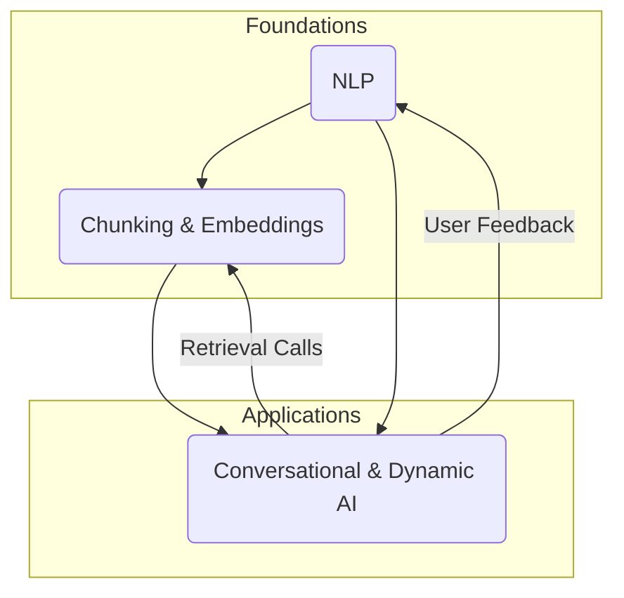

# 1. Natural Language Processing (NLP)

## Unified Narrative

Natural Language Processing is the branch of AI that gives computers the ability to read, write, speak, and listen in human languages. It started with rule-based machine translation in the 1950s, matured with statistics in the 1980s, and surged with deep learning and transformer models (e.g., BERT, GPT) in the 2010s. Modern NLP powers translation, voice assistants, sentiment analysis, and more. While it improves accessibility and data insight, it also raises privacy, bias, and misinformation risks. Understanding NLP means grasping both its linguistic roots and its data-driven present.

### Conceptual Overview

| Dimension | Key Points | Illustrative Examples |
|-----------|------------|-----------------------|
| Core Concepts | Tokenization, language models, embeddings, transformers | WordPiece/BPE, GPT-4 |
| Methods & Techniques | Statistical MT, RNNs, Attention, Transfer learning, Fine-tuning | Seq2Seq with attention; BERT fine-tune for Q&A |
| Use-Cases | Translation, speech-to-text, chatbots, document summarization | Google Translate, Zoom live captions |
| Gaps / Challenges | Bias, transparency, long-context reasoning, low-resource languages | Amazon résumé filter bias; limited Pashto corpus |

### Interconnections Across Topics

- Conversational & Dynamic AI uses NLP as its language engine.
- Chunking for Embeddings supplies the vector format that fuels retrieval-augmented NLP systems.
(See global map after Topic 3.)

### Actionable Framework / Guide

1. Fundamentals → Read "Speech & Language Processing" (Jurafsky & Martin) ch. 1-4.
2. Hands-on → Fine-tune a small BERT model on a sentiment dataset (Hugging Face).
3. Ethics → Study "Stochastic Parrots" paper; audit your fine-tuned model for bias.
4. Scaling → Explore transformer architectures (Attention Is All You Need).
5. Capstone → Build a multilingual FAQ bot; measure BLEU & user satisfaction.
Recommended tools: Hugging Face 🤗, spaCy, LangChain.

## 2. Conversational & Dynamic AI

### Unified Narrative

Conversational & Dynamic AI refers to systems that interact with users in open-ended, context-aware dialogue: chatbots, voice assistants, and interactive tutors. Early chatbots were script-driven; today's systems leverage large language models and continual context tracking to provide adaptive, multi-turn dialogues. Benefits include 24/7 support, personalized learning, and healthcare triage. Risks include privacy leakage, misinformation, and workforce disruption. The core skill is orchestrating NLP, dialogue management, and UX design into a seamless experience.

### Conceptual Overview

| Dimension | Key Points | Illustrative Examples |
|-----------|------------|-----------------------|
| Core Concepts | Dialogue state, context window, intent & slot filling | RASA intent classifier |
| Methods & Techniques | Retrieval-augmented generation (RAG), reinforcement learning from human feedback (RLHF), multimodal grounding | GPT-4-based assistant; DALL-E + chat |
| Use-Cases | Customer service, virtual tutors, health triage, meeting copilots | Duolingo chat, Babylon Health |
| Gaps / Challenges | Long-term memory, emotional intelligence, safety guardrails, hallucination control | Alexa privacy episodes; ChatGPT hallucinations |

### Interconnections Across Topics

- Relies on NLP for understanding and generation.
- Often incorporates text-chunking + embeddings to retrieve knowledge (RAG).
- Shares ethical concerns (bias, privacy) with both other topics.

### Actionable Framework / Guide

1. Basics → Study RASA or Microsoft BotFramework tutorials.
2. Prototype → Build a FAQ chatbot using OpenAI ChatCompletion + vector DB.
3. Feedback Loop → Collect chat logs, fine-tune with RLHF for tone & accuracy.
4. Safety → Implement content filters + conversation red-teaming.
5. Advanced → Explore multimodal agents (speech, vision) and memory modules.
Key resources: Stanford CS224U lectures, "Conversational AI" by Lopez & Klopf, OpenAI Function-Calling docs.

## 3. Text Splitting / Chunking for Embeddings

### Unified Narrative

Large documents must be broken into manageable "chunks" before being embedded into vector space for search or Retrieval-Augmented Generation. The chunk size, overlap, and splitting strategy (fixed, sentence-based, recursive, semantic) determine how well context is preserved and how accurately queries retrieve relevant information. Optimal chunking balances context richness with noise reduction and is tailored to the embedding model (e.g., ada-002 performs best around 256-512 tokens). Mastery of chunking is crucial for scalable knowledge bases, enterprise search, and conversational AI memory.

### Conceptual Overview

| Dimension | Key Points | Illustrative Examples |
|-----------|------------|-----------------------|
| Core Concepts | Chunk, embedding, vector DB, overlap | 256-token sliding window |
| Methods & Techniques | Fixed-size, sentence splitting (spaCy, NLTK), recursive, semantic, agentic | LangChain RecursiveCharacterTextSplitter |
| Use-Cases | RAG chatbots, semantic search, summarization pipelines | ChatGPT + Pinecone knowledge base |
| Gaps / Challenges | Heterogeneous chunk sizes, long-context queries, cost vs. recall trade-off | Mixed document vs. sentence vectors |

### Interconnections Across Topics

- Provides the data plumbing for Conversational AI knowledge retrieval.
- Uses NLP tasks (sentence segmentation) internally.
- Influences bias & privacy because chunk boundaries affect what data is stored.

### Actionable Framework / Guide

1. Identify Embedding Model → e.g., text-embedding-ada-002.
2. Baseline Split → Fixed 256-token chunks, 20-token overlap.
3. Evaluate → Run typical queries; measure precision/recall.
4. Iterate → Test semantic splitting or recursive methods; monitor vector count vs. quality.
5. Deploy → Automate pipeline (LangChain, Pinecone, Supabase).
Key references: Pinecone "Chunking Strategies" guide, LangChain docs, Full-Stack Retrieval tutorials.

## 4. Global Interconnections Map

Narrative: NLP supplies language understanding; chunking converts corpora into searchable vectors; Conversational AI orchestrates both, creating a feedback loop that improves underlying models and data stores.

## 5. Unified Learning Pathway

Stage 1 – Core Literacy
- Complete an "Intro to NLP" course (Coursera or fast.ai).
- Run notebooks on tokenization and embeddings.

Stage 2 – Building Blocks
- Implement fixed-chunk embedding pipeline on personal notes.
- Create a simple retrieval-based Q&A bot.

Stage 3 – Integration
- Add conversational layer (OpenAI ChatCompletion) that queries your vector DB.
- Instrument logging to study user queries, chunk hits, and failure cases.

Stage 4 – Ethics & Evaluation
- Audit data for PII; add anonymization pre-processing.
- Measure bias using counterfactual evaluation (e.g., gender swap).

Stage 5 – Specialization
Choose a vertical:
a) Multilingual assistant → Focus on translation models & cross-lingual embeddings.
b) Healthcare triage bot → Study regulatory compliance (HIPAA, GDPR).
c) Developer copilot → Integrate code-aware chunkers (AST-based splitting).

Stage 6 – Contribution & Mastery
- Publish a blog/tutorial; open-source your retrieval pipeline.
- Contribute test cases or data cleaning scripts to an open-source Conversational AI repo.

## 6. Key Resources at a Glance

- Books: "Speech & Language Processing" (Jurafsky & Martin), "Designing Bots" (Corti).
- Courses: fast.ai NLP, Stanford CS224U, DeepLearning.AI "Building Systems with ChatGPT".
- Tools: Hugging Face Transformers, RASA, LangChain, Pinecone/Supabase, spaCy.
- Papers: "Attention Is All You Need", "Stochastic Parrots", "RAG: Combining Retrieval with Generative Models".
- Communities: Papers with Code, Hugging Face forums, LangChain Discord.

This synthesized framework starts with language fundamentals, layers in the mechanics of text-to-vector chunking, and culminates in end-to-end conversational systems—equipping learners to move from basic proficiency to expert, ethically grounded practice.
