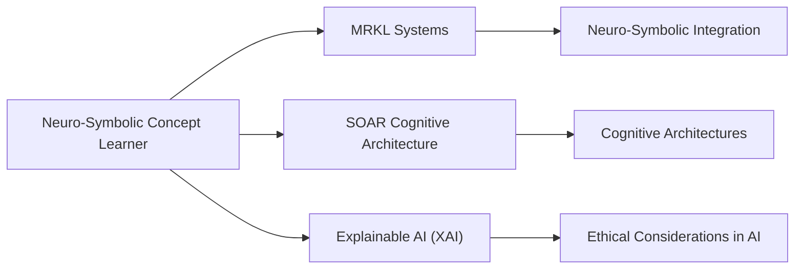

# NSCL

## Origin

The **[[NSCL]] ([[Neuro-Symbolic Concept Learner]])** is a cognitive system designed to learn visual concepts and language through paired images and Q&A without explicit supervision. This approach combines neural networks for pattern recognition with symbolic [[AI]] for logical reasoning, addressing complex tasks like image understanding and natural language processing. The immediate circumstances behind [[NSCL]]'s creation likely involve the need for more flexible and generalizable [[AI]] systems that can learn from diverse data sources without extensive human labeling.

Over time, [[NSCL]]'s applications have expanded to include enhancing memory recall by grounding concepts in neuro-symbolic representations and improving idea generation through hybrid reasoning that connects abstract concepts to ethical constraints. This evolution reflects broader trends in [[AI]] research towards more integrated and adaptive systems.

## Possibilities

### Expected Outcomes

#### Positive Outcomes

- **Enhanced Learning and Adaptation**: [[NSCL]] can improve cognitive assistants' ability to learn from diverse data, enhancing their adaptability and effectiveness in real-world applications.
- **Improved Reasoning**: By integrating neural and symbolic [[AI]], [[NSCL]] can facilitate more robust and logical decision-making processes in cognitive assistants.
- **Efficient Data Utilization**: It enables learning from unstructured or unlabeled data, reducing the need for extensive human supervision.

#### Negative Outcomes

- **Complexity and Integration Challenges**: Integrating neuro-symbolic systems can be complex, requiring significant computational resources and expertise.
- **Dependence on Data Quality**: While [[NSCL]] can learn from diverse data, its performance may suffer if the data is noisy or biased.
- **Ethical Considerations**: As with any [[AI]] system, there are ethical concerns regarding data privacy and potential biases in decision-making processes.

## Actual Outcomes

### Positive Outcomes

- **Enhanced Cognitive Assistants**: NSCL-like systems have been used to improve cognitive assistants in various domains, such as education and healthcare, by providing more adaptive and personalized support.
- **Real-World Applications**: In medical research, cognitive assistants powered by neuro-symbolic [[AI]] can help analyze complex medical images and data more effectively.

### Negative Outcomes

- **Technical Challenges**: Implementing [[NSCL]] in real-world scenarios often faces technical hurdles, such as high computational demands and the need for specialized expertise.
- **Misinterpretation Risks**: Without proper validation, NSCL's outputs may be misinterpreted, leading to incorrect conclusions or decisions.

### Resonance

NSCL resonates with other cognitive architectures like **[[SOAR]]** and **[[ACT-R]]**, which also aim to model human cognition computationally. These systems share a common goal of enhancing human capabilities through technology. Additionally, NSCL's focus on neuro-symbolic integration parallels developments in **[[MRKL]]**, which use large language models to delegate tasks to specialized modules.

### Distinction

Competing ideas include purely neural or symbolic approaches, each with their strengths and limitations. For instance, **[[Pure Neural Networks]]** excel in pattern recognition but may lack the logical reasoning capabilities of symbolic systems. Challenges and gaps in NSCL include the complexity of integrating different AI paradigms and ensuring ethical considerations are properly addressed.

## Summary

### Bloom's Taxonomy Table

| **Bloom's Layer** | **Description**                     | **Examples**               |
| ----------------- | ----------------------------------- | -------------------------- |
| Factual           | Basic facts about NSCL and neuro-symbolic AI | NSCL's ability to learn from images and Q&A |
| Conceptual        | Relationships between neuro-symbolic AI and cognitive architectures | Comparing NSCL with SOAR and ACT-R |
| Procedural        | Practical methods for integrating NSCL into cognitive assistants | Using NSCL for adaptive learning in education |
| Metacognitive     | Reflective insights on the impact of NSCL on AI development | Evaluating the ethical implications of NSCL |

### Integral Theory Table

| **Quadrant**        | **Key Elements/Insights**  |
| ------------------- | -------------------------- |
| Interior-Individual | Personal experiences with NSCL, such as improved problem-solving skills |
| Interior-Collective | Societal values emphasizing the importance of AI for human enhancement |
| Exterior-Individual | Observable behaviors like more efficient data analysis using NSCL |
| Exterior-Collective | Organizational structures supporting AI research and development |

### Knowledge Expansion Table

| **Knowledge Item**        | **Description**                    | **Relevance/Relationship**                      |
| ------------------------- | ---------------------------------- | ----------------------------------------------- |
| [[MRKL]]         | Modular neuro-symbolic architecture | Enhances task delegation and reasoning in cognitive assistants |
| [[SOAR]]                 | Cognitive architecture for problem-solving | Provides a framework for integrating NSCL in decision-making processes |
| [[Explainable AI (XAI)]] | Techniques for AI transparency and interpretability | Essential for ensuring ethical and reliable operation of NSCL |

### Visualization

This visualization highlights NSCL's connections to other key concepts in AI research, including neuro-symbolic integration, cognitive architectures, and ethical considerations.
[^1] [^2] [^3] [^4] [^5]

## Project Link

[[AI Cognitive Assistant]]

[^1]: https://www.psychologicalscience.org/policy/funding-available-for-research-on-augmenting-human-cognition-and-intelligent-cognitive-assistants.html
[^2]: https://en.wikipedia.org/wiki/CALO
[^3]: https://par.nsf.gov/servlets/purl/10195501
[^4]: https://www.src.org/program/ica/
[^5]: https://ohsl.us/projects/mycroft-cognitive-assistant
