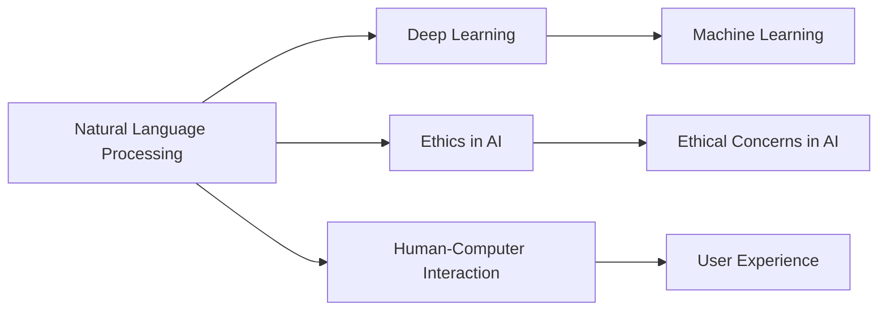

# Natural Language Processing

## Origin

Natural Language Processing (NLP) emerged as a field within computational linguistics and [[AI]] with the aim to enable machines to understand, interpret, and generate human language. The immediate need for NLP was to bridge the communication gap between humans and machines, making interactions more intuitive and efficient. Historically, one of the earliest NLP attempts was machine translation post World War II, which led to significant advances like the development of the Georgetown-IBM experiment in 1954. Over the decades, NLP has evolved significantly, moving from rule-based systems to more sophisticated, data-driven approaches leveraging advances in [[Machine Learning]] and, more recently, deep learning technologies.

Notable milestones in NLP's evolution include the rise of statistical methods in the 1980s, the advent of big data and [[Machine Learning]] in the 2000s, and the incorporation of deep neural networks in the 2010s. Today, transformer-based models like BERT and GPT have revolutionized the field, enabling more nuanced and context-aware language processing capabilities.

## Possibilities

### Expected Outcomes

#### Positive Outcomes

1. **Enhanced Communication**: NLP can streamline communication across languages via advanced translation services.
2. **Increased Accessibility**: Tools like speech-to-text and voice recognition enhance accessibility for individuals with disabilities.
3. **Improved Customer Service**: NLP-driven chatbots provide 24/7 customer support, increasing efficiency and customer satisfaction.
4. **Data Insights**: NLP enables companies to analyze massive volumes of unstructured data for actionable insights.

#### Negative Outcomes

1. **Privacy Risks**: The collection and processing of personal data raise significant privacy concerns.
2. **Bias and Fairness**: NLP systems can perpetuate or exacerbate biases present in the training data.
3. **Misinterpretation**: Challenges in understanding nuances can lead to incorrect interpretations of input text, affecting decisions.

## Actual Outcomes

### Positive Outcomes

1. **Google Translate**: A real-world example of NLP's success in breaking language barriers globally.
2. **Virtual Assistants**: Systems such as Siri and Alexa use NLP to improve user experience significantly.
3. **Sentiment Analysis**: Businesses leverage sentiment analysis to gauge consumer opinions in real-time.

### Negative Outcomes

1. **Amazon's Recruitment Tool**: An NLP-based tool that was biased against female applicants, highlighting the challenges in fair [[AI]] modeling.
2. **Deepfakes**: NLP combined with deep learning has given rise to synthetic text generation, potentially spreading misinformation.

### Resonance

NLP intersects with various disciplines such as [[Computer Vision]], [[Cognitive Science]], and [[Philosophy of Language]]. It complements efforts in enhancing machine perception and understanding. For instance, NLP and computer vision together enable more comprehensive [[AI]] systems capable of interpreting the world in a multisensory manner.

### Distinction

Competing ideas and challenges include the traditional semantic web approaches and emerging neuro-symbolic AI methods, which attempt to combine symbolic reasoning with data-driven learning. Critics of NLP point to issues of interpretability and accountability in decision-making systems that rely on black-box neural networks.

## Summary

### Bloom's Taxonomy Table

| **Bloom's Layer** | **Description**                     | **Examples**                                      |
| ----------------- | ----------------------------------- | ------------------------------------------------- |
| Factual           | Basic facts and terminology         | NLP, [[Machine Learning]], neural networks            |
| Conceptual        | Relationships and overarching ideas | NLP enhances human-computer interaction           |
| Procedural        | Practical methods and processes     | Sentiment analysis, machine translation, chatbots |
| Metacognitive     | Reflective insights                 | Ethical implications, bias, privacy               |

### Integral Theory Table

| **Quadrant**        | **Key Elements/Insights**                                                     |
| ------------------- | ----------------------------------------------------------------------------- |
| Interior-Individual | A user's increased comfort using voice commands for accessibility             |
| Interior-Collective | Societal shift towards expecting [[AI]]-driven customer service                   |
| Exterior-Individual | Observable behavior of using NLP-enabled devices like smartphones             |
| Exterior-Collective | Corporate reliance on NLP for data-driven decision making                     |

### Knowledge Expansion Table

| **Knowledge Item**             | **Description**                                  | **Relevance/Relationship**                           |
| ------------------------------ | ------------------------------------------------ | ---------------------------------------------------- |
| [[Deep Learning]]              | A subset of machine learning                     | Core technology driving advances in NLP              |
| [[AI Ethics]]                  | Analysis of ethical implications                 | Addressing NLP's role in bias, fairness, and privacy |
| [[Human-Computer Interaction]] | Study of interfaces between humans and computers | NLP enhances interaction by making it more intuitive |

### Visualization

---

This structured exploration of [[Natural Language Processing]] reveals both its transformative potential and challenges, providing insights for its role in developing a "Living Knowledge Management System." Such a system must consider the ethical dimensions and interdisciplinary connections to leverage NLP for meaningful knowledge organization and utilization.

## Project Link

[[Create Knowledge Management System]]
