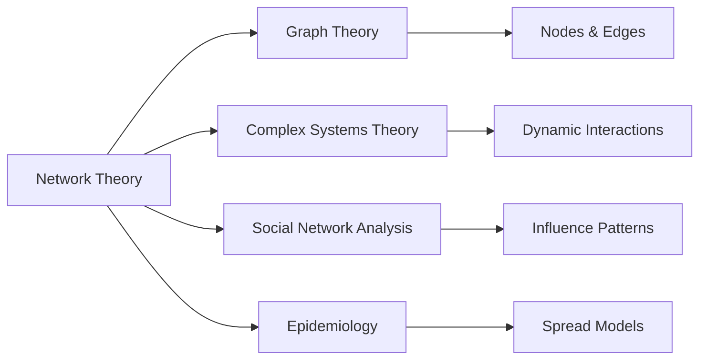

# Network Theory

## Origin

Network Theory emerged as a critical area of study primarily to address the complexities in interconnected systems across various domains such as sociology, computer science, biology, and logistics. Its origins can be traced back to the [[Graph Theory Solution to the Königsberg Bridge Problem]] solved by Leonhard Euler in 1736, establishing the foundation for [[Graph Theory]]. This early work focused on the analysis of connected nodes and pathways and set the precedent for understanding complex networks in mathematical terms.

Over time, with contributions from scholars across fields, particularly during the latter half of the 20th century, Network Theory evolved into a comprehensive framework for analyzing interactions and relationships. Key milestones include the introduction of the [[Small-World Network]] model by Watts and Strogatz in 1998, which demonstrated that many real networks exhibit high clustering with short path lengths, and the concept of [[Scale-Free Networks]] popularized by Barabási and Albert in 1999, indicating that some networks had a few highly connected nodes, or hubs, critical for the structure and dynamics of the system.

Network Theory has expanded significantly to include applications in understanding social networks, internet architecture, organizational behavior, and even neural networks, showcasing its adaptability and importance across disciplines.

## Possibilities

### Expected Outcomes

#### Positive Outcomes

- Improved decision-making through enhanced understanding of how information, ideas, or diseases spread within a network, as seen in public health strategies targeting contagious diseases.
- Enhanced technological development and innovation, particularly in telecommunications and transportation networks, where understanding the flow and structure translates into efficiency improvements like optimizing traffic or data flow.
- Strengthened organizational collaboration, as businesses use insights from Network Theory to improve communication flow, coordination mechanisms, and identify key influencers or decision-makers within teams.

#### Negative Outcomes

- Potential for increased vulnerability in networks where critical nodes or hubs, if compromised, can lead to significant failures, as seen in cybersecurity breaches where attacking specific network points can lead to widespread disruption.
- Risk of misuse in manipulating social networks, where understanding of social influences and behaviors could be used unethically for mass manipulation or propagation of misinformation.

## Actual Outcomes

### Positive Outcomes

- In epidemiology, Network Theory has been instrumental in modeling the spread of diseases such as HIV and COVID-19, allowing health authorities to develop targeted interventions and vaccination strategies that mitigate widespread transmission.
- In business, companies like Amazon use supply chain network analysis to optimize logistics, reducing costs and improving delivery times significantly through data-driven decision-making enhanced by network insights.

### Negative Outcomes

- The 2008 financial crisis highlighted the interconnected nature of financial institutions, where Network Theory could have anticipated vulnerabilities within the banking system, averting the cascading failures due to highly interdependent financial products like subprime mortgages.
- Social media networks, as studied through Network Theory, have shown susceptibility to misinformation spread, exemplifying potential downsides when network structures facilitate rapid dissemination without adequate checks for accuracy.

### Resonance

- **Interdisciplinary Links**: The application of Network Theory in [[Social Network Analysis]] opens discussions in [[Sociology]] about influence and community building. Similarly, its use in [[Neuroscience]] to understand brain connectivity patterns enriches our knowledge of cognitive processes.
- **System Modelling**: In [[Ecosystem Services]], Network Theory aids in modelling ecological interactions, emphasizing its parallel role in understanding both natural and artificial systems.

### Distinction

- **Alternative Frameworks**: Unlike traditional hierarchical organizational models, Network Theory offers a distributed approach that challenges conventional wisdom about centralized vs decentralized decision-making structures. However, a critique lies in its assumption that all nodes or connections are similar across different networks, potentially overlooking unique attributes.
- **Limitations**: While extremely versatile, Network Theory requires high-quality, extensive data for effective application, posing data collection and privacy challenges. Additionally, overly complex models may lead to analysis paralysis, emphasizing a need for balance.

## Summary

### Bloom's Taxonomy Table

| **Bloom's Layer** | **Description**                                   | **Examples**                                                        |
| ----------------- | ------------------------------------------------- | ------------------------------------------------------------------- |
| Factual           | Core concepts like nodes, edges, and network types| Concepts from small-world and scale-free networks                   |
| Conceptual        | Interconnectivity and systemic impacts            | How network centrality affects influence in [[Social Network Analysis]] |
| Procedural        | Analyzing networks using tools like NetworkX      | Applications in optimizing logistics and supply chain management    |
| Metacognitive     | Reflecting on ethical implications of network use | Understanding the misuse potential in social engineering            |

### Integral Theory Table

| **Quadrant**        | **Key Elements/Insights**                                            |
| ------------------- | -------------------------------------------------------------------- |
| Interior-Individual | Personal insights via social influence or isolation effects          |
| Interior-Collective | Societal impacts like culture shifts driven by media network dynamics|
| Exterior-Individual | Behavioral patterns influenced by viral phenomena                    |
| Exterior-Collective | Organizational network design, exemplified in corporate structures   |

### Knowledge Expansion Table

| **Knowledge Item**          | **Description**                                                   | **Relevance/Relationship**                                          |
| --------------------------- | ----------------------------------------------------------------- | ------------------------------------------------------------------- |
| [[Graph Theory]]            | Mathematical study of graphs, essential in Network Theory        | Provides foundational concepts such as nodes and edges              |
| [[Complex Systems Theory]]  | Analyzes complex systems with interconnected elements            | Explores dynamic interactions and emergent behaviors in systems     |
| [[Social Network Analysis]] | Studies social structures using networks and [[Graph Theory]]        | Applies Network Theory principles to human social interactions      |
| [[Epidemiology]]            | Science of disease patterns and spread                           | Employs Network Theory to model and mitigate disease outbreaks      |

### Visualization

## Project Link

[[Create Knowledge Management System]]
