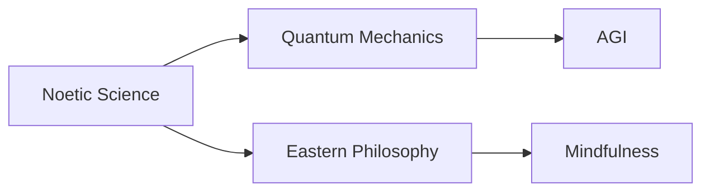

# Noetic Science

## Origin

[[Noetic Science]] emerged with the aim of exploring how consciousness and knowledge intermingle, influencing both the subjective and objective worlds. Founded by Apollo 14 astronaut Edgar Mitchell in 1973, the Noetic Institute sought to investigate consciousness through a scientific lens, addressing a burgeoning interest in understanding the nature of consciousness beyond traditional scientific paradigms at the time. This movement arose during a period rich with exploration into altered states of consciousness, transcending more mechanical views of the mind espoused by conventional neurosciences. Over time, [[Noetic Science]] expanded to include interdisciplinary research, merging psychology, biology, and spirituality, and has sought to examine consciousness's role in physical and observable phenomena.

Historically, the shift from strictly materialistic views of consciousness was marked by an acknowledgment of phenomena such as telepathy, intuition, and extrasensory perception (ESP). Milestones include foundational conferences and increased academic interest in interdisciplinary consciousness research by the late 20th century and the establishment of organizations devoted to bridging science and spirituality.

## Possibilities

### Expected Outcomes

#### Positive Outcomes

1. **Enriched Understanding**: Applications of [[Noetic Science]] offer enhanced perspectives on consciousness, allowing for deeper psychological and existential understanding in personal and professional contexts.
2. **Holistic Health**: Holistic approaches in healthcare that consider consciousness's impact on physical well-being can improve patient outcomes. For example, incorporating meditation or mindfulness as part of patient care can promote healing.
3. **Innovation in Learning Systems**: Educational models integrating consciousness studies with cognitive science can foster more effective learning by recognizing individual emotional and cognitive states.

#### Negative Outcomes

1. **Scientific Skepticism**: Misapplications or overstatements regarding metaphysical claims can lead to credibility loss within the scientific community.
2. **Misinterpretation and Pseudoscience**: Risks involve the potential of equating speculative elements of [[Noetic Science]] with proven scientific theories, which can undermine empirical research.
3. **Ethical Dilemmas**: Exploration of human potential through consciousness could lead to ethical challenges regarding privacy, consent, and application of findings.

## Actual Outcomes

### Positive Outcomes

- **Integration in Therapy**: Real-world therapy practices integrating Noetic approaches, such as mindfulness, have proven effective in stress reduction and mental health improvement.
- **Consciousness Research**: Projects like the Global Consciousness Project have explored connections between mass human consciousness and random event generators, suggesting potential metaphysical connections to collective human focus.

### Negative Outcomes

- **Controversial Claims**: Instances where bold assertions about consciousness principles are unsubstantiated foster skepticism and detract from legitimate research efforts. For instance, unsupported claims about noetic phenomena's influence on physical objects can distract from evidence-based research.

### Resonance

Noetic Science finds connections with [[Quantum Mechanics]] and [[Eastern Philosophy]], suggesting parallels between quantum theories of interconnectedness and spiritual concepts of unity. It complements [[Cognitive Science]] by positing additional layers of understanding consciousness, challenging how intelligence is comprehended in [[AI]] contexts such as [[AGI]] (Artificial General Intelligence).

### Distinction

Noetic Science stands distinct from purely mechanistic views, contrasted with approaches like [[Behaviorism]], which focus solely on observable behavior. Critics challenge the lack of empirical evidence for some noetic phenomena, pressing for stringent methodological frameworks.

## Summary

### Bloom's Taxonomy Table

| **Bloom's Layer** | **Description**                                 | **Examples**                                                 |
| ----------------- | ----------------------------------------------- | ------------------------------------------------------------ |
| Factual           | Basic facts and terminology                     | Terms like "consciousness," "noetic," "mindfulness."         |
| Conceptual        | Relationships and overarching ideas             | Interdisciplinary approaches integrating science and spirituality. |
| Procedural        | Practical methods and processes                 | Mindfulness practices, consciousness assessments.            |
| Metacognitive     | Reflective insights                             | Consideration of how personal biases affect understanding of consciousness. |

### Integral Theory Table

| **Quadrant**        | **Key Elements/Insights**                                |
| ------------------- | -------------------------------------------------------- |
| Interior-Individual | Personal stories of mindfulness impacting stress levels. |
| Interior-Collective | Societal embrace of meditation and mindfulness norms.    |
| Exterior-Individual | Observed behavioral changes via meditation programs.     |
| Exterior-Collective | Institutional research on consciousness phenomena.       |

### Knowledge Expansion Table

| **Knowledge Item**          | **Description**                                         | **Relevance/Relationship**                                          |
| --------------------------- | ------------------------------------------------------- | ------------------------------------------------------------------- |
| [[Quantum Mechanics]]       | Studies of subatomic particles involving consciousness. | Examines theories of interconnectedness resonant with noetic ideas. |
| [[Eastern Philosophy]]      | Philosophical traditions exploring consciousness.       | Offers parallel ideas in spirituality and mind-body connections.    |
| [[AGI]]                     | Focus on creating machine consciousness.                | Noetic insights may inform [[AI]]'s understanding of consciousness.     |

### Visualization

---

This comprehensive exploration of Noetic Science illustrates its unique position in bridging scientific inquiry and spiritual understanding. Focusing on consciousness, Noetic Science retains relevance in modern discourse, aiding in devising innovative approaches to learning and development for individual and collective empowerment within a knowledge management system.

## Project Link

[[Create Knowledge Management System]]
