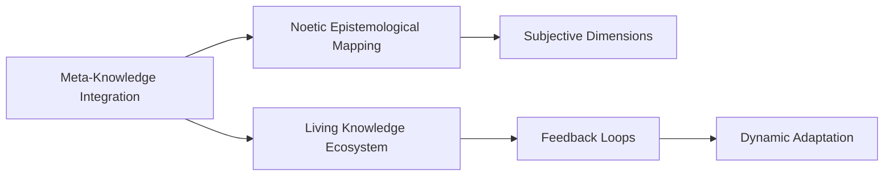

# Noetic Synthesis

## Narrative

### Origin

The concept of [[Meta-Knowledge]] Integration, [[Epistemology]], and [[Noetic Science]] Synthesis towards a [[Living Knowledge Ecosystem]] emerges from the intersection of knowledge management, [[Epistemology]], and [[Systems Thinking]]. Its creation is rooted in addressing the following core challenges:
1. **Fragmentation of Knowledge**: In both academic and practical domains, knowledge often exists in silos, making it difficult to integrate disparate fields or disciplines.
2. **[[Epistemology|Epistemological]] Complexity**: Traditional approaches to understanding knowledge often fail to account for the subjective (noetic) dimensions of human experience and meaning-making.
3. **System Adaptability**: Existing knowledge systems are often static and do not adapt to rapidly changing environments or incorporate feedback loops effectively.

The idea was catalyzed by advancements in **complex systems theory**, the growing prominence of **[[Knowledge Graphs]]**, and the increasing recognition of the role of noetics (subjective consciousness) in [[Epistemology|epistemological]] frameworks. Early work on this concept can be traced back to thinkers like Buckminster Fuller (systems synthesis), Ken Wilber ([[Integral Theory]]), and more recently, developments in [[Cybernetics]] and [[Machine Learning]]. The term "Living Knowledge Ecosystem" introduces the metaphor that knowledge systems should behave like biological ecosystems—dynamic, interconnected, adaptive, and resilient.

#### Evolution

Historically:
- In the **1970s–1980s**, early ideas about knowledge integration emerged with advancements in system dynamics ([[Jay Forrester]]) and holistic worldviews (e.g., [[Gaia Hypothesis]]).
- The **1990s–2000s** saw rapid digitization with tools like wikis enabling collaborative ecosystems but without adequate epistemological mapping.
- By the 2010s, concepts such as [[Knowledge Graphs]] (e.g., Google's) began operationalizing relationships between data points.
- Today's focus lies on synthesizing objective data with subjective noetic insights using [[AI]]-driven tools that mimic human sense-making processes.

---

### Possibilities

#### Positive Expected Outcomes

1. **Cross-Disciplinary Innovation:** Facilitates breakthroughs by connecting ideas across traditionally isolated fields (e.g., combining neuroscience and philosophy for advances in cognitive science).
	 - *Example*: Healthcare applications integrating biomedical data with patient-reported outcomes for personalized medicine.
2. **Enhanced Decision-Making:** Provides decision-makers with richer contextual maps that integrate objective facts with subjective interpretations.
	 - *Example*: Urban planning using participatory GIS systems combined with cultural narratives from local communities.
3. **Dynamic Learning Systems:** Enables organizations to create adaptive learning environments where feedback loops refine collective understanding over time.
4. **Sustainability Planning:** Mimics natural ecosystems for sustainable development initiatives tied to global goals like those outlined by the UN SDGs.

#### Negative Expected Outcomes

1. **Epistemological Overload:** Users may struggle to navigate overly complex models that attempt to incorporate every perspective or dataset.
2. **Bias Amplification:** If noetic inputs are improperly weighted or validated, subjective biases could distort conclusions (e.g., reinforcing cultural stereotypes).
3. **Technocratic Domination:** Centralized control over dynamic ecosystems could reinforce power hierarchies rather than democratizing access to knowledge.

---

### Actual Outcomes

#### Positive Examples

- Real-world applications include [[AI]]-powered platforms like Obsidian, which allow users to build personal knowledge ecosystems connected through bidirectional links.
- NASA's use of knowledge integration frameworks for cross-disciplinary collaboration on missions like Mars exploration demonstrates how this approach fosters innovation under complexity.

#### Negative Examples

- Social media platforms initially aimed at creating digital communities devolved into echo chambers due to algorithmic biases within their "ecosystems."
- Large-scale misuse of integrated data systems can lead to privacy violations or ethical concerns (e.g., Cambridge Analytica scandal).

---

### Resonance

This concept resonates strongly with:
1. [[Integral Theory]]: Aligning individual subjectivity ("noetic") with collective objectivity ("epistemological mapping").
2. [[Cybernetics]] & [[Systems Thinking]]: Emphasizing feedback loops within dynamic ecosystems.
3. [[AI]] & [[Machine Learning]]: Leveraging neural networks as models for living systems of thought.

---

### Distinction

While similar concepts exist—such as Google's [[Knowledge Graphs]] or systemic design—the unique contribution here is its emphasis on integrating noetic dimensions (subjective experiences) alongside traditional epistemic frameworks into a *living* system capable of adaptation.

Critiques include:
1. Practical Scalability: Can such a complex system be scaled without losing coherence?
2. Philosophical Skepticism: Critics argue that merging noetics with empirical science risks conflating qualitative meaning-making processes with quantitative metrics.

---

## Summary Section

### Bloom's Taxonomy Table

| Bloom's Layer       | Description                                         | Examples                                                                                  |
|---------------------|-----------------------------------------------------|------------------------------------------------------------------------------------------|
| Factual             | Core facts about meta-knowledge integration         | Definition of terms like "noetics," "[[Epistemology]]," "living ecosystem."                  |
| Conceptual          | Relationships between ideas                         | Links between disciplines such as neuroscience + philosophy = cognitive insights         |
| Procedural          | Practical tools/methodologies for implementation    | Use of software like [[Obsidian]]; participatory GIS; real-world feedback loops          |
| Metacognitive       | Reflective insights                                 | Awareness of bias amplification risks when integrating subjective inputs                 |

---

### Integral Theory Table

| Quadrant            | Key Elements/Insights                                                                                |
| ------------------- | ---------------------------------------------------------------------------------------------------- |
| Interior-Individual | Personal journaling apps bridging subjective insights + external references ([[Roam]], [[Obsidian]]) |
| Interior-Collective | Cultural frameworks embedding indigenous wisdom alongside scientific models                          |
| Exterior-Individual | Tools enabling behavior tracking integrated into larger context-aware systems                        |
| Exterior-Collective | National research initiatives integrating cross-disciplinary expertise via [[AI]] platforms              |

---

### Knowledge Expansion Table

| Knowledge Item                        | Description                                                                                   | Relevance/Relationship                                                                        |
|---------------------------------------|-----------------------------------------------------------------------------------------------|---------------------------------------------------------------------------------------------|
| [[Knowledge Graphs]]                  | Data representation model connecting entities through relationships                           | Serves as a foundational tool for building living ecosystems                                |
| [[Noetic Sciences]]                   | Study focusing on consciousness and intuitive intelligence                                    | Provides framework for incorporating subjective aspects                                     |
| [[Systems Thinking]]                  | Holistic approach analyzing interconnections within complex systems                           | Basis for ecological metaphors tied into living knowledge architectures                    |

---

## Visualizations

### MermaidJS Relationship Chart

## Project Link

[[Create Knowledge Management System]]
