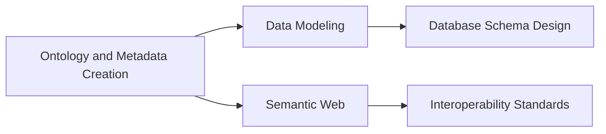

# Ontology and Metadata Creation

## Narrative

### Origins

Ontology and metadata creation has evolved as a crucial tool in the realm of data management and knowledge representation. Initially conceived to address the burgeoning data and information management needs in various fields such as libraries, biology, and computer science, it sought to provide a structured way to represent knowledge and data.

The development of these concepts can be pinpointed to the challenge of effectively organizing, categorizing, and retrieving information in complex systems. Libraries were the early adopters, using metadata for cataloging and retrieval purposes. The growth of the internet and the subsequent data explosion highlighted the need for more sophisticated knowledge representation, leading to the adoption of ontologies in fields like [[AI]], bioinformatics, and the semantic web.

Historically, significant milestones include the establishment of the Resource Description Framework (RDF) and Web Ontology Language (OWL), foundational standards that have shaped how data is interlinked and described across systems.

### Possibilities

**Expected Outcomes**

- **Positive Outcomes**: Ontologies and metadata creation can vastly improve searchability, interoperability, and data integration within and across organizations, enhancing efficiency and knowledge exchange. They allow for the creation of intelligent systems that understand and process human language in applications like [[Semantic Web]] and [[AI]].
- **Negative Outcomes**: The complexity involved in developing comprehensive ontologies can lead to significant resource expenditure. There's also a risk of over-complication, where an overly intricate system may cause bottlenecks and restrict usability. Misalignment or misunderstanding of terminology across various disciplines can also present significant challenges.

### Actual Outcomes

- **Positive Outcomes**: In healthcare, ontologies like the Systematized Nomenclature of Medicine (SNOMED) have revolutionized data interoperability, allowing different systems to effectively share and interpret complex medical information. Similarly, the [[Gene Ontology Project]] has dramatically enhanced data mining in genomics by organizing genes across species.
- **Negative Outcomes**: In some projects, the initial setup of ontology frameworks was not sufficiently adaptive to evolving needs, leading to obsolescence or substantial costs associated with updates. Furthermore, metadata and ontology creation can sometimes become overly prescriptive, hindering innovation by rigidly defining categories and relations.

### Resonance

Ontology and metadata creation find parallels in structural design, linguistics, and [[Epistemology]]. Each involves organizing underlying principles into a system capable of generating greater understanding. In tech industries, similar frameworks are seen in [[Data Modeling]] and [[Taxonomy Creation]] within machine learning algorithms, informing pattern recognition and decision-making by providing structure to otherwise chaotic data sets.

### Distinction

While ontologies strive for broad and flexible applicability, alternative methods like controlled vocabularies, taxonomies, and simple metadata stand out for their simplicity and ease of use. These can be preferable for smaller datasets where complexity does not justify ontology development. A challenge lies in achieving a balance between depth of detail and pragmatic functionality.

## Summary

### Bloom's Taxonomy Table

| **Bloom's Layer** | **Description**                     | **Examples**                                           |
| ----------------- | ----------------------------------- | ------------------------------------------------------ |
| Factual           | Basic facts and terminology         | RDF, OWL, Metadata, Semantic Web                       |
| Conceptual        | Relationships and overarching ideas | Ontology = Structure; Metadata = Description           |
| Procedural        | Practical methods and processes     | Ontology development, metadata tagging                 |
| Metacognitive     | Reflective insights                 | Understanding impacts on data interoperability and [[AI]]  |

### Integral Theory Table

| **Quadrant**        | **Key Elements/Insights**                                     |
| ------------------- | ------------------------------------------------------------- |
| Interior-Individual | Researchers reflect on ontology to assign deeper meaning      |
| Interior-Collective | Society adopts ontological frameworks like RDF, enhancing collaboration |
| Exterior-Individual | Professionals tagging data using metadata standards           |
| Exterior-Collective | Systems utilize ontologies to enhance data sharing efficiency |

### Knowledge Expansion Table

| **Knowledge Item**              | **Description**                                 | **Relevance/Relationship**                                   |
| ------------------------------- | ----------------------------------------------- | ------------------------------------------------------------ |
| [[Data Modeling]]               | Organizing and structuring data for databases   | Shares objectives and practices regarding data representation |
| [[Semantic Web]]                | An extension of the web through standardized tags | Utilizes ontologies for improved data sharing and interoperability |
| [[Taxonomy Creation]]           | Classification system for diverse fields        | Provides simpler alternative for data organization            |

### Visualization

---

## Project Link

[[Create Knowledge Management System]]
