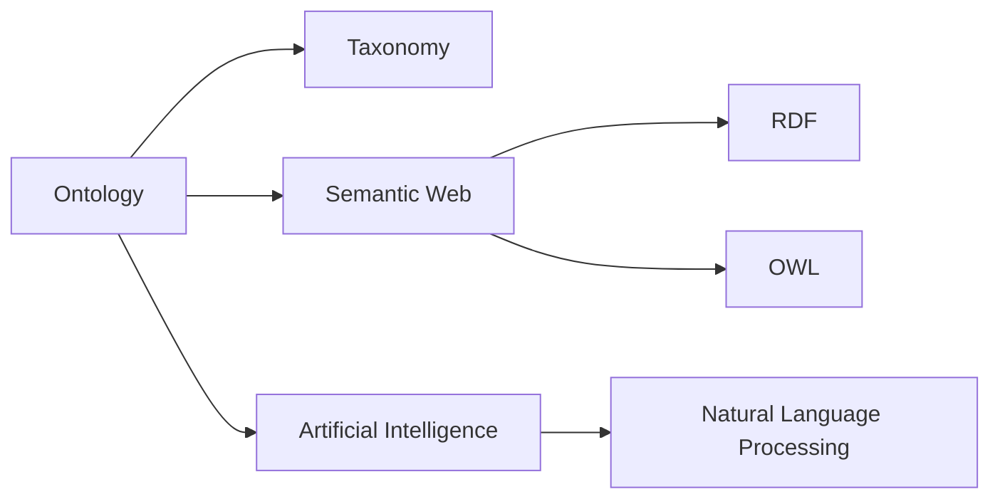

# Ontology: A Comprehensive Exploration

## 1. **Narrative**

### Origin

Ontology, derived from the Greek words "ontos" (being) and "logos" (study), originated as a philosophical discipline focused on the nature of being, existence, and reality. It emerged within the field of [[metaphysics]] during Ancient Greece, with early contributors like [[Plato]] and [[Aristotle]]. Aristotle's work on categorizing entities based on their essence laid the groundwork for formal ontology, introducing concepts such as substance, categories, and properties.

In its modern incarnation, ontology transitioned from pure philosophy to practical applications in areas such as computer science, information systems, [[AI]], and knowledge management. This shift began in earnest during the late 20th century when researchers identified a need for formalized structures to represent knowledge in digital systems. For example:
- In [[AI]] research during the 1980s and 1990s, ontologies were developed to create machine-readable frameworks for representing complex domains of information.
- The Semantic Web initiative by [[Tim Berners-Lee]] further popularized ontology by proposing it as a critical component for organizing web-based knowledge into interoperable formats.

Today's ontologies are used to define structured vocabularies and relationships within specific domains — from healthcare (e.g., SNOMED CT) to e-commerce (e.g., product taxonomies).

---

### Evolution

#### Key Milestones

1. **Classical Ontology**: Philosophers like Aristotle formalized categories of being.
2. **Medieval Scholasticism**: Expanded ontology within theological debates.
3. **Modern Philosophy**: Thinkers like [[Immanuel Kant]] reframed ontology in terms of human cognition and perception.
4. **Computational Era**: Ontologies transformed into practical tools for structuring data:
	 - Development of tools like [[OWL]] for managing ontological models in digital environments.
	 - Integration into advanced fields such as natural language processing ([[Natural Language Processing]]) and robotics.

#### Shifts Over Time

- From abstract metaphysical discussions about existence to actionable frameworks used to organize complex data ecosystems.
- Increasing emphasis on interoperability between different systems using shared ontological structures.

---

### Possibilities

#### Expected Outcomes

##### Positive Outcomes

1. **Enhanced Knowledge Organization:**
	 Ontologies provide a clear structure for organizing data logically and hierarchically across fields like medicine or supply chain management.
	 *Example*: In healthcare systems, medical ontologies (e.g., ICD-10 or SNOMED CT) enable consistent diagnosis classification worldwide.

2. **Improved Machine Understanding:**
	 By encoding domain-specific knowledge into formal languages (e.g., OWL), computers can "understand" relationships between concepts more effectively.
	 *Example*: Google's Knowledge Graph uses ontological principles to improve search results by connecting related entities.

3. **Interoperability Across Systems:**
	 Shared ontological frameworks allow disparate datasets to interact seamlessly via common standards such as RDF or OWL.
	 *Example*: E-commerce platforms leverage shared product taxonomies to facilitate cross-platform searches.

4. **Scalable Automation:**
	 Ontology-driven automation streamlines tasks like semantic data integration or personalized recommendations in [[AI]] systems.

##### Negative Outcomes

1. **Ambiguity & Misalignment:**
	 Poorly designed or incomplete ontologies can lead to misinterpretation of data due to lack of consensus on certain definitions or categories.
	 *Example*: Disparate medical terminology standards across regions can cause inefficiencies in global health research efforts.

2. **Overhead Costs & Complexity:**
	 Building and maintaining an ontology requires significant investment in expertise, time, and technical resources—potentially outweighing benefits if not planned properly.

3. **Bias Encoding:**
	 If biases are embedded into an ontology's structure during design (intentionally or unintentionally), it perpetuates inequities across dependent systems.
	 *Example*: In hiring algorithms that rely on biased recruitment taxonomies, systemic discrimination may be amplified.

---

#### Actual Outcomes

##### Positive Outcomes

- The Human Genome Project utilized biological ontologies like GO ([[Gene Ontology]]) to standardize genetic information globally.
- Autonomous vehicles rely on real-time decision-making supported by ontologically structured roadmaps that define objects such as vehicles vs pedestrians vs traffic signals.

##### Negative Outcomes

- Early failures with the Semantic Web initiative stemmed from overambitious goals regarding universal adoption of standardized web-based ontologies.
- Mistranslation issues arose when global e-commerce giants attempted integrating localized product taxonomies without sufficient alignment strategies.

---

### Resonance

Ontology intersects with multiple disciplines:
- [[Epistemology]] explores how humans acquire knowledge—complementing ontology's focus on what exists.
- [[Data Science]] applies similar principles for structuring datasets efficiently.
- [[AI]] relies heavily on well-defined domain-specific ontologies for machine learning models' interpretability.

---

### Distinction

Ontology differs from related approaches like taxonomy or classification hierarchies by emphasizing relationships between entities beyond simple categorization:
1. Taxonomy = Hierarchical grouping based only on similarity/difference ([[Taxonomy]]).
2. Ontology = Describes entities + relationships + rules governing interactions ([ontology vs taxonomy]).

Critiques include its steep learning curve ("ontological engineering") compared with simpler alternatives like relational databases or flat taxonomies.

---

## 2. Summary Section

### Bloom's Taxonomy Table

| **Bloom's Layer** | **Description**                                       | **Examples**                                                                                     |
| ----------------- | ----------------------------------------------------- | ------------------------------------------------------------------------------------------------ |
| Factual           | Core facts about ontology terminology                 | Terms like "ontology," "semantic web," "RDF," "OWL."                                             |
| Conceptual        | Relationships between ontology components             | Understanding classes/subclasses; relating objects via predicates ("is-a," "part-of").           |
| Procedural        | Steps/tools involved in creating/managing an ontology | Using Protégé software; mapping concepts using OWL/RDF standards; validating consistency checks. |
| Metacognitive     | Reflecting upon implications/limitations              | Evaluating why biases emerge during design; analyzing cost-benefit tradeoffs before adoption     |

---

### Integral Theory Table

| Quadrant                   | Key Elements/Insights                                                                                      |
|----------------------------|-----------------------------------------------------------------------------------------------------------|
| Interior-Individual        | Personal insight gained via semantic clarity ("I better understand this domain now.").                    |
| Interior-Collective        | Shared cultural practices around standardization efforts (e.g., WHO's use of ICD codes globally).          |
| Exterior-Individual        | Observable use cases where practitioners employ tools (Protégé) directly influencing workflows             |
| Exterior-Collective        | Structural changes enabled by widespread adoption at organizational/system-wide levels                    |

---

### Knowledge Expansion Table

| Knowledge Item           | Description                                                           | Relevance/Relationship                                          |
|--------------------------|-----------------------------------------------------------------------|------------------------------------------------------------------|
| [[Taxonomy]]             | Hierarchical grouping of items based purely on similarity/differences.| Often confused with but distinct from ontology                  |
| [[Semantic Web]]         | Vision for standardized web-based interoperable data                 | Relies heavily upon robust shared domain-specific ontologies    |
| [[AI]] |      [[AI]] models requiring structured representations                |         Direct consumer/application-use overlap                         |

---

## 3. Visualization

This visualization highlights connections between key areas influenced by ontology while showcasing related subtopics under each major branch—allowing users exploration pathways into deeper studies ([[RDF]], etc.).

## Project Link

[[Create Knowledge Management System]]
