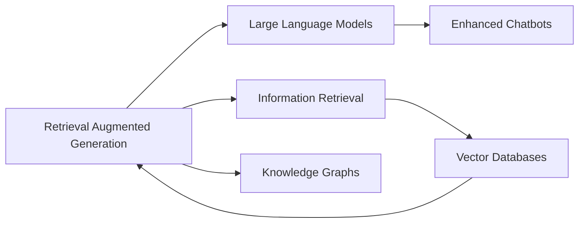

# RAG

## Origin

**Retrieval Augmented Generation (RAG)** was developed to address two significant challenges in large language models (LLMs): **hallucinations** and **outdated training data**. Hallucinations occur when LLMs generate information that is not based on any actual data, while outdated training data limits their ability to provide current information. RAG combines natural language generation with information retrieval, allowing LLMs to access and incorporate specific, up-to-date information from external sources into their responses.[^1][^2][^3]

RAG's evolution has been marked by advancements in integrating external knowledge stores with LLMs, enhancing their ability to provide accurate and contextually relevant information. This approach has expanded from basic text retrieval to more sophisticated methods involving vector databases and fine-tuning for domain-specific applications.[^1][^3]

## Possibilities

### Expected Outcomes

#### Positive Outcomes

- **Improved Accuracy**: RAG reduces hallucinations by grounding responses in actual data, making LLMs more reliable.[^3]
- **Domain-Specific Applications**: It enables LLMs to provide precise information in specialized domains by integrating external knowledge.[^2]
- **Efficient Updates**: RAG allows for updating model knowledge without retraining the entire model, saving resources.[^3]

#### Negative Outcomes

- **Dependence on Data Quality**: The effectiveness of RAG depends heavily on the quality and relevance of the external data sources.[^2]
- **Complexity in Implementation**: Setting up and maintaining RAG systems can be complex, requiring significant technical expertise.[^2]

## Actual Outcomes

### Positive Outcomes

- **Enhanced Chatbots**: Companies have used RAG to improve chatbot performance by providing them with access to internal company data, ensuring responses are accurate and up-to-date.[^1]
- **Factual Information Systems**: RAG has been applied in systems that require providing factual information from authoritative sources, enhancing user trust in AI outputs.[^1]

### Negative Outcomes

- **Data Management Challenges**: Implementing RAG requires managing large datasets and ensuring they are correctly indexed and updated, which can be resource-intensive.[^2]
- **Dependence on Retrieval Algorithms**: The quality of retrieved information can vary based on the retrieval algorithms used, potentially leading to suboptimal results if not optimized.[^1]

### Resonance

RAG shares parallels with other techniques that combine AI with external data sources, such as **knowledge graph-based systems**. These systems also rely on integrating external knowledge to enhance AI performance, highlighting the broader trend of leveraging data retrieval to improve AI capabilities.

### Distinction

RAG differs from traditional LLM approaches by its emphasis on external data integration. However, it faces challenges from alternative methods like **fine-tuning LLMs** without external data, which can be more straightforward but less effective for providing current information.

## Summary

### Bloom's Taxonomy Table

| **Bloom's Layer** | **Description**                     | **Examples**               |
| ----------------- | ----------------------------------- | -------------------------- |
| Factual           | Basic facts about RAG              | RAG combines NLG and IR    |
| Conceptual        | Relationships between RAG and LLMs | Enhancing LLM accuracy     |
| Procedural        | Practical methods for RAG           | Using vector databases     |
| Metacognitive     | Reflective insights on RAG's impact  | Reducing hallucinations    |

### Integral Theory Table

| **Quadrant**        | **Key Elements/Insights**  |
| ------------------- | -------------------------- |
| Interior-Individual | Personal experience with RAG improving AI reliability |
| Interior-Collective | Societal value in accurate AI outputs |
| Exterior-Individual | Use of RAG in chatbots for customer service |
| Exterior-Collective | Impact of RAG on organizational knowledge management systems |

### Knowledge Expansion Table

| **Knowledge Item**        | **Description**                    | **Relevance/Relationship**                      |
| ------------------------- | ---------------------------------- | ----------------------------------------------- |
| [[LLM]] | Overview of LLMs and their limitations | RAG addresses LLM limitations by integrating external data |
| [[Information Retrieval]] | Techniques for retrieving relevant data | Fundamental to RAG's operation |
| [[Vector Databases]]      | Storage and querying methods for vector data | Used in RAG for efficient document retrieval |

### Visualization

This visualization highlights RAG's connections to LLMs, information retrieval, and related technologies like vector databases and knowledge graphs.
[^1] [^2] [^3] [^4] [^5]

[^1]: https://en.wikipedia.org/wiki/Retrieval-augmented_generation
[^2]: https://stackoverflow.blog/2023/10/18/retrieval-augmented-generation-keeping-llms-relevant-and-current/
[^3]: https://www.superannotate.com/blog/rag-explained
[^4]: https://forum.obsidian.md/t/obsidian-creates-wikilinks-for-non-existing-pages-even-if-the-wikilinks-option-is-turned-off/63219
[^5]: https://blogs.nvidia.com/blog/what-is-retrieval-augmented-generation/
