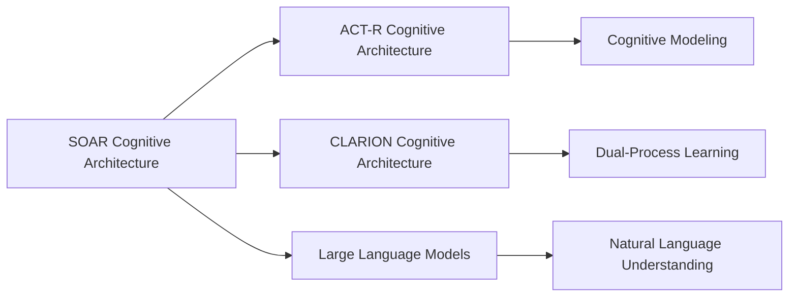
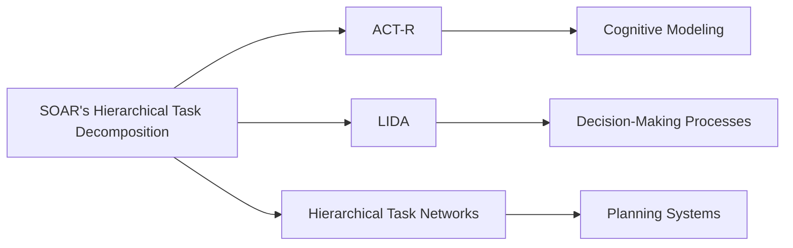

# SOAR

## Origin

**[[SOAR]]**, a cognitive architecture, was originally developed by John Laird, Allen Newell, and Paul Rosenbloom at Carnegie Mellon University. It was created to model human cognition and support general intelligent agents capable of performing a wide range of tasks, including decision-making, problem-solving, and natural-language understanding.[^1] [[SOAR]]'s initial development began as John Laird's thesis in 1983, with the goal of creating a system that could encode, use, and learn various types of knowledge.[^1]

Over time, [[SOAR]] has evolved significantly. One of its key milestones was the development of **R1-Soar**, which demonstrated [[SOAR]]'s ability to scale to moderate-size problems by configuring DEC computers.[^1] Another significant milestone was the integration of **reinforcement learning** and **semantic memory** into [[SOAR]], enhancing its learning capabilities.[^2]

## Possibilities

### Expected Outcomes

#### Positive Outcomes

- **Enhanced Problem-Solving**: [[SOAR]]'s ability to reason through goals and subgoals makes it effective in complex problem-solving scenarios, enhancing productivity and decision-making.[^3]
- **Improved Human-Machine Interaction**: [[SOAR]]'s natural language understanding and complex reasoning capabilities make it suitable for applications like chatbots and virtual assistants, improving user experience.[^3]
- **Cognitive Modeling**: [[SOAR]] is used to model human cognition, providing insights into human decision-making processes and cognitive behaviors.[^3]

#### Negative Outcomes

- **Complexity and Scalability**: [[SOAR]]'s modular structure, while beneficial, can become overly complex, making it challenging to scale for very large applications without significant computational resources.[^1]
- **Dependence on Knowledge Encoding**: The effectiveness of [[SOAR]] depends heavily on the quality and completeness of the encoded knowledge, which can be time-consuming and costly to develop.[^1]

## Actual Outcomes

### Positive Outcomes

- **Virtual Humans and Game AIs**: [[SOAR]] has been successfully used in simulating virtual humans and developing AI agents for games like StarCraft and Minecraft, showcasing its ability to integrate complex reasoning and spatial reasoning.[^1]
- **NTD-Soar**: This simulation of the NASA Test Director demonstrated SOAR's capability in integrating multiple cognitive capabilities, such as natural-language processing and problem-solving.[^1]

### Negative Outcomes

- **Resource Intensity**: Implementing SOAR for large-scale applications can be resource-intensive, requiring significant computational power and development time.[^1]
- **Limited Flexibility**: While SOAR is versatile, its reliance on encoded knowledge can limit its flexibility in rapidly changing environments without continuous updates.[^1]

### Resonance

SOAR's modular and hierarchical structure resonates with other cognitive architectures like **ACT-R** and **CLARION**, which also aim to model human cognition but with different focuses. For instance, ACT-R emphasizes cognitive psychology and memory modules, while CLARION combines symbolic and connectionist approaches.[^3] SOAR's integration with **Large Language Models (LLMs)** for enhanced language understanding aligns with the broader trend of neuro-symbolic integration in AI research.[^3]

### Distinction

SOAR is distinct from other architectures due to its focus on general problem-solving and learning. However, it faces challenges from more specialized architectures like **DUAL**, which emphasizes episodic memory and temporal reasoning.[^3] Critiques of SOAR include its complexity and the need for extensive knowledge encoding, which can be limiting in dynamic environments.[^1]

## Summary

### Bloom's Taxonomy Table

| **Bloom's Layer** | **Description**                     | **Examples**               |
| ----------------- | ----------------------------------- | -------------------------- |
| Factual           | Basic facts and terminology         | SOAR's origins, key features |
| Conceptual        | Relationships and overarching ideas | SOAR vs. ACT-R, CLARION     |
| Procedural        | Practical methods and processes     | Implementing SOAR in games  |
| Metacognitive     | Reflective insights                 | Evaluating SOAR's limitations |

### Integral Theory Table

| **Quadrant**        | **Key Elements/Insights**  |
| ------------------- | -------------------------- |
| Interior-Individual | Personal insights from using SOAR for strategic planning |
| Interior-Collective | Societal impact of SOAR in human-machine interaction |
| Exterior-Individual | Observing AI agents' behaviors in games using SOAR |
| Exterior-Collective | Organizational use of SOAR in NASA simulations |

### Knowledge Expansion Table

| **Knowledge Item**        | **Description**                    | **Relevance/Relationship**                      |
| ------------------------- | ---------------------------------- | ----------------------------------------------- |
| [[ACT-R]]                | Cognitive architecture for human cognition | Similarities and differences with SOAR in cognitive modeling |
| [[CLARION]]              | Dual-process cognitive architecture    | Comparison with SOAR's problem-solving approach |
| [[LLM]]| Models for natural language processing  | Integration with SOAR for enhanced language capabilities |

### Visualization

This visualization highlights SOAR's connections to other cognitive architectures and technologies, demonstrating its role in the broader AI landscape.
[^1] [^3] [^2] [^4] [^5]

## Project Link

[[AI Cognitive Assistant]]

# SOAR's Hierarchical Task Decomposition

## Origin

**SOAR's Hierarchical Task Decomposition** originates from the cognitive architecture SOAR, developed by John Laird, Allen Newell, and Paul Rosenbloom at Carnegie Mellon University. The goal was to create a general intelligent agent capable of performing a wide range of tasks, including problem-solving and planning. SOAR's hierarchical task decomposition is rooted in the Problem Space Hypothesis, which posits that goal-oriented behavior involves searching through a space of possible states by applying operators to achieve a goal.[^1]

### Evolution

Over time, SOAR has evolved to include features like reinforcement learning and chunking, which allow it to learn from experience and convert complex reasoning into automatic processes.[^1] Its applications have expanded beyond problem-solving to include cognitive modeling and AI research.

## Possibilities

### Expected Outcomes

#### Positive Outcomes

- **Efficient Problem-Solving**: SOAR's hierarchical task decomposition enables efficient breakdown of complex tasks into manageable subtasks, improving problem-solving efficiency.
- **Adaptive Learning**: The architecture supports reinforcement learning, allowing agents to adapt and improve based on feedback.
- **Cognitive Modeling**: SOAR can model human cognition, providing insights into decision-making processes.

#### Negative Outcomes

- **Complexity Overload**: Overly complex tasks may lead to impasses, requiring additional resources to resolve.
- **Dependence on Domain Knowledge**: SOAR relies heavily on domain-specific knowledge, which can limit its applicability in unfamiliar domains.

## Actual Outcomes

### Positive Outcomes

- **AI Research Applications**: SOAR has been widely used in AI research to model human cognition and develop intelligent agents.
- **Cognitive Simulations**: It has been applied in cognitive simulations to understand human decision-making processes.

### Negative Outcomes

- **Impasse Resolution Challenges**: In real-world applications, resolving impasses can be resource-intensive and may not always lead to optimal solutions.
- **Limited Domain Generalization**: SOAR's effectiveness is often domain-specific, limiting its generalizability across diverse tasks.

### Resonance

SOAR's hierarchical task decomposition resonates with other cognitive architectures like **[[ACT-R]]** and **[[LIDA]]**, which also use hierarchical methods for problem-solving. Additionally, it aligns with **[[Hierarchical Task Networks]]** in planning systems, which decompose tasks into simpler subtasks.[^2][^3]

### Distinction

- **Competing Ideas**: Other architectures like **[[CLARION]]** use dual-process models for implicit and explicit learning, differing from SOAR's rule-based approach.
- **Challenges**: SOAR faces challenges in handling very complex or dynamic environments without extensive domain knowledge.

## Summary

### Bloom's Taxonomy Table

| **Bloom's Layer** | **Description**                     | **Examples**               |
| ----------------- | ----------------------------------- | -------------------------- |
| Factual           | Basic facts about SOAR's architecture | SOAR's use of production rules, chunking.[^1] |
| Conceptual        | Relationships between SOAR and other architectures | Comparison with ACT-R, LIDA.[^1] |
| Procedural        | Practical methods for task decomposition | Hierarchical task decomposition in SOAR.[^1] |
| Metacognitive     | Reflective insights on SOAR's applications | Evaluating SOAR's efficiency in problem-solving.[^1] |

### Integral Theory Table

| **Quadrant**        | **Key Elements/Insights**  |
| ------------------- | -------------------------- |
| Interior-Individual | Personal insights from using SOAR for problem-solving, reflecting on its efficiency and limitations. |
| Interior-Collective | Societal value in AI research, recognizing SOAR's contribution to cognitive modeling. |
| Exterior-Individual | Observable behaviors in AI agents using SOAR, such as improved decision-making. |
| Exterior-Collective | Impact on AI systems and research communities, influencing the development of intelligent agents. |

### Knowledge Expansion Table

| **Knowledge Item**        | **Description**                    | **Relevance/Relationship**                      |
| ------------------------- | ---------------------------------- | ----------------------------------------------- |
| [[ACT-R]]                | Cognitive architecture focusing on cognitive modeling | Similarities in hierarchical task decomposition. |
| [[LIDA]]                 | Cognitive architecture using decision-making processes | Comparison with SOAR's problem-solving methods.[^1] |
| [[Hierarchical Task Networks]] | Planning framework for task decomposition | Shared concepts in task decomposition.[^2] |

### Visualization

This visualization illustrates how SOAR's hierarchical task decomposition connects to other cognitive architectures and planning frameworks, highlighting their shared concepts and applications.
[^6] [^7] [^8] [^9] [^10]

## Project Link

[[AI Cognitive Assistant]]

[^1]: https://en.wikipedia.org/wiki/Soar_(cognitive_architecture)
[^2]: https://dl.acm.org/doi/abs/10.5555/2222503
[^3]: https://roboticsbiz.com/comparing-four-cognitive-architectures-soar-act-r-clarion-and-dual/
[^4]: https://www.youtube.com/watch?v=BUiWk-DqLaA
[^5]: https://web.eecs.umich.edu/~soar/sitemaker/docs/misc/GentleIntroduction-2006.pdf
[^6]: https://en.wikipedia.org/wiki/Soar_(cognitive_architecture)
[^7]: https://arxiv.org/html/2311.05772v2
[^8]: http://www.isle.org/~langley/papers/solve.tr15.pdf
[^9]: https://cdn.aaai.org/ojs/21728/21728-13-25741-1-2-20220628.pdf
[^10]: https://arxiv.org/pdf/2205.03854
