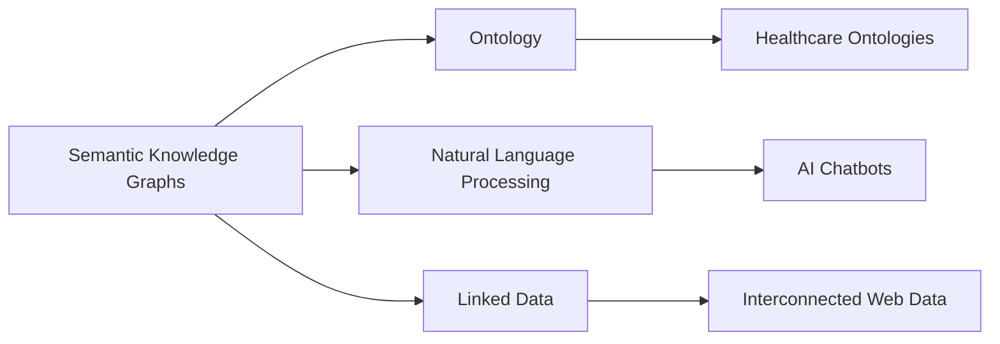

# Semantic Knowledge Graphs

# Narrative

## Origin

### Immediate Circumstances and Purpose

[[Semantic Knowledge Graphs]] were conceived to improve the way information is structured, connected, and retrieved on the internet and within databases. Traditionally, data was stored in discrete, often disconnected entities. The primary purpose was to enable more sophisticated, contextual searching and processing by embedding meaning into data relationships, primarily responding to challenges in [[AI]] and more intuitive, human-like search engines.

### Evolution

Since their creation, Semantic Knowledge Graphs have evolved significantly. Initially leveraged by large search engines like Google in the form of the Knowledge Graph™, they highlighted significant milestones: the development of schema.org to standardize semantic data, the advancement of [[Natural Language Processing]] ([[NLP]]) tools, and the integration of semantic technologies into [[AI]] systems. Over time, these graphs have expanded from search optimization to underpinning new [[AI]]-driven applications such as chatbots, recommendation systems, and enterprise data management solutions.

## Possibilities

### Expected Outcomes

#### Positive Outcomes

- **Enhanced Search Capabilities**: By embedding semantics in data, search results become more accurate and relevant, improving user experience as seen in Google's ability to deliver concise information snippets directly in search results.
- **Improved Knowledge Discovery**: Systems can uncover patterns and relationships within data that were previously unseen, such as healthcare systems identifying potential new drug interactions.
- **Interconnected Knowledge Networks**: Facilitates linking disparate pieces of information, promoting a unified understanding across various domains.

#### Negative Outcomes

- **Privacy Concerns**: As more information is interlinked, the potential for misuse of personal data increases.
- **Complexity in Implementation**: Establishing a comprehensive and accurate semantic framework can be time-consuming and resource-intensive.
- **Misinterpretation Risks**: Erroneous connections formed in the graph may lead to misleading conclusions or perpetuate biases.

## Actual Outcomes

### Positive Outcomes

- **Real-World Example**: Google's Knowledge Graph has been instrumental in enhancing search functionalities, making internet searches more intuitive by understanding context and intent.
- **Enterprise Success**: Companies like Siemens use knowledge graphs to integrate vast amounts of enterprise data, leading to improved decision-making and operational efficiencies.

### Negative Outcomes

- **Data Privacy Incidents**: Instances like Facebook's Cambridge Analytica scandal highlight the potential misuse of interconnected personal data.
- **Systemic Bias**: Algorithms powered by semantic graphs have sometimes been criticized for reinforcing existing biases, as seen in biased search query results or [[AI]] assistants.

### Resonance

[[Semantic Knowledge Graphs]] align with ideas from [[Systems Thinking]], where interconnectedness and relationships within a system are key. They also enhance [[Machine Learning]] by providing structured data that improves model accuracy.

### Distinction

Alternative approaches like non-semantic graph databases (e.g., [[Graph Theory]]-based databases without a semantic layer) compete with semantic graphs. Challenges include the dynamic nature of language, making it difficult for semantic systems to continuously update and stay relevant. Real-world examples include the challenges faced by early AI search engines in understanding context without semantics.

## Summary

### Bloom's Taxonomy Table

| **Bloom's Layer**   | **Description**                                | **Examples**                                          |
|-----------------|--------------------------------------------|---------------------------------------------------|
| Factual         | Core facts and terminology regarding semantic graphs | Understanding terms like 'ontology', 'triples', 'metadata'              |
| Conceptual      | Relationships and overarching ideas        | Linking concepts through graphs to enhance search relevance           |
| Procedural      | Practical methods such as implementing graphs for information retrieval | Utilizing RDF and SPARQL for building semantic web applications |
| Metacognitive   | Reflective insights on implications          | Contemplating ethics of interconnected data and potential misuse |

### Integral Theory Table

| **Quadrant**            | **Key Elements/Insights**                             |
| ----------------------- | ----------------------------------------------------- |
| Interior-Individual     | Personal fulfillment from creating interconnected knowledge systems |
| Interior-Collective     | Cultural shift towards valuing interconnected and comprehensive knowledge |
| Exterior-Individual     | Enhanced personal productivity using semantic search tools |
| Exterior-Collective     | Organizational use of semantic graphs for robust data analysis |

### Knowledge Expansion Table

| **Knowledge Item**              | **Description**                                                | **Relevance/Relationship**                                      |
| ------------------------------- | -------------------------------------------------------------- | --------------------------------------------------------------- |
| [[Ontology]]                    | A structured framework for organizing information              | Foundational for building semantic knowledge graphs             |
| [[Natural Language Processing]] | Techniques for understanding and interpreting human languages  | Enhances semantic graphs by improving text data comprehension   |
| [[Linked Data]]                 | Interconnected data systems using RDF and related technologies | Supports data interoperability within semantic knowledge graphs |

### Visualization

---

## Project Link

[[Create Knowledge Management System]]
