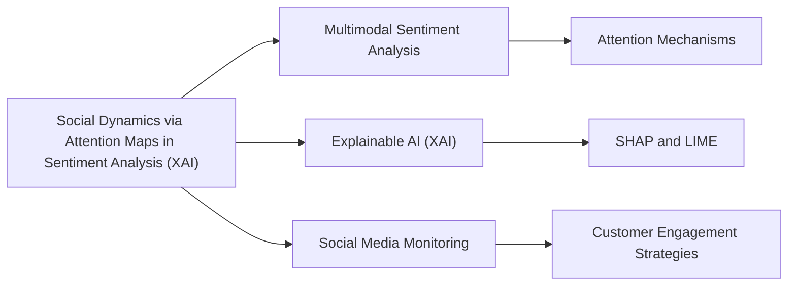

# Social Dynamics via Attention Maps in Sentiment Analysis (XAI)

## Origin

**Social dynamics via attention maps in sentiment analysis ([[XAI]])** emerged as a response to the need for more nuanced and interpretable sentiment analysis, particularly in complex social media environments. This approach combines advanced techniques from [[Explainable AI]] ([[XAI]]) with attention mechanisms to highlight important regions or features in data that contribute to sentiment. The immediate circumstances driving its creation include the challenges of understanding and predicting human emotions from text and images, especially when these data are intertwined with social dynamics.

Historically, sentiment analysis has evolved from simple text-based polarity detection to more sophisticated multimodal approaches, incorporating images and videos. The integration of attention maps has been pivotal in enhancing the interpretability of these models by focusing on the most relevant features or regions that influence sentiment predictions.

## Possibilities

### Expected Outcomes

#### Positive Outcomes

- **Enhanced Interpretability**: Attention maps provide insights into which parts of the data (e.g., specific words in text or regions in images) are driving the sentiment predictions, making models more transparent and trustworthy.
- **Improved Accuracy**: By dynamically focusing on the most relevant features, models can achieve better performance in sentiment analysis tasks, especially in complex social contexts.
- **Personalized Feedback**: In applications like customer service or social media monitoring, attention maps can help identify specific issues or sentiments that need attention, allowing for more targeted responses.

#### Negative Outcomes

- **Data Privacy Concerns**: The use of attention maps might inadvertently highlight sensitive information within images or text, raising privacy concerns.
- **Overreliance on Visual Cues**: Models might become too reliant on visual features, potentially leading to biased interpretations if these features are not representative of the broader context.
- **Complexity in Interpretation**: While attention maps can provide insights, they may also introduce complexity in understanding the model's decision-making process, especially for non-experts.

## Actual Outcomes

### Positive Outcomes

- **Multimodal Sentiment Analysis**: Studies have shown that using attention mechanisms in multimodal sentiment analysis can significantly improve model performance by effectively integrating text and image features.[^1]
- **Social Media Monitoring**: Companies have used attention-based models to better understand customer sentiments on social media, allowing for more effective engagement strategies.

### Negative Outcomes

- **Misinterpretation Risks**: There have been instances where models misinterpreted certain visual cues due to cultural or contextual misunderstandings, leading to inappropriate responses.
- **Bias in Data**: If the training data is biased, attention maps might amplify these biases, leading to unfair outcomes in sentiment analysis.

### Resonance

This knowledge item resonates with other disciplines through its application of attention mechanisms, which are also used in areas like **Natural Language Processing (NLP)** and **Computer Vision**. The focus on interpretability aligns with broader trends in **Explainable AI (XAI)**, emphasizing transparency in AI decision-making processes.

### Distinction

Competing ideas include alternative methods for enhancing model interpretability, such as **SHAP (SHapley Additive exPlanations)** or **LIME (Local Interpretable Model-agnostic Explanations)**. Challenges arise from balancing interpretability with model complexity and ensuring that attention maps do not introduce new biases or privacy risks.

## Summary

### Bloom's Taxonomy Table

| **Bloom's Layer** | **Description**                     | **Examples**               |
| ----------------- | ----------------------------------- | -------------------------- |
| Factual           | Basic concepts of attention maps and XAI | Understanding attention mechanisms in sentiment analysis |
| Conceptual        | Relationships between attention maps, sentiment analysis, and social dynamics | Recognizing how attention maps enhance model interpretability in social contexts |
| Procedural        | Practical applications of attention maps in sentiment analysis | Using attention maps to improve accuracy in multimodal sentiment analysis |
| Metacognitive     | Reflecting on the impact of attention maps on model transparency and bias | Considering the ethical implications of relying on attention maps for sentiment predictions |

### Integral Theory Table

| **Quadrant**        | **Key Elements/Insights**  |
| ------------------- | -------------------------- |
| Interior-Individual | Personal insights into how attention maps can reveal biases in one's own perceptions of sentiment. |
| Interior-Collective | Societal norms around transparency and accountability in AI decision-making processes. |
| Exterior-Individual | Observable behaviors such as using attention maps to inform targeted customer responses. |
| Exterior-Collective | Organizational structures that prioritize explainable AI in sentiment analysis for better customer engagement. |

### Knowledge Expansion Table

| **Knowledge Item**        | **Description**                    | **Relevance/Relationship**                      |
| ------------------------- | ---------------------------------- | ----------------------------------------------- |
| [[Multimodal Sentiment Analysis]] | Combines text and image data for sentiment analysis | Utilizes attention maps to enhance model performance |
| [[Explainable AI (XAI)]] | Techniques for making AI models more interpretable | Attention maps are a key component of XAI in sentiment analysis |
| [[Social Media Monitoring]] | Uses AI to track and analyze social media data | Can benefit from attention maps for more accurate sentiment analysis |

### Visualization

This visualization highlights the connections between social dynamics via attention maps in sentiment analysis and related concepts like multimodal sentiment analysis, explainable AI, and social media monitoring.
[^2] [^1] [^3] [^4] [^5]

## Project Link

[[AI Cognitive Assistant]]

[^1]: https://journal.esrgroups.org/jes/article/download/7090/4887/13027
[^2]: https://www.microsoft.com/en-us/research/publication/visual-sentiment-analysis-with-social-relations-guided-multiattention-networks/
[^3]: https://firstmonday.org/ojs/index.php/fm/article/download/10757/10207
[^4]: https://www.researchgate.net/publication/382519046_A_Sentiment_Analysis_Model_Based_on_Attention_Map_Convolutional_Network
[^5]: https://www.mdpi.com/2076-3417/12/16/8174
