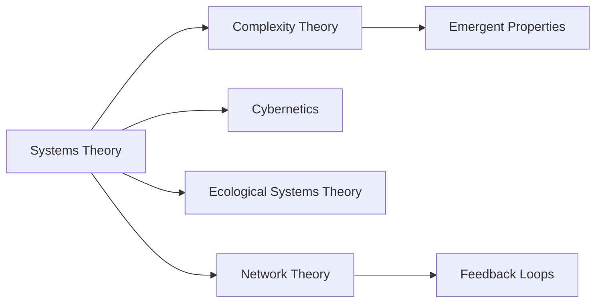

# Analysis of Systems Theory in Relation to Knowledge Management

## Origin

### Immediate Circumstances and Purpose

Systems Theory originated in the early 20th century as a framework for understanding complex interrelationships within various disciplines. Spearheaded by biologist Ludwig von Bertalanffy, its primary aim was to address inadequacies found in reductionist approaches that isolated components of a system, thus failing to capture the complexity and interdependence of the whole. This theory stressed the importance of seeing systems as wholes with interrelated parts, which can include anything from organisms to social structures or mechanical systems.

### Evolution

Since its inception, Systems Theory has evolved significantly, influencing many fields like biology, engineering, and social sciences. Key historical milestones include the development of General Systems Theory in the 1940s, cybernetics in the 1940s and 50s which integrated systems feedback loops, and the emergence of complex adaptive systems in the late 20th century. Its application has expanded from biological systems to organizational management, urban planning, and beyond, making it a cornerstone for managing complexity in dynamic environments.

## Possibilities

### Expected Outcomes

#### Positive Outcomes

- **Holistic Understanding**: Systems Theory promotes a comprehensive understanding of complex systems, facilitating improved decision-making processes by considering all interconnected elements. This approach leads to enhanced problem-solving and innovation.
- **Interdisciplinary Collaboration**: Encourages diverse fields to collaborate, promoting innovations from cross-disciplinary synergies.
- **Efficient Resource Management**: By understanding systems, resources can be allocated more effectively, enhancing productivity and sustainability in organizations.

#### Negative Outcomes

- **Complexity Overload**: Misinterpretation or overuse can lead to analysis paralysis, where the complexity of systems becomes overwhelming, hindering actionable insights.
- **Resistance to Change**: Organizations may face inertia when adapting to new models that a systems approach necessitates.
- **Misapplication**: Applying [[Systems Thinking]] without sufficient understanding can lead to flawed decision-making, particularly when interdependencies are overlooked.

## Actual Outcomes

### Real Historical Events or Situations

#### Positive Outcomes

- **Toyota Production System**: Utilized [[Systems Thinking]] in manufacturing, leading to the development of lean production techniques, significantly improving efficiency and reducing waste.
- **Healthcare Systems Improvements**: Application in healthcare has led to better patient flow management and resource utilization, as seen in initiatives like the UK National Health Service reforms.

#### Negative Outcomes

- **Financial Crises**: Misapplication in financial markets, where reliance on complex models failed to account for unforeseen interdependencies, contributing to significant economic downturns, such as the 2008 financial crisis.
- **Environmental Policy Challenges**: In environmental policy, systems can fail if interconnected impacts aren't fully considered, leading to unintended consequences in ecosystems.

### Resonance

- Systems Theory resonates with [[Complexity Theory]], which studies how relationships between parts give rise to collective behaviors.
- It complements [[Ecological Systems]] understanding and [[Organizational Development]] through its focus on interrelationships and feedback mechanisms.
- Aligns with [[Cybernetics]] and [[Network Theory]] in analyzing communication and control in networks, emphasizing feedback loops.

### Distinction

- [[Reductionism]]: Contrary to Systems Theory, reductionism focuses on dissecting systems into individual components, often criticized for missing the broader system context.
- [[Linear Theories]]: Such theories view relationships as direct causations, unlike the dynamic view embraced by [[Systems Thinking]].
- Critiques include the notion that Systems Theory can sometimes oversimplify complexity, ignoring elements not easily categorized into a system.

## Summary

### Bloom's Taxonomy Table

| **Bloom's Layer** | **Description**                     | **Examples**                                                                 |
| ----------------- | ----------------------------------- | --------------------------------------------------------------------------- |
| Factual           | Basic facts and terminology         | Systems, interdependence, feedback loops                                    |
| Conceptual        | Relationships and overarching ideas | Interrelated parts, holistic view, interdisciplinary collaboration          |
| Procedural        | Practical methods and processes     | Systems modeling, lean production, healthcare process improvements          |
| Metacognitive     | Reflective insights                 | Reflecting on how seeing systems as wholes impacts understanding and action |

### Integral Theory Table

| **Quadrant**        | **Key Elements/Insights**  |
| ------------------- | -------------------------- |
| Interior-Individual | Personal insights from applying [[Systems Thinking]] in problem-solving contexts |
| Interior-Collective | Societal acknowledgment of interconnected systems, such as climate initiatives |
| Exterior-Individual | Observable behaviors in professionals applying systemic approaches             |
| Exterior-Collective | Structural changes in organizations employing systems models                   |

### Knowledge Expansion Table

| **Knowledge Item**               | **Description**                                                                    | **Relevance/Relationship**                                       |
|----------------------------------|------------------------------------------------------------------------------------|------------------------------------------------------------------|
| [[Complexity Theory]]            | Studies how parts form patterns and collective behaviors                           | Enhances understanding of emergent properties in systems         |
| [[Cybernetics]]                  | Explores control and communication in animals and machines                         | Provides mechanisms for systems feedback loops                   |
| [[Ecological Systems Theory]]    | Addresses environmental components and interactions                               | Extends [[Systems Thinking]] to ecological perspectives              |

### Visualization

## Project Link

[[Create Knowledge Management System]]
