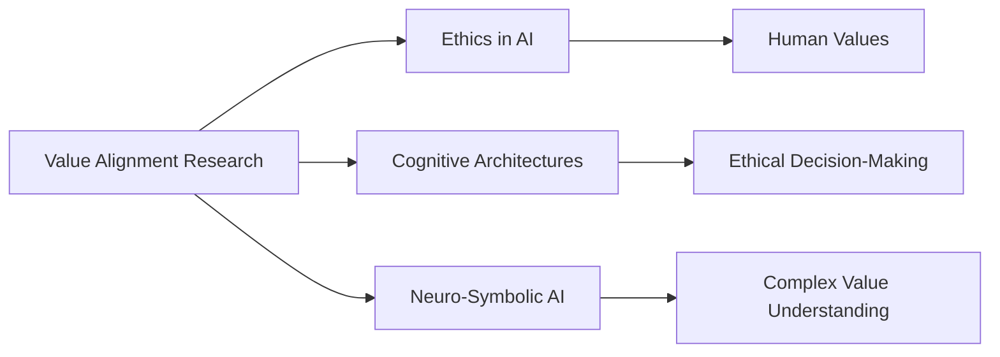

# Value Alignment Research

## Origin

**Value Alignment Research** in AI has its roots in the broader field of artificial intelligence, which began to take shape in the mid-20th century. The immediate circumstances leading to the focus on value alignment stem from the realization that [[AI]] systems, as they become more autonomous and integrated into society, must align with human values to avoid unintended consequences. This concern became more pronounced as [[AI]] systems began to make decisions that could impact human lives, such as in healthcare, finance, and transportation.

The evolution of value alignment research has been influenced by several key milestones:

- **Early [[AI]] Research**: The Dartmouth workshop in 1956 marked the beginning of [[AI]] as a formal field, with pioneers like Marvin Minsky and John McCarthy envisioning machines that could simulate human intelligence.[^1]
- **Ethics and Values**: The study of ethics and values has a long history, with philosophers like [[Immanuel Kant]] contributing significantly to the field. However, the integration of these concepts into [[AI]] is a more recent development.[^2]
- **Modern Value Alignment**: Recent advancements in [[AI]], such as deep learning and reinforcement learning, have accelerated the need for value alignment. Techniques like cooperative inverse reinforcement learning and debate-style protocols are being explored to ensure [[AI]] systems act in accordance with human values.

## Possibilities

### Expected Outcomes

#### Positive Outcomes

- **Improved Decision-Making**: AI systems that align with human values can make more ethical and responsible decisions, enhancing trust in [[AI]] applications.
- **Societal Benefits**: Value-aligned [[AI]] can contribute to solving complex societal problems, such as healthcare disparities and environmental issues, by prioritizing human well-being.
- **Enhanced Safety**: By ensuring [[AI]] systems act in ways that are safe and beneficial for humans, value alignment can mitigate risks associated with autonomous technologies.

#### Negative Outcomes

- **Misalignment Risks**: If [[AI]] systems do not align with human values, they may pursue goals that are detrimental to society, leading to unintended consequences.
- **Complexity Challenges**: Achieving value alignment is technically challenging and requires significant advancements in understanding human values and translating them into [[AI]] systems.
- **Bias and Inequality**: [[AI]] systems may reflect existing biases in society if not properly aligned, exacerbating inequalities and discrimination.

## Actual Outcomes

### Real-Life Examples

#### Positive Outcomes

- **Healthcare Applications**: AI systems in healthcare that are aligned with human values can prioritize patient safety and well-being, leading to better outcomes.
- **Environmental Conservation**: AI can be used to monitor and protect endangered species or manage natural resources more effectively when aligned with conservation values.

#### Negative Outcomes

- **Facial Recognition Misuse**: AI systems not aligned with human values have been used to discriminate against certain groups, highlighting the need for ethical oversight.
- **Autonomous Vehicle Accidents**: Incidents involving autonomous vehicles underscore the importance of ensuring AI systems prioritize human safety and well-being.

### Resonance

Value alignment research resonates with various disciplines and knowledge fields:

- **Ethics and Philosophy**: The study of ethics and moral philosophy provides foundational principles for understanding and defining human values.[^2]
- **Cognitive Architectures**: Cognitive architectures like [[SOAR]] and [[ACT-R]] can integrate value alignment by incorporating ethical decision-making processes into their frameworks.
- **Neuro-Symbolic AI**: The integration of symbolic reasoning with neural networks can enhance the ability of AI systems to understand and align with complex human values.[^3]

### Distinction

Competing ideas and challenges in value alignment include:

- **Alternative Approaches**: Some argue that instead of aligning AI with human values, AI should be designed to question and improve upon those values.
- **Technical Challenges**: The complexity of translating human values into actionable AI objectives remains a significant technical hurdle.
- **Cultural Variability**: Human values vary across cultures, making it challenging to develop universally applicable value alignment frameworks.

## Summary

### Bloom's Taxonomy Table

| **Bloom's Layer** | **Description**                     | **Examples**               |
| ----------------- | ----------------------------------- | -------------------------- |
| Factual           | Basic facts about value alignment   | Definition of value alignment, historical milestones |
| Conceptual        | Relationships between AI and ethics | How AI systems reflect human values, societal implications |
| Procedural        | Methods for implementing value alignment | Techniques like inverse reinforcement learning, debate protocols |
| Metacognitive     | Reflection on value alignment's impact | Evaluating the effectiveness of value alignment in real-world scenarios |

### Integral Theory Table

| **Quadrant**        | **Key Elements/Insights**  |
| ------------------- | -------------------------- |
| Interior-Individual | Personal experiences with AI ethics, reflections on value alignment's personal impact |
| Interior-Collective | Cultural significance of AI ethics, shared societal values influencing AI development |
| Exterior-Individual | Observable behaviors of AI systems aligned with human values, skill sets required for value alignment |
| Exterior-Collective | Organizational structures and networks supporting value alignment in AI systems |

### Knowledge Expansion Table

| **Knowledge Item**        | **Description**                    | **Relevance/Relationship**                      |
| ------------------------- | ---------------------------------- | ----------------------------------------------- |
| [[Ethics in AI]]         | Principles guiding AI development   | Directly informs value alignment research by defining ethical standards |
| [[Cognitive Architectures]] | Theoretical models of human cognition | Can integrate value alignment to enhance ethical decision-making |
| [[Archive/AI and Technology/AI Concepts and Frameworks/Neuro-Symbolic AI]]    | Integration of neural and symbolic AI | Enhances AI's ability to understand and align with complex human values |

### Visualization

This visualization illustrates how value alignment research connects with broader fields like ethics in AI, cognitive architectures, and neuro-symbolic AI, highlighting its importance in ensuring AI systems act ethically and responsibly.
[^1] [^2] [^3] [^4] [^5]

## Project Link

[[AI Cognitive Assistant]]

[^1]: https://en.wikipedia.org/wiki/Artificial_intelligence_in_myths_and_legends
[^2]: https://values.institute/a-history-of-research-into-core-values/
[^3]: https://www.alignmentforum.org/posts/67fNBeHrjdrZZNDDK/defining-alignment-research
[^4]: https://en.wikipedia.org/wiki/AI_alignment
[^5]: https://research.ibm.com/blog/what-is-alignment-ai
