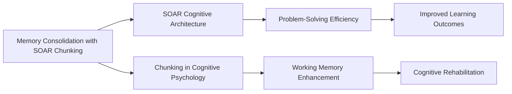

# Memory Consolidation with SOAR Chunking

## Origin

**Memory Consolidation with [[SOAR]] Chunking** draws from two primary sources: the cognitive psychology concept of **chunking** and the **[[SOAR]]** cognitive architecture.

- **Chunking** in cognitive psychology involves grouping small pieces of information into larger units to enhance memory retention and working memory efficiency. This concept was introduced by George Miller in 1956, highlighting the limited capacity of short-term memory and how chunking can bypass this limitation by creating meaningful groups of information.[^1]

- **[[SOAR]]** is a general problem-solving architecture that uses production rules and chunking for learning and problem-solving. It integrates learning through reinforcement and episodic memory, allowing it to improve performance by consolidating rules into chunks.[^2]

The immediate circumstances for combining these concepts involve enhancing cognitive architectures like [[SOAR]] with memory consolidation techniques. This integration aims to improve the efficiency and effectiveness of learning and problem-solving by leveraging chunking to organize and retain information better.

**Evolution**: Over time, chunking has evolved from a memory aid to a learning mechanism in cognitive architectures. [[SOAR]]'s use of chunking has expanded its capabilities in acquiring rules from goal-based experiences, enhancing its performance in various tasks.[^2] The integration of chunking into [[SOAR]] has also been explored for improving memory consolidation, particularly in contexts where working memory is limited, such as in individuals with cognitive impairments.[^1][^2]

## Possibilities

### Expected Outcomes

#### Positive Outcomes

- **Enhanced Learning Efficiency**: By organizing information into meaningful chunks, [[SOAR]] can improve learning speed and retention, especially in complex problem-solving tasks.
- **Improved Memory Consolidation**: Chunking helps in reducing the cognitive load on working memory, allowing for more efficient transfer of information to long-term memory.
- **Adaptability to Cognitive Impairments**: This approach can be beneficial for individuals with working memory deficits, such as those with Alzheimer's disease, by aiding in verbal and spatial working memory performance.[^1]

#### Negative Outcomes

- **Overreliance on Chunks**: If chunks become too complex or abstract, they may not be as effective in aiding memory recall.
- **Contextual Dependence**: The effectiveness of chunking can depend heavily on the context in which information is presented and learned, potentially limiting its applicability across different scenarios.
- **Learning Curve**: Implementing chunking strategies in cognitive architectures like SOAR may require significant initial setup and training, which can be time-consuming and resource-intensive.

## Actual Outcomes

### Positive Outcomes

- **Efficient Problem-Solving**: SOAR's use of chunking has been demonstrated to improve performance in search-based puzzle tasks and knowledge-based expert systems by efficiently acquiring and applying rules.[^2]
- **Cognitive Rehabilitation**: Chunking strategies have shown promise in cognitive rehabilitation, helping individuals with working memory deficits to improve their memory performance.[^1]

### Negative Outcomes

- **Complexity in Implementation**: The integration of chunking into cognitive architectures can be complex, requiring careful design to ensure that chunks are meaningful and useful for the specific tasks at hand.
- **Dependence on Prior Knowledge**: The effectiveness of chunking in SOAR may depend on the user's prior knowledge and experience, as chunks are more easily formed and recalled when they relate to existing cognitive structures.[^1]

## Resonance

Chunking and SOAR's application resonate with other cognitive architectures and learning mechanisms:
- **ACT-R**: Like SOAR, ACT-R separates memory into declarative and procedural components, which can be enhanced by chunking strategies.
- **CLARION**: This dual-process architecture also benefits from chunking by organizing implicit and explicit knowledge into manageable units.

## Distinction

Competing ideas include:
- **Alternative Learning Mechanisms**: Other cognitive architectures might use different learning mechanisms, such as reinforcement learning or deep learning, which do not rely on chunking.
- **Limitations of Chunking**: While chunking is effective for short-term memory, it may not always translate to long-term retention without additional reinforcement or practice.

## Summary

### Bloom's Taxonomy Table

| **Bloom's Layer** | **Description**                     | **Examples**               |
| ----------------- | ----------------------------------- | -------------------------- |
| Factual           | Basic facts about chunking and SOAR | Chunking concept, SOAR architecture |
| Conceptual        | Relationships between chunking, memory, and SOAR | How chunking enhances SOAR's learning capabilities |
| Procedural        | Practical methods for implementing chunking in SOAR | Steps to integrate chunking into SOAR for improved problem-solving |
| Metacognitive     | Reflective insights on the impact of chunking in SOAR | Evaluating the effectiveness of chunking in different contexts |

### Integral Theory Table

| **Quadrant**        | **Key Elements/Insights**  |
| ------------------- | -------------------------- |
| Interior-Individual | Personal experience with chunking improving memory recall |
| Interior-Collective | Cultural significance of efficient learning strategies like chunking |
| Exterior-Individual | Observable improvements in problem-solving skills using SOAR with chunking |
| Exterior-Collective | Impact of chunking on organizational learning and performance in complex systems |

### Knowledge Expansion Table

| **Knowledge Item**        | **Description**                    | **Relevance/Relationship**                      |
| ------------------------- | ---------------------------------- | ----------------------------------------------- |
| [[ACT-R Architecture]]   | Separates declarative and procedural memory | Complementary approach to memory organization |
| [[CLARION Architecture]] | Dual-process architecture for implicit and explicit learning | Similar use of chunking for knowledge organization |
| [[Neuro-Symbolic Integration]] | Combines neural networks with symbolic AI | Potential integration with SOAR for enhanced reasoning |

### Visualization

This visualization illustrates how SOAR's use of chunking enhances problem-solving efficiency and working memory, leading to improved learning outcomes and cognitive rehabilitation benefits.
[^1] [^3] [^2] [^4] [^5]

## Project Link

[[AI Cognitive Assistant]]

[^1]: https://en.wikipedia.org/wiki/Chunking_(psychology)
[^2]: https://apps.dtic.mil/sti/tr/pdf/ADA169359.pdf
[^3]: https://snap.berkeley.edu/project/12247973
[^4]: https://www.kcl.ac.uk/archive/news/ioppn/records/2011/may2011/chunking-in-early-alzheimers-disease
[^5]: https://cbmm.mit.edu/sites/default/files/documents/Week3_Squire2015.pdf
