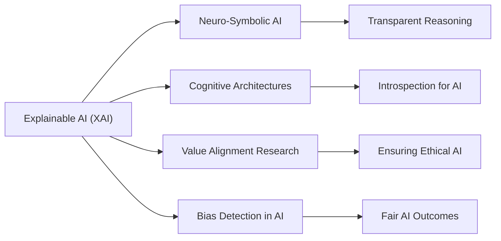

# Explainability in AI: A Unified Framework for Ethics, Trust, and Practical Integration

## Unified Narrative

Explainable AI ([[XAI]]) emerged out of necessity to counteract the opacity of advanced [[AI]] systems, particularly deep learning models often labeled as "black boxes." This need arose due to concerns surrounding **trust, fairness, and accountability** in [[AI]]-driven decision-making across critical sectors such as **healthcare, finance, and law**. Over time, [[XAI]] has evolved not only as a technical field but also as an **ethical framework**, intersecting with cognitive science, regulatory compliance, and user trust.

### Core Concepts & Techniques

[[XAI]] methodologies can be categorized into **model-specific** and **model-agnostic** approaches. Techniques such as **LIME (Local Interpretable Model-agnostic Explanations)** and **[[SHAP]] (SHapley Additive Explanations)** provide post-hoc explanations by approximating complex models with interpretable surrogates. These mechanisms have enabled **bias detection, regulatory compliance, and safety improvements**, but they also introduce **computational costs and interpretability challenges** due to their simplistic or locally constrained nature.

At the intersection of **philosophy, cognitive science, and [[AI]]**, [[XAI]] resonates with **neuro-symbolic [[AI]]**, which combines symbolic reasoning with deep learning to provide natural explainability within [[AI]] systems. Additionally, in cognitive architectures like **[[SOAR]] and [[ACT-R]]**, insights from [[XAI]] can contribute to **introspective [[AI]] systems** capable of explaining their reasoning in human-like terms.

### Practical & Ethical Challenges

Despite its advancements, [[XAI]] faces several challenges:
1. **Oversimplification & Misrepresentation** – Many [[XAI]] techniques provide approximations, not true explanations, which can lead to misleading interpretations.
2. **Bias & Trust Issues** – While [[XAI]] helps uncover biases, biased data can still corrupt [[AI]] decisions. [[XAI]] alone does not eliminate discrimination.
3. **Regulatory and Ethical Dilemmas** – Standardizing [[XAI]] across industries remains a challenge, particularly for **global regulations and policy alignment**.

Furthermore, ethical justification frameworks for AI depend on the capability of **XAI-backed models to provide human-understandable rationales**. Ethical AI frameworks integrate XAI's transparency alongside **value alignment research**, ensuring that AI systems not only explain their decisions but also adhere to principles of fairness, inclusivity, and moral reasoning.

### Interdisciplinary Resonance

XAI thrives in collaboration with other domains, including:
- **Neuro-symbolic AI**, which enhances reasoning capabilities in AI-driven models.
- **Value alignment research**, ensuring AI follows ethical and moral standards.
- **Cognitive architectures**, bridging human cognition with explainability in intelligent assistants.

To fully leverage XAI, its role must be understood as an **integrative tool** that goes beyond AI debugging—it must shape how AI interacts with society, aligns with ethical norms, and fosters human-AI collaboration.

---

## Organized Summaries via Tables

### Bloom's Taxonomy for XAI and Model Interpretability

| **Layer**          | **Description**                          | **Examples** |
|--------------------|------------------------------------------|--------------|
| **Factual**       | Understanding basic XAI concepts         | LIME, SHAP, black-box AI concerns |
| **Conceptual**    | Relationships between XAI, trust, and ethics | XAI's role in ethical AI development |
| **Procedural**    | Methods for explainable AI implementation | Training surrogate models, applying bias detection tools |
| **Metacognitive** | Reflective considerations on XAI's societal impact | How XAI's transparency influences AI adoption |

---

### Integral Theory Framework for XAI's Societal & Technical Role

| **Quadrant**             | **Key Elements & Insights**                            |
|--------------------------|--------------------------------------------------------|
| **Interior-Individual**  | Personal trust in AI through transparency |
| **Interior-Collective**  | Societal values in AI governance and ethical AI policies |
| **Exterior-Individual**  | Practical tools like LIME and SHAP for model debugging |
| **Exterior-Collective**  | Regulatory compliance frameworks supporting XAI adoption |

---

### Knowledge Expansion Framework: XAI in the Broader AI Landscape

| **Knowledge Item**          | **Description**                                    | **Relevance & Relationship** |
|-----------------------------|----------------------------------------------------|--------------------------------|
| **Neuro-Symbolic AI**       | Merges symbolic reasoning with deep learning       | Enhances **transparent reasoning mechanisms** in AI |
| **Cognitive Architectures** | Frameworks mirroring human cognition               | Aids self-awareness and introspection in AI |
| **Value Alignment Research** | Ensures AI aligns with ethical principles         | Key to ensuring AI remains fair and unbiased |
| **Bias Detection in AI**    | Techniques for identifying bias in AI models       | XAI assists in uncovering and mitigating biases |

---

## Emergent Relationships with Visualizations

This visual representation illustrates how **XAI acts as a crucial bridge** between technical AI interpretability (via LIME, SHAP) and ethical/moral considerations (via value alignment and bias detection).

---

## Actionable Framework for XAI Implementation & Research Navigation

To apply concepts from XAI practically, a **structured approach** should be followed:

### 1. Applying XAI in Practical AI Systems

✅ **Use Model-Agnostic Techniques**
- Implement **LIME & SHAP** for local interpretability.
- Apply **counterfactual explanations** to generate human-understandable rationales.

✅ **Enhance Ethical AI Implementation**
- Combine XAI with **Value Alignment** frameworks to improve **fairness** and mitigate biases.
- Ensure end-users can **understand and interact** with XAI methods to enhance decision-making transparency.

---

### 2. Creating a Research Roadmap for Future XAI Developments

🔬 **Explore Neuro-Symbolic Extensions**
- Investigate **hybrid models** combining neural reasoning with explicit explanations.

📜 **Develop Standardization in AI Ethics**
- Work towards **cross-industry XAI adoption guidelines** for ethical AI certification.

⚖ **Assess Algorithmic Bias & Dataset Fairness**
- Integrate automatic **bias evaluation tools for machine learning** workflows.

---

### 3. Enhancing Regulatory and Governance Applications of XAI

🏛 **Aligning with Global AI Regulations**
- Establish **XAI-based compliance reports** for AI transparency in sectors like **healthcare, finance, and legal AI applications**.

🤝 **Improving Human-AI Trust Levels**
- Create **interactive explanation interfaces** for regulatory audits and transparency disclosures.

---

## Closing Thoughts: XAI as a Bridge Between Technical AI and Human-Centered AI

The synthesis of XAI research reveals that **explainability is not an optional feature but a foundational requirement** for ethical AI. As AI systems become increasingly embedded in our daily lives, **ensuring transparent, interpretable, and justifiable AI decisions is essential** not only for ethical governance but also for fostering public trust and preventing unintended biases.

XAI is most effective when:
- 📍 It is **integrated into AI ethics frameworks** (not just left as an afterthought).
- 🔎 It **enhances transparency without compromising performance**.
- ⚖ It **guides policymakers and regulators on responsible AI development**.

By combining XAI with **neuro-symbolic reasoning, cognitive architectures, and value alignment research,** AI developers can **move towards truly interpretable, ethically-aligned, and human-compatible AI systems**.
[^1] [^2] [^3] [^4] [^5] [^6] [^7] [^8] [^9] [^10] [^11] [^12] [^13] [^14] [^15] [^16] [^17] [^18] [^19] [^20]

## Project Link

[[AI Cognitive Assistant]]

[^1]: https://en.wikipedia.org/wiki/Explainable_artificial_intelligence
[^2]: https://www.larksuite.com/en_us/topics/ai-glossary/xai-explainable-ai
[^3]: https://openaccess.city.ac.uk/id/eprint/31322/
[^4]: https://www.temenos.com/news/2024/08/19/what-is-explainable-ai-a-brief-history-of-artificial-intelligence/
[^5]: https://ercim-news.ercim.eu/en134/special/explainable-ai-a-brief-history-of-the-concept
[^6]: https://c3.ai/glossary/data-science/lime-local-interpretable-model-agnostic-explanations/
[^7]: https://diposit.ub.edu/dspace/bitstream/2445/192075/1/tfg_nieto_juscafresa_aleix.pdf
[^8]: https://www.steadforce.com/blog/explainable-ai-with-lime
[^9]: https://christophm.github.io/interpretable-ml-book/lime.html
[^10]: https://www.datacamp.com/tutorial/explainable-ai-understanding-and-trusting-machine-learning-models
[^11]: https://www.holisticseo.digital/ai/type/explainable/
[^12]: https://arxiv.org/html/2410.17139v1
[^13]: https://shelf.io/blog/ethical-ai-uncovered-10-fundamental-pillars-of-ai-transparency/
[^14]: https://www.ibm.com/think/topics/explainable-ai
[^15]: https://en.wikipedia.org/wiki/Explainable_artificial_intelligence
[^16]: https://ijarsct.co.in/Paper16988.pdf
[^17]: https://www.larksuite.com/en_us/topics/ai-glossary/xai-explainable-ai
[^18]: https://www.brcommunity.com/articles.php?id=c011
[^19]: https://arxiv.org/html/2407.18782v1
[^20]: https://canvasbusinessmodel.com/blogs/brief-history/xai-brief-history
